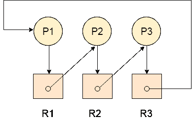

# 使用 RAG 进行死锁检测

> 原文：<https://www.javatpoint.com/os-deadlock-detection-using-rag>

如果在资源分配图中形成了一个循环，其中所有资源都有一个实例，那么系统就会陷入死锁。

对于多实例资源类型的资源分配图，循环是死锁的必要条件，但不是充分条件。

以下示例包含三个进程 P1、P2、P3 和三个资源 R2、R2、R3。所有资源都有各自的实例。

如果我们分析图，那么我们可以发现图中形成了一个循环，因为系统满足死锁的所有四个条件。

### 分配矩阵

利用系统的资源分配图可以形成分配矩阵。在分配矩阵中，将为分配的每个资源创建一个条目。例如，在下面的矩阵中，因为 R3 被分配给 P1，所以在 P1 前面和 R3 下面输入 en。

| 过程 | R1 | R2 | R3 |
| 第一亲代 | Zero | Zero | one |
| P2 | one | Zero | Zero |
| P3 | Zero | one | Zero |

### 请求矩阵

在请求矩阵中，将为每个请求的资源创建一个条目。如下例所示，P1 需要 R1，因此在 P1 前面和 R1 下面做了一个入口。

| 过程 | R1 | R2 | R3 |
| 第一亲代 | one | Zero | Zero |
| P2 | Zero | one | Zero |
| P3 | Zero | Zero | one |

### Avial = (0，0，0)

我们在系统中没有任何可用的资源，也没有将要发布的过程。每个流程至少需要一个资源来完成，因此他们将持续持有每个流程。

我们无法使用可用资源满足至少一个进程的需求，因此当我们在图中检测到一个周期时，系统已经死锁。