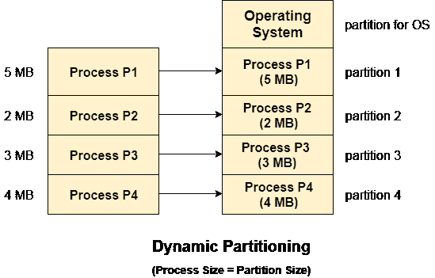
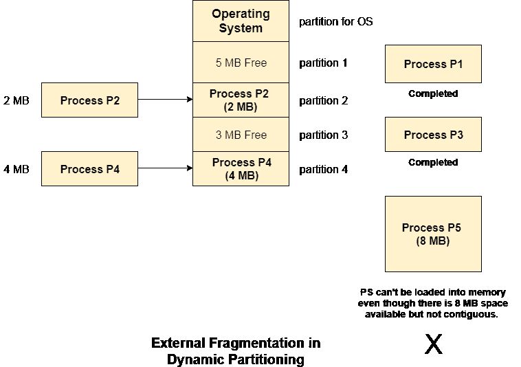

# 动态分区

> 原文：<https://www.javatpoint.com/os-dynamic-partitioning>

动态分区试图克服固定分区带来的问题。在这种技术中，最初不声明分区大小。它在进程加载时声明。

第一个分区是为操作系统保留的。剩余的空间被分成几部分。每个分区的大小将等于进程的大小。分区大小根据进程的需要而变化，因此可以避免内部碎片。

## 动态分区相对于固定分区的优势

### 1.没有内部碎片

鉴于动态分区中的分区是根据进程的需要创建的，显然不会有任何内部碎片，因为分区中不会有任何未使用的剩余空间。

### 2.对流程的规模没有限制

在固定分区中，由于缺少足够的连续内存，大小大于最大分区大小的进程无法执行。这里，在动态分区中，不能限制进程大小，因为分区大小是根据进程大小决定的。

### 3.多道程序设计的程度是动态的

由于没有内部碎片，分区中不会有任何未使用的空间，因此可以同时在内存中加载更多的进程。

## 动态分区的缺点

### 外部碎片

没有内部碎片并不意味着不会有外部碎片。

让我们考虑三个进程:P1 (1 MB)和 P2 (3 MB)以及 P3 (1 MB)正被加载到主内存的相应分区中。

过了一段时间，P1 和 P3 完成了任务，他们被分配的空间被释放了。现在主内存中有两个未使用的分区(1 MB 和 1 MB)，但是它们不能用于在内存中加载 2 MB 进程，因为它们不是连续定位的。

规则规定进程必须连续出现在主内存中才能执行。我们需要改变这一规则，以避免外部分裂。

### 复杂的内存分配

在固定分区中，分区列表只生成一次，永远不会改变，但在动态分区中，分配和解除分配非常复杂，因为每次分配给新进程时，分区大小都会发生变化。操作系统必须跟踪所有分区。

由于动态内存分配中分配和解除分配非常频繁，分区大小每次都会改变，操作系统很难管理一切。