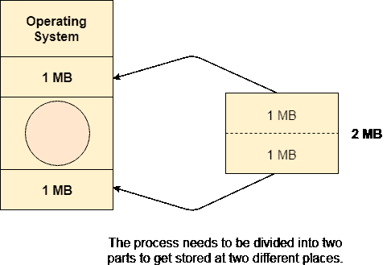

# 需要寻呼

> 原文：<https://www.javatpoint.com/os-need-for-paging>

## 动态分区的缺点

动态分区的主要缺点是外部碎片。虽然这可以通过压缩来消除，但是正如我们前面讨论的，压缩会使系统效率低下。

我们需要找到一种能够以更优化的方式在分区中加载进程的机制。让我们讨论一种动态灵活的机制，称为分页。

## 需要寻呼

让我们考虑大小为 2 MB 的进程 P1 和分成三个分区的主内存。在三个分区中，有两个分区是大小各为 1 MB 的孔。

P1 需要在主内存中有 2 MB 的空间来加载。我们有两个各 1 MB 的孔，但它们不是连续的。

虽然，主内存中有 2 MB 的可用空间，但这些空间在变得连续之前是无用的。这是一个需要解决的严重问题。

我们需要某种机制，可以将一个进程存储在内存的不同位置。

分页背后的想法是将进程划分为页面，这样我们就可以将它们存储在内存的不同位置。我们将在接下来的章节中用例子讨论分页。

