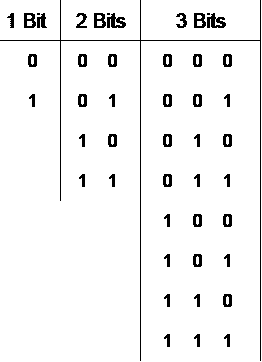
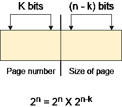

# 二进制地址基础

> 原文：<https://www.javatpoint.com/os-basics-of-binary-addresses>

计算机系统将二进制地址分配给存储单元。然而，系统使用一定数量的位来寻址存储单元。

使用 1 位，我们可以寻址两个存储位置。使用 2 位我们可以寻址 4 个，使用 3 位我们可以寻址 8 个存储位置。

可以在地址中的位数和存储器位置范围之间的映射中识别模式。

**我们知道，**

```

Using 1 Bit we can represent 2^1 i.e 2 memory locations. 
Using 2 bits, we can represent 2^2 i.e. 4 memory locations. 
Using 3 bits, we can represent 2^3 i.e. 8 memory locations. 
Therefore, if we generalize this, 
Using n bits, we can assign 2^n memory locations.  

n bits of address  → 2 ^ n memory locations 

```



这 n 位可以分为两部分，即 **K** 位和 **(n-k)** 位。

