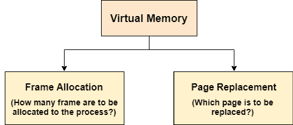

# 页面替换算法

> 原文：<https://www.javatpoint.com/os-page-replacement-algorithms>

页面替换算法决定要替换哪个内存页面。替换过程有时称为换出或写入磁盘。当在主存储器中没有找到所请求的页面时(页面错误)，页面替换完成。

虚拟内存主要有两个方面，帧分配和页面替换。拥有最优的帧分配和页面替换算法是非常重要的。帧分配就是要给进程分配多少帧，而页面替换就是要确定需要替换的页码，以便为请求的页面腾出空间。

### 如果算法不是最优的呢？

1.如果分配给一个进程的帧数不够或不准确，那么就会出现抖动问题。由于缺少帧，大部分页面将驻留在主存储器中，因此会出现更多的页面错误。

但是，如果操作系统为进程分配了更多的帧，则可能会出现内部碎片。

2.如果页面替换算法不是最优的，那么还会有抖动的问题。如果被请求页面替换的页面数量将在不久的将来被引用，那么将会有更多数量的换入和换出，因此操作系统必须执行比通常更多的替换，这将导致性能不足。

因此，最优页面替换算法的任务是选择能够限制抖动的页面。

### 页面替换算法的类型

有各种页面替换算法。每种算法都有不同的方法来替换页面。

1.  **最优页面替换算法→** 该算法替换了以后不会被引用这么久的页面。虽然它不能实际实施，但它可以作为一个基准。其他算法在最优性方面与此进行了比较。
2.  **最近最少使用的(LRU)页面替换算法→** 该算法替换长期未被引用的页面。该算法正好与最优页面替换算法相反。在这种情况下，我们看过去，而不是盯着未来。
3.  **FIFO →** 在本算法中，维护一个队列。首先分配到框架的页面将首先被替换。换句话说，位于队列罕见末端的页面将在每个页面出错时被替换。