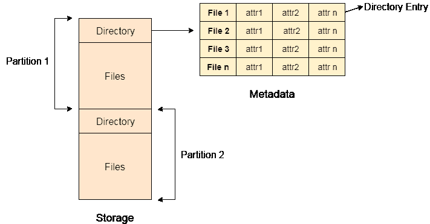

# 目录结构

> 原文：<https://www.javatpoint.com/os-directory-structure>

## 什么是目录？

目录可以定义为磁盘上相关文件的列表。该目录可能存储部分或全部文件属性。

为了在不同的操作系统上获得不同文件系统的好处，硬盘可以被分成不同大小的分区。分区也称为卷或迷你磁盘。

每个分区必须至少有一个目录，其中可以列出该分区的所有文件。为目录中的每个文件维护一个目录条目，该目录存储与该文件相关的所有信息。

一个目录可以被看作是一个文件，其中包含一堆文件的元数据。

每个目录都支持对文件的一些常见操作:

1.  文件创建
2.  搜索文件
3.  文件删除
4.  重命名文件
5.  遍历文件
6.  文件列表