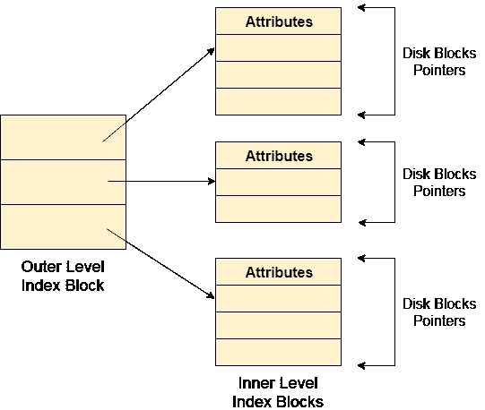

# 链接索引分配

> 原文：<https://www.javatpoint.com/os-linked-index-allocation>

## 单层链接索引分配

在索引分配中，文件大小取决于磁盘块的大小。为了允许大文件，我们必须将几个索引块链接在一起。在链接索引分配中，

*   给出文件名的小标题
*   前 100 个块地址的集合
*   指向另一个索引块的指针

对于较大的文件，索引块的最后一个条目是指向另一个索引块的指针。这也称为链接模式。

**优势:**消除文件大小限制

**劣势:**随机接入变得有点难

## 多级索引分配

在多级指数分配中，我们有不同级别的指数。外层索引块包含指向内层索引块的指针，内层索引块包含指向文件数据的指针。

*   外层索引用于查找内层索引。
*   内层索引用于查找所需的数据块。

**优势:**随机接入变得更好更高效。

**劣势:**文件的访问时间会更长。

