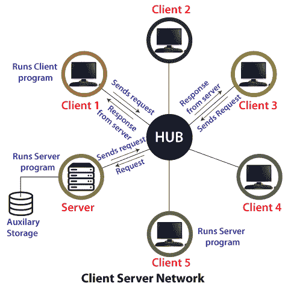

# 网络操作系统

> 原文：<https://www.javatpoint.com/network-operating-system>

在本节中，我们将详细了解网络操作系统的概念。

## 你说的网络操作系统是什么意思？

一个操作系统，包括软件和相关的协议，通过网络与其他自主计算机进行方便和经济的通信，被称为网络操作系统。它允许像磁盘、打印机等设备。，在计算机之间共享。作为网络一部分的各个机器都有自己的[操作系统](https://www.javatpoint.com/os-tutorial)，网络操作系统位于各个机器的顶部。由于各台计算机都有自己的操作系统来访问其他计算机的资源，因此它们必须使用正确的密码登录到另一台计算机。此功能还导致没有进程迁移，在不同机器上运行的进程无法通信。传输控制协议是常见的网络协议。

**网络操作系统的各种特性如下。**

*   网络操作系统通过以下方式提供包括登录规则在内的一些保护功能
*   这种操作系统提供了许多网络产品和备份产品。
*   它提供了许多功能，包括处理器指南、计算机化硬件检测和多处理器指南
*   它通过图形界面帮助不同的审计设备。

**网络操作系统类型**

网络操作系统可以专门用作:

*   对等系统
*   客户机-服务器系统

**对等网络操作系统**

**Peer To Peer** 网络是每个系统具有相同能力和职责的网络资源，也就是说，这个架构中没有一个系统在功能上优于其他系统。

系统之间没有主从关系，即对等网络操作系统中的每个节点都是平等的。网络中的所有节点都与其他节点有平等的关系，并且有类似类型的软件来帮助共享资源。

对等网络操作系统允许两台或多台计算机共享它们的资源，以及打印机、扫描仪、光盘等。，可从每台计算机访问。这些网络最适合拥有 25 个或更少工作站的小型环境。

要建立对等网络，您需要网络适配器卡、正确安装的网络电缆来连接它们，以及网络集线器或交换机来互连计算机。

对等网络是有组织的，只是一组可以共享资源的计算机。工作站中的每台计算机都跟踪其用户帐户和安全设置，因此没有一台计算机负责工作组。工作组几乎没有安全性，也没有集中的登录过程。任何用户一旦登录到网络上的对等点，就可以使用任何共享资源。由于没有中央安全性，共享资源可以通过密码来控制，或者用户可以通过不共享某些文件或文件夹来阻止它们的可访问性。

**对等网络操作系统的优势**

*   这种系统的安装和维护成本较低。
*   在这种情况下，不需要专用硬件。
*   设置某些网络策略不需要专门的网络管理员。
*   由于使用了简单的布线方案，通常是双绞线电缆，因此非常容易设置。

**对等网络操作系统的缺点**

*   对等网络通常不太安全，因为它们通常使用共享级安全性。
*   系统中任何节点的这种故障都会影响整个系统。
*   它的性能会随着网络的增长而下降。
*   对等网络无法区分访问资源的网络用户。
*   在对等网络中，您希望控制的每个共享资源都必须有自己的密码。这多个密码可能很难记住。
*   缺乏对网络的集中控制。

**客户端-服务器网络操作系统**

在客户机-服务器系统中，有两大类系统:

*   服务器被称为后端。
*   一个叫做前端的客户。

客户机-服务器网络操作系统是一种基于服务器的网络，其中存储和处理工作负载在客户机和服务器之间共享。

客户端请求包括打印和文档存储在内的产品，服务器满足它们的请求。通常所有的社区服务，如电子邮件、打印都是通过服务器进行的。

服务器计算机系统通常比客户端计算机系统更有效。这种关联要求为客户和服务器开发软件程序。在服务器上运行的软件程序被称为网络操作系统，它为服务器和客户端提供了一个环境社区。

客户端-服务器网络是为了应对许多个人电脑打印机和服务器通过网络连接的环境而开发的。基本概念发生了变化，概述了具有独特功能的专用服务器。

**例如:**与存储客户端机器文件的文件服务器相关或连接的客户数量。另一个系统可能是特殊的打印服务器，通过使用不同的客户来满足打印要求。网络服务器或电子邮件服务器是可以在客户机-服务器系统中使用的不同的专用服务器。

客户机-服务器应用程序的一个常见应用程序涉及一个网络上许多计算机都可以访问的数据库。数据库存储在服务器上，数据库查询从客户端发送并由服务器处理。然后，查询结果通过网络发送回客户端。一台服务器一次可能提供太多客户端。

**客户端-服务器网络操作系统的优势**

*   由于集中的数据安全性，该网络比对等网络系统更安全。
*   由于客户端和服务器之间的分工，网络流量减少。
*   覆盖的面积相当大，因此对于大型现代组织来说很有价值，因为它分布了存储和处理。
*   在客户机-服务器网络系统中，可以通过多个平台远程访问服务器。

**客户端-服务器网络操作系统的缺点**

*   在客户机-服务器网络中，安全性和性能是重要的问题。因此，网络管理需要训练有素的网络管理员。
*   根据安全性、资源和连接性，实施客户机-服务器网络可能是一个代价高昂的问题。

* * *