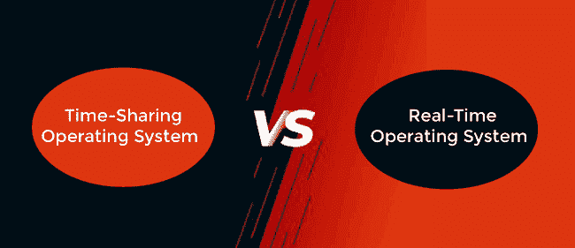

# 分时操作系统和实时操作系统的区别

> 原文：<https://www.javatpoint.com/time-sharing-vs-real-time-operating-system>

分时操作系统和实时操作系统是两种类型的操作系统，可以通过各种方式加以区分。分时操作系统主要执行一般任务，而实时操作系统执行特定任务。这些操作系统之间的主要区别在于分时操作系统侧重于对子请求提供快速响应。另一方面，实时操作系统(RTOS)专注于及时执行任务。

在本文中，您将了解分时和实时操作系统之间的区别。但是在讨论差异之前，您需要了解分时和实时操作系统。

## 什么是分时操作系统？

分时操作系统允许几个用户同时从不同的位置使用计算机系统。操作系统是在用户和系统硬件之间建立连接的程序。分时操作系统建立在多道程序设计概念的基础上，在这种概念中，多个作业通过不断地在它们之间切换来同时完成。它的切换速度极快，允许用户与每个程序交互，因为它无需共享系统即可运行。

分时系统使用交互式计算机系统来允许用户和系统之间的直接交互。术语**‘交互’**是指用户通过输入设备对系统或程序的直接指令。系统将在输出设备上显示结果。结果生成得更快，响应时间必须短于一秒。

分时操作系统允许几个用户同时共享计算机资源。因为分时系统中的每个命令或操作都很短，所以每个用户占用的 CPU 时间更少。分时操作系统使用战略性的中央处理器调度和多道程序设计为每个用户提供一个小型分时系统。在执行过程中，每个用户至少与内存中的一个独立程序进行交互，称为**过程。**

### 分时操作系统的优缺点

分时操作系统有各种各样的优点和缺点。这些措施如下:

**优势**

分时操作系统有许多优点。其中一些如下:

1.  有助于减少 CPU 空闲时间。
2.  它提供了快速响应的好处。
3.  它避免了软件的重复。
4.  每份工作都有平等的机会。

**缺点**

分时操作系统有各种缺点。其中一些如下:

1.  数据通信发生在分时操作系统中。
2.  它有可靠性的问题。

## 什么是实时操作系统？

实时操作系统是一种为实时应用程序服务的操作系统，这些应用程序在数据到达时处理数据。它在特定的时间内完成一项任务。计算的逻辑结果和产生结果所需的时间决定了系统输出的正确性。它包括实时任务调度的方法。它主要用于嵌入式系统。对于在特定时间限制内执行的计时应用程序或活动，它非常有用。它使用严格的时间限制来驱动外部环境中的任务执行。

实时操作系统需要准确的结果和及时的结果，这意味着结果必须在一定的时间限制内产生，否则系统将失败。它主要用于控制设备应用，如汽车发动机燃油喷射系统、工业控制系统、武器系统、医学成像系统等。

### 实时操作系统的优缺点

实时操作系统有各种各样的优点和缺点。这些措施如下:

**优势**

实时操作系统有许多优点。其中一些如下:

1.  实时操作系统从一个任务转移到另一个任务通常需要更少的时间。任务通常在 3 微秒或更短的时间内切换。这种类型的快速任务管理可确保关键流程按时执行。
2.  RTOS 是一个全天候可用的系统，因为它能产生最大的效果。因此，它适用于必须一直运行的应用程序。除此之外，一个 RTOS 系统可以支持不同的单片机系统。
3.  实时操作系统，尤其是那些基于硬 RTOS 的系统，是完全没有错误的。它确保以更有效的方式处理错误。此外，操作系统会遇到抖动问题，这是一个测量循环之间错误数量的问题。一个正确编程的 RTOS 可以优化，使其遭受较少的抖动。
4.  RTOS 确保系统消耗更多资源，同时保持所有设备活动。因此，使用 RTOS 的系统几乎不会停机。此外，托管公司在使用 RTOS 时也要展示出最大的效果。
5.  实时操作系统一次只关注一个应用程序。这个应用程序通常是已经在执行的应用程序。队列中的所有其他人将以等待模式等待。因此，关键任务可能会在规定的期限内按时完成，以达到所需的确切结果。

**缺点**

实时操作系统有各种各样的缺点。其中一些如下:

1.  实时操作系统不断经历信号中断。因此，为了获得一致的速度，必须将所需的驱动程序加载到计算机上。在司机的帮助下，只要中断发生，RTOS 就能迅速做出反应。
2.  如前所述，RTOS 一次只关注一个应用程序。它用于保持准确性和减少误差。所有其他低优先级应用程序都需要等待。
3.  虽然实时操作系统(RTOS)可以专注于特定的应用程序，但它与多任务处理不同。它们只是为了运行某些任务而设计的。
4.  使用实时操作系统时，经常会遇到程序崩溃。与常规操作系统不同，RTOS 可能无法有效分离内存域。因此，流程在解决这些问题时会遇到问题。
5.  复杂的算法隐藏在 RTOS 接口的背后。对于一个典型的用户来说，这些算法很难编写。只有专业的开发人员才能编写和理解它们。

## 分时操作系统和实时操作系统的主要区别

在这里，您将了解分时和实时操作系统之间的主要区别。这些差异如下:

1.  用户必须在实时操作系统中的特定时间范围内收到响应；否则，系统可能会出现故障。相比之下，在分时操作系统中，响应产生得非常快，几乎不需要几分之一秒。如果反应错过了时间，结果不会是灾难性的。
2.  许多用户在分时操作系统中共享计算机资源，而外部事件在实时系统中的处理是有限度的。
3.  实时处理只涉及一个应用程序。相比之下，分时处理必须处理广泛的应用。
4.  在实时操作系统的情况下，不会发生切换。另一方面，分时操作系统使用上下文切换将 CPU 从一个进程切换到另一个进程。
5.  在 RTOS，计算任务在特定的时间内完成，而在分时操作系统中，重点是快速响应请求。

## 分时操作系统和实时操作系统的直接区别

在这里，您将了解分时和实时操作系统之间的直接差异。其中一些如下:

| 特征 | 分时 | 实时操作系统 |
| **定义** | 分时系统允许几个用户同时从不同的位置使用一个计算机系统。 | 实时操作系统在特定时间内完成任务。 |
| **计算机资源** | 用户可以在用户之间共享资源。 | 在重新分配给另一个进程之前，资源在固定的时间内分配给一个进程。 |
| **切换** | 切换方法/功能可用。 | 切换方法/功能不可用。 |
| **修改程序** | 程序中的任何修改都是可能的。 | 程序中可能无法进行任何修改。 |
| **回应** | 响应在秒内生成。 | 用户必须在指定的时间限制内获得响应。 |
| **流程交易** | 它同时运行多个应用程序。 | 它只同时运行一个应用程序。 |
| **基础** | 它的重点是快速响应请求。 | 它侧重于在截止日期前完成一项计算机任务。 |

## 结论

分时操作系统允许多个用户通过在计算机系统之间切换中央处理器来同时与计算机系统交互。相比之下，实时操作系统更有可能一次完成单个任务并按时交付服务。

* * *