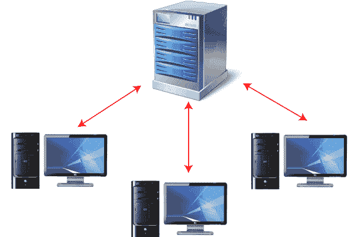

# 多用户操作系统

> 原文：<https://www.javatpoint.com/multi-user-operating-system>

在本文中，您将了解多用户操作系统、类型及其优缺点。

## 什么是多用户操作系统？

多用户操作系统是一种允许几个用户访问运行在单个操作系统上的单个系统的操作系统。这些系统通常非常复杂，它们必须管理连接到它们的各种用户所需的任务。用户通常会坐在通过网络和其他系统机器(如打印机)连接到系统的终端或计算机上。多用户操作系统不同于连接的单用户操作系统，因为每个用户从不同的机器访问相同的操作系统。

开发多用户操作系统的主要目标是将其用于大型机系统上的分时和批处理。这种多用户操作系统现在经常用于大型组织、政府部门、大型大学等教育机构，以及服务器端，如 Ubuntu 服务器或视窗服务器。这些服务器允许多个用户同时访问操作系统、内核和硬件。

它通常负责处理内存和其他运行程序的处理，识别和使用系统硬件，并有效地处理用户交互和数据请求。这对一个操作系统，一个多用户操作系统来说尤其重要，因为几个用户同时依赖这个系统正常运行。

## 多用户操作系统的组件

多用户操作系统有各种组件。其中一些如下:

### 记忆

系统内部的物理内存是存储发生的地方。也称为**随机存取存储器(RAM)。**系统可以校正主存储器中存在的数据。所以，每个被执行的程序都应该像硬盘一样从物理存储器中拷贝。主内存被确定为操作系统的重要组成部分，因为它指定了可以同时执行多少个程序。

### 核心

多用户操作系统使用内核组件，它是用低级语言构建的。该组件嵌入在计算机系统的主存储器中，可以直接与系统的硬件交互

### 处理器

计算机的中央处理器有时被称为计算机的大脑。在大型机器中，中央处理器需要更多的集成电路。在较小的计算机上，中央处理器被映射在一个被称为微处理器的芯片上。

### 用户界面

用户界面是用户与所有软件和硬件进程之间的交互方式。它使用户能够以简单的方式与计算机系统交互。

### 设备处理器

每个输入和输出设备都需要它的设备处理器。设备处理程序的主要目标是提供整个设备请求队列池中的所有请求。设备处理程序以连续循环模式运行，首先从队列端丢弃输入/输出请求块。

### 筒子车

假脱机程序代表**“同时在线外设输出”。**假脱机程序运行所有计算机进程，并同时输出结果。假脱机被各种输出设备使用，包括打印机。

## 多用户操作系统的类型

有各种类型的多用户操作系统。其中一些如下:

### 分布式的计算机系统

分布式系统也称为分布式计算。它是分布在多台计算机上的多个组件的集合，这些组件相互作用、协调，对最终用户来说就像一个连贯的系统。在网络的帮助下，最终用户将能够与它们交互或操作它们。

### 时间分片系统

在这个系统中，每个用户的工作都有特定的 CPU 时间。换句话说，每项工作都被分配到一个特定的时间段。这些时间片对用户来说太小了。称为“调度程序”的内部组件决定运行下一个作业。该调度程序根据优先级周期确定并执行必须执行的作业。

### 多处理机系统

该系统使用多个处理器，有助于提高整体性能。如果该系统中的一个处理器出现故障，另一个处理器负责完成其分配的任务。

## 如何使用多用户操作系统？

单主系统包含在多用户系统中。所有网络用户可以随时随地访问主系统，并打开其本地版本的系统。本地版本也被称为“工作模型”。所有用户都可以在他们的本地工作模型上更新、删除和创建新文件，但是该模型在保存到主系统之前对其他用户不可用。

## 多用户操作系统的特点

多用户操作系统有多种特征。其中一些如下:

### 资源共享

多用户操作系统中可以共享多种设备，如打印机、传真机、绘图仪和硬盘。用户可以使用此功能共享他们自己的文档。在这个系统下，所有用户都有一小部分 CPU 时间。

### 多任务处理

多用户操作系统可以同时执行几个任务，几个程序也可以同时执行。

### 后台处理

后台处理是一个术语，指的是命令不被处理而是“在后台”执行。通常，其他程序与系统实时交互。

### 分时

多用户操作系统使用的一种策略，通过在很短的时间内切换作业来同时处理多个用户请求。

### 系统

操作系统必须处理计算机硬件和软件资源的组合。

### 看不见

多用户操作系统的各种功能对用户是隐藏的。这是由于操作系统是本能的或发生在低端的因素，如磁盘格式化等。

## 多用户操作系统示例

多用户操作系统有各种各样的例子。其中一些如下:

### Unix 操作系统

面向中小型商业计算系统的高度可靠的开放系统架构。因为它基于开放系统架构，包括 AIX、Solaris，甚至 Mac OS 在内的科技巨头都有自己的 Unix 版本。例如，酒店业、医疗保健等。

### 多重虚拟存储

IBM 开发了一个用于大型机系统的操作系统。它通常用于需要高强度输入/输出的企业计算。例如银行、保险、航空业务等。

### 共享计算

多用户操作系统是一种操作支持大多数网络邮件应用程序的服务器的软件。典型的 webmail 应用程序可能需要使用数百台计算机。每一个都运行一个能够同时支持不同用户的多用户操作系统。因为这些系统有数百万(如果不是数十亿)用户不断登录来检查他们的消息，所以他们需要能够同时处理大量用户的操作系统。

## 多用户操作系统的优缺点

多用户操作系统有各种优点和缺点。这些措施如下:

### 优势

多用户操作系统有各种优点。一些优点如下:

1.  在打印过程中可以使用多用户操作系统，以允许多个用户访问同一台打印机，而普通操作系统可能无法做到这一点。
2.  在单个计算机系统上，几个用户可以访问同一份文档。例如，如果一个 PPT 文件保存在一台计算机上，其他用户可以在其他系统上看到它。
3.  多用户操作系统在办公室和图书馆非常有用，因为它们可以有效地处理打印作业。
4.  如果一台计算机在自己的网络系统中出现故障，整个系统不会停止运行。
5.  航空公司在某些功能上使用多用户操作系统。
6.  订票系统使用多用户操作系统。
7.  每个用户都可以在自己的计算机上访问相同的文档。

## 多用户操作系统的缺点

多用户操作系统有各种缺点。一些缺点如下:

1.  随着计算机的共享，病毒攻击会同时在所有计算机上发生。因此，如果一台机器受到影响，其他机器也会受到影响。
2.  如果病毒攻击一台计算机，它会同时传播到整个网络系统，最后，所有的计算机系统都会出现故障。
3.  所有计算机信息都是公开共享的，网络上的每个人都可以访问您的个人信息。
4.  一台计算机上的多个帐户可能不适合所有用户。因此，每个用户最好有多台电脑。

* * *