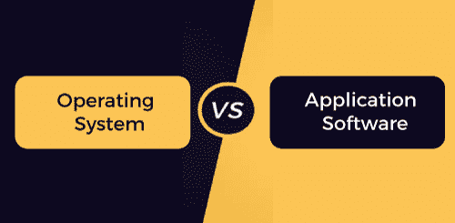

# 操作系统和应用软件的区别

> 原文：<https://www.javatpoint.com/operating-system-vs-application-software>

在本文中，您将了解**操作系统**和**应用软件**之间的区别。但是在讨论差异之前，您需要了解操作系统和应用软件。

## 什么是操作系统？

一个[操作系统](https://www.javatpoint.com/os-tutorial)作为**用户**和**系统硬件**之间的接口。它负责计算机系统的所有功能。它还负责处理软件和硬件组件，并保持设备正常工作。所有计算机程序和应用程序都需要一个操作系统来执行任何任务。

用户是最常见的操作系统组件，通过输入数据和运行几个应用程序和服务来控制和制造东西。接下来是实现任务，它管理计算机的所有操作，并帮助移动各种功能，包括照片、视频、工作表等。操作系统通过适当的编程提供了帮助应用程序和实用程序运行的工具。

操作系统执行基本活动，如识别键盘输入，然后显示输出。它还跟踪磁盘上的目录和活动文件。它充当控制器，确保不同的程序和用户保持登录在计算机上，并且不会发生冲突。它提供了安全性和安全性，并允许用户毫无困难地访问系统。操作系统的一些例子有**微软视窗、iOS、Linux** 和 **Ubuntu** 。

### 操作系统的优缺点

操作系统有各种各样的优点和缺点。这些措施如下:

**优势**

操作系统有各种各样的优点。其中一些如下:

1.  操作系统充当用户和计算机硬件之间的接口。它允许用户输入数据、处理和访问结果。此外，用户可以通过操作系统与计算机接口，以执行各种功能，如算术计算和其他重要任务。
2.  操作系统为所有客户端提供了用户友好的图形界面，因为它为简单的路线提供了不同的菜单、符号、捕捉等。
3.  操作系统允许通过传真机、打印机和调制解调器与其他用户共享数据和相关信息。此外，单个用户可以通过电子邮件与多个用户同时传输相同的数据。此外，许多应用程序、照片和媒体文件可以使用操作系统从一台电脑移动到另一台设备。
4.  一个操作系统可以同时管理多个作业。它使用户能够同时执行几项任务。

**操作系统的缺点**

操作系统有各种缺点。其中一些如下:

1.  使用 TLB 需要改进。
2.  需要内部骨折。
3.  操作系统极其复杂，用来创建它们的语言不清楚，定义也不明确。此外，如果操作系统出现用户无法直接理解的问题，则无法快速纠正。
4.  操作系统威胁更高，因为它们更容易受到病毒攻击。许多用户在他们的系统上安装恶意软件包，这将停止操作系统的运行并使其变慢。
5.  如果中央操作系统出现故障，整个系统都会出现故障，系统不会执行任何任务。此外，操作系统是计算机系统的大脑，没有它就无法运行。如果中央系统出现故障，所有通信都将中断，无法进行进一步的数据处理。

## 什么是应用软件？

应用软件是一种设计用于完成特定任务的软件。它是一种根据用户请求运行或执行的软件形式。它执行单一任务。这些软件应用程序是专门为解决某些问题而开发的，如文档创建、图像编辑、计算等。应用软件采用高级语言编写，如**[【Java】](https://www.javatpoint.com/java-tutorial)[【C】](https://www.javatpoint.com/c-programming-language-tutorial)**[**c++**](https://www.javatpoint.com/cpp-tutorial)。没有操作系统就无法安装。应用软件的例子有 [VLC](https://www.javatpoint.com/vlc-full-form) 媒体播放器、[谷歌 Chrome](https://www.javatpoint.com/what-is-google-chrome) 、 [Adobe Photoshop](https://www.javatpoint.com/photoshop) 、 [Mozilla Firefox](https://www.javatpoint.com/mozilla-firefox) 、Opera 等。

### 应用软件的优缺点

应用软件有各种各样的优点和缺点。这些措施如下:

**优势**

应用软件有各种各样的优点。其中一些如下:

1.  工程师对许可应用程序编程的标准升级只是为了健康。此外，工程师定期派遣教员解决可能出现的任何问题。
2.  他们唯一最大的优势是他们精确地满足了用户的需求。因为它们是为了特定的目的而开发的，所以用户知道他必须只使用一个软件来完成他的任务。
3.  它节省了业务时间和金钱，因为它消除了员工开发、编写和测试程序的需要。
4.  伴随 it 的企业可能会限制访问，并可能会考虑另外监控其组织的计划。

**应用软件的缺点**

应用软件有各种各样的缺点。其中一些如下:

1.  对于开发人员来说，为特定目的开发应用软件的成本相当高。这可能会对他们的预算和收入流产生影响，尤其是如果花费太多时间构建通常不可接受的软件。
2.  创建它们是一个花费大量时间的过程，因为它需要开发人员和支持者之间的持续接触。
3.  我们中的许多人经常使用应用程序编程，然后在网络上共享，这确实存在被 bug 或其他恶意项目感染的风险。
4.  某些为特定业务设计的软件可能与其他通用应用程序不兼容。这可能是许多组织的巨大绊脚石。

## 操作系统和应用软件之间的主要区别

操作系统和应用软件之间有各种主要区别。其中一些如下:

1.  操作系统充当用户和系统硬件之间的接口。它还处理内存管理、硬件设备控制、任务调度、进程管理和各种其他任务。相比之下，应用软件专注于特定的任务。
2.  Picasa 是应用软件的最好例子，因为它可以打开各种文件格式的图像。另一方面，微软视窗系统是操作系统的最好例子，它有助于系统的运行。
3.  计算机上不存在应用软件。必须通过互联网下载。另一方面，因为操作系统是计算机的重要组成部分，所以通常是预先安装的。
4.  除非操作系统的原始版本已经包含在设备中，否则用户可能需要付费才能获得该版本。另一方面，应用软件有免费和付费两种版本，每个版本都有自己的一套选项。
5.  一些最流行的操作系统是微软、Ubuntu 和 Linux。另一方面，WhatsApp、Instagram 和 Viber 是一些最受欢迎的应用软件。
6.  人们可以使用应用软件来做世界其他地方看不到的事情。另一方面，操作系统有助于操作计算机和执行基本任务。
7.  操作系统比应用软件贵得多。
8.  操作系统通常用 C、C++或汇编语言编写。应用软件可以用不同的语言编写，包括 Java、Visual Basic、C 和 C++。

## 操作系统和应用软件之间的直接比较

操作系统和应用软件之间有各种面对面的比较。其中一些如下:

| 特征 | 操作系统 | 应用软件 |
| **定义** | 它充当用户和系统硬件之间的接口。 | 它是一种为完成某一组任务而创建的软件。它是一种根据用户请求运行或执行的软件形式。 |
| **语言** | 操作系统通常用 C、C++或汇编语言编写。 | 应用软件可以用不同的语言编写，包括 Java、Visual Basic、C 和 C++。 |
| **安装** | 购买设备时，它已预装在系统中。 | 它可以在网上购买和下载。然后使用安装包来完成安装。 |
| **运行时间** | 它在用户打开计算机时开始(引导)，在用户关闭计算机时结束(关闭)。 | 当需要完成特定任务时，用户会打开它。任务的持续时间决定了任务的执行时间。 |
| **重要性** | 这很重要，因为没有操作系统，计算机就无法运行。 | 它不如操作系统重要。没有正常工作的操作系统是不可能使用它的。 |
| **工作** | 它成为计算机的重要组成部分，因此通常是预先安装的。 | 它不存在于计算机上，必须从互联网上下载。 |
| **功能** | 它让用户可以选择做额外的事情，同时置身于外部世界。 | 它帮助计算机运行并执行基本任务。 |
| **目标** | 有效管理硬件资源。 | 应用软件的首要目标是完成某项任务。 |
| **示例** | Windows、Linux、NOS、DOS、Unix 等。 | VLC 媒体播放器，Picasa 照片查看器，WhatsApp。 |

## 结论

操作系统是充当用户和硬件之间接口的系统软件，而应用软件是执行特定任务的程序。在没有操作系统的计算机系统上安装应用软件是不可能的。

* * *