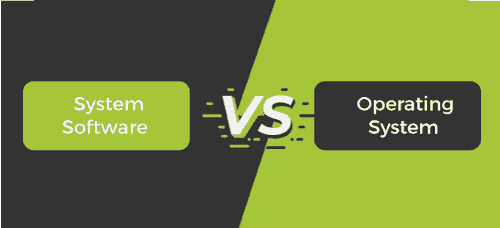

# 系统软件和操作系统的区别

> 原文：<https://www.javatpoint.com/system-software-vs-operating-system>

在本文中，您将了解**系统软件**和**操作系统**的区别。但是在讨论差异之前，您需要了解系统软件和操作系统。

## 什么是系统软件？

系统软件是管理资源并允许用户与系统交互的软件。它主要通过操作系统控制计算机的内部工作。它还管理外围设备，包括打印机、存储设备和显示器。

构成计算机操作系统的数据和程序被称为系统软件。打印机、硬件驱动程序、函数库、系统服务、系统首选项和其他配置文件都包含在系统文件中。系统软件程序的例子有文件管理工具、系统实用程序、汇编程序、调试器和编译器。

当您在计算机上安装操作系统时，系统软件就安装好了。您也可以通过对 **Windows** 执行**【Windows Update】**，对 **Mac OS X** 执行**【软件更新】**等程序来更新软件。

### 系统软件的优缺点

系统软件有各种各样的优点和缺点。这些措施如下:

**优势**

系统软件有各种各样的优点。其中一些如下:

1.  它应该用中央处理器和其他计算机硬件可以读取的计算机语言编写。
2.  它应该与专用硬件和高级应用软件接口。它通常与硬件无关，并且与它工作的硬件没有直接联系。其他依赖系统软件的程序也必须随着它们的发展和变化而得到支持。
3.  它直接连接到允许系统运行的硬件。
4.  它通常需要一种编程语言，这比更直观的用户界面更难学。

**缺点**

系统软件有各种各样的缺点。其中一些如下:

1.  系统软件开发人员必须对低级语言和机器活动有全面的了解。
2.  它不能满足用户的所有要求。
3.  系统软件开发和更新需要更长的时间。
4.  如果你选择一个有许可和信誉的组织的系统软件，它会更贵。

## 什么是操作系统？

一个[操作系统](https://www.javatpoint.com/os-tutorial)作为**用户**和**系统硬件**之间的接口。它负责计算机系统的所有功能。它还负责处理软件和硬件组件，并保持设备正常工作。所有计算机程序和应用程序都需要一个操作系统来执行任何任务。

用户是最常见的操作系统组件，通过输入数据和运行几个应用程序和服务来控制和制造东西。接下来是实现任务，它管理计算机的所有操作，并帮助移动各种功能，包括照片、视频、工作表等。操作系统通过适当的编程提供了帮助应用程序和实用程序运行的工具。它提供了安全性和安全性，并允许用户毫无困难地访问系统。操作系统的一些例子有**微软视窗、iOS、Linux** 和 **Ubuntu** 。

### 操作系统的优缺点

操作系统有各种各样的优点和缺点。这些措施如下:

**优势**

操作系统有各种各样的优点。其中一些如下:

1.  操作系统充当用户和计算机硬件之间的接口。它允许用户输入数据、处理和访问结果。此外，用户可以通过操作系统与计算机接口，以执行各种功能，如算术计算和其他重要任务。
2.  操作系统为所有客户端提供了用户友好的图形界面，因为它为简单的路线提供了不同的菜单、符号、捕捉等。
3.  一个操作系统可以同时管理多个作业。它使用户能够同时执行多个任务。
4.  操作系统允许通过传真机、打印机和调制解调器与其他用户共享数据和相关信息。此外，单个用户可以通过电子邮件与多个用户同时传输相同的数据。此外，许多应用程序、照片和媒体文件可以使用操作系统从一台电脑移动到另一台设备。

**操作系统的缺点**

操作系统有各种各样的缺点。其中一些如下:

1.  使用 TLB 需要改进。
2.  需要内部骨折。
3.  操作系统极其复杂，用来创建它们的语言不清楚，定义也不明确。此外，如果操作系统出现用户无法直接理解的问题，则无法快速纠正。
4.  如果中央操作系统出现故障，整个系统都会出现故障，系统不会执行任何任务。
5.  操作系统威胁更高，因为它们更容易受到病毒攻击。

## 系统软件和操作系统之间的直接差异

在这里，您将了解系统软件和操作系统之间的直接区别。其中一些如下:

| 特征 | 系统软件 | 操作系统 |
| **定义** | 系统软件是管理资源并允许用户与系统交互的软件。 | 操作系统充当用户和计算机硬件之间的接口。 |
| **记忆** | 只要需要，它就会加载到主内存中。 | 当系统开启时，它一直驻留在主存储器中。 |
| **内存管理** | 它管理系统。 | 它管理系统和系统软件。 |
| **执行** | 它仅在需要时运行。 | 它一直在运行。 |
| **示例** | 系统软件的一些例子有 mac OS、安卓、微软 windows。 | 操作系统的一些例子有视窗、OS X 和 Linux。 |

## 结论

系统软件是管理资源并允许用户与系统交互的软件。另一方面，操作系统收集协调计算机硬件设备之间所有活动的程序。

* * *