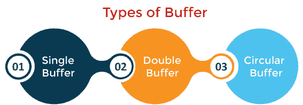
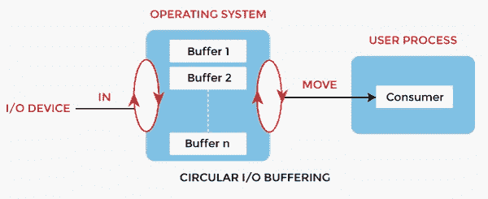

# 操作系统中的缓冲

> 原文：<https://www.javatpoint.com/buffering-in-operating-system>

***缓冲区*** 是**主存储器**中用于暂时存储或保存数据**的区域。换句话说，缓冲区临时存储从一个地方传输到另一个地方的数据，无论是在两个设备之间还是在一个应用程序之间。将数据临时存储在缓冲器中的行为称为 ***缓冲*** 。**

 **当在计算机内的进程之间移动数据时，可以使用缓冲区。缓冲区可以在硬件的固定存储位置实现，也可以在软件中使用虚拟数据缓冲区，指向物理内存中的某个位置。在所有情况下，数据缓冲器中的数据都存储在物理存储介质上。

大多数缓冲区是在软件中实现的，由于访问时间比硬盘驱动器快得多，软件通常使用更快的内存来存储临时数据。当接收数据速率和处理数据速率之间存在差异时，通常使用缓冲区，例如在打印机假脱机程序或在线视频流中。

缓冲区通常通过在内存中实现队列或先进先出算法来调整时序，同时以一种速率将数据写入队列，并以另一种速率读取数据。

### 缓冲的目的

在 YouTube 上观看视频或直播流时，您会面临缓冲。在视频流中，缓冲区表示视频可以实时播放给观众之前需要下载的数据量。计算机环境中的缓冲区意味着在中央处理器使用所需数据之前，将存储一定数量的数据来预加载所需数据。

计算机有许多不同的设备以不同的速度运行，需要一个缓冲区作为所有交互的临时占位符。这样做是为了让一切都高效运行，并且当时运行的所有设备、程序和进程之间没有问题。数据缓冲背后有三个原因，

1.  它有助于在传输数据的两个设备之间匹配速度*。例如，硬盘必须存储从调制解调器接收的文件。众所周知，与硬盘相比，调制解调器的传输速度较慢。因此，来自调制解调器的字节会累积在缓冲空间中，当文件的所有字节都到达缓冲区时，整个数据会在一次操作中写入硬盘。*
**   它帮助数据传输大小不同的设备相互适应。它帮助设备在发送或接收数据之前处理数据。在计算机网络中，大的信息被分割成小的片段并通过网络发送。这些片段在接收端的缓冲区中累积，并重新组合以形成完整的大消息。*   它还支持 ***复制语义*** 。使用复制语义，缓冲区中的数据版本保证是系统调用时的数据版本，而与缓冲区中数据的任何后续更改无关。缓冲提高了设备的性能。它将一个作业的输入/输出与同一作业的计算重叠。*

 *### 缓冲的类型

操作系统中有三种主要的缓冲类型，例如:

**1。单缓冲**

在单一缓冲中，只有一个缓冲器用于在两个设备之间传输数据。生产者将一个数据块放入缓冲区。之后，消费者消耗缓冲区。只有当缓冲区为空时，处理器才再次产生数据。

**面向块的设备:**在面向块的设备中执行以下操作，

*   系统缓冲区接受输入。
*   接受输入后，该块被转移到用户空间，然后请求另一个块。
*   两个块同时工作。当用户处理一个数据块时，下一个数据块将被读入。
*   操作系统可以交换进程。
*   操作系统可以将系统缓冲区的数据记录到用户进程中。

**面向流的设备:**它执行以下操作，例如:

*   ***线***-一次操作用于滚动制作终端。用户一次输入一行，在一行的末尾有一个回车。
*   ***字节***-一次操作用于表单模式，终端每次击键都有意义。

**2。双缓冲**

在**双缓冲**中，用两个方案或两个缓冲器代替一个。在这种缓冲中，生产者产生一个缓冲区，而消费者同时消耗另一个缓冲区。因此，生产者不需要等待填充缓冲区。双缓冲也称为缓冲交换。

**面向块:**这就是双缓冲区的工作原理。系统中有两个缓冲区。

*   驱动程序或控制器使用一个缓冲区来存储数据，同时等待它被更高的层次级别获取。
*   另一个缓冲区用于存储来自低级模块的数据。
*   双缓冲的一个主要缺点是过程的复杂性增加了。
*   如果进程执行输入/输出的快速突发，那么使用双缓冲可能会有缺陷。

**面向流:**它执行这些操作，例如:

*   ***行*** -一次 I/O，用户进程不需要暂停输入或输出，除非进程在双缓冲区之前运行。
*   ***字节*** -在时间操作中，双缓冲区与两倍长度的单缓冲区相比没有优势。

**3。循环缓冲**

当使用两个以上的缓冲区时，缓冲区的集合称为**循环缓冲区**。每个缓冲区是循环缓冲区中的一个单元。使用循环缓冲区而不是双缓冲区，数据传输速率将会提高。

*   在这种情况下，数据不会直接从生产者传递到消费者，因为数据在消费之前会因缓冲区的覆盖而改变。
*   当缓冲区 x 中的数据等待被使用时，生产者只能填满缓冲区 x-1。

### 缓冲是如何工作的

在操作系统中，缓冲区的工作方式如下:

*   缓冲是为了有效地处理数据流的生产者和消费者之间的速度不匹配。
*   主内存中会产生一个缓冲区，用于堆积从调制解调器接收的字节。
*   在接收到缓冲区中的数据后，数据在一次操作中从缓冲区传输到磁盘。
*   这个数据传输过程不是瞬间的。因此，调制解调器需要另一个缓冲区来存储额外的输入数据。
*   当第一个缓冲区被填满时，就会请求将数据传输到磁盘。
*   然后，当第一个缓冲区中的数据传输到磁盘时，调制解调器将附加的输入数据填充到第二个缓冲区中。
*   当两个缓冲区都完成任务时，调制解调器切换回第一个缓冲区，同时第二个缓冲区的数据传输到磁盘。
*   两个缓冲区分解了生产者和数据消费者，从而最小化了他们之间的时间要求。
*   缓冲还为具有不同数据传输大小的设备提供了变化。

### 缓冲区的优势

在任何进程或任务执行期间，缓冲在任何操作系统中都起着非常重要的作用。它有以下优点。

*   缓冲区的使用允许统一的磁盘访问。它简化了系统设计。
*   该系统对进行输入/输出的用户进程没有数据对齐限制。通过将数据从用户缓冲区复制到系统缓冲区，反之亦然，内核消除了对用户缓冲区特殊对齐的需要，使用户程序更简单、更可移植。
*   使用缓冲区可以减少磁盘流量，从而提高整体系统吞吐量并缩短响应时间。
*   缓冲算法有助于确保文件系统的完整性。

### 缓冲区的缺点

缓冲并不是在所有方面都更好。因此，存在以下几个缺点，例如:

*   让缓冲区具有容纳元素数量所需的精确大小既昂贵又不切实际。因此，缓冲区在大部分时间稍微大一点，剩余的空间被浪费了。
*   缓冲区在任何时间点都有固定的大小。当缓冲区已满时，必须以更大的大小重新分配它，并且必须移动它的元素。同样，当缓冲区中有效元素的数量明显小于其大小时，必须以较小的大小重新分配缓冲区，并移动元素以避免过多的浪费。
*   在读写用户进程时，使用缓冲区需要额外的数据拷贝。当传输大量数据时，额外的拷贝会降低性能。

* * ****