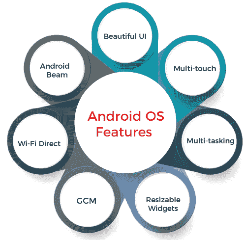

# 安卓和视窗操作系统的区别

> 原文：<https://www.javatpoint.com/android-vs-windows-os>

安卓和视窗都是兼容不同智能手机和平板电脑的最佳操作系统。这两种操作系统都有来自世界各地的数百万用户，并且具有彼此不同的特性和规格表。

安卓由 ***谷歌*** 开发分发，Windows 由 ***微软*** 开发分发。从一开始，安卓手机就因为价格便宜而在市场上非常普遍，许多公司都在推广安卓设备。安卓操作系统是免费的，而视窗操作系统是封闭源码的。

Windows Phone 的制造商数量有限，大多数设备的成本都要高得多。Windows 操作系统的主要缺点是更新仅由微软提供，并且 Windows 操作系统的应用程序有限。安卓操作系统从不同的方面获得更新，与视窗操作系统相比，有这么多安卓应用可用。

该操作系统的最新版本是适用于基于 Windows 的智能手机的 Windows 8.1，而适用于基于 Android 的智能手机的 Android 4.4 Kitkat。视窗智能手机提供了一个实时切片类型的界面。如果我们拿安卓和 Windows Phone 8.0 做对比，应该会有很大的区别。但是如果我们把安卓和 Windows Phone 8.1 对比，它就变成了一个强大的对手。安卓和 Windows 操作系统在以下几个方面是相似的，比如:

*   安卓和 Windows CE 都支持多语言支持。
*   安卓和视窗操作系统都允许电子邮件服务、网络服务、远程登录。
*   安卓和 Windows CE 都允许备用键盘，备用键盘支持多种键盘，安装方便。

## Android 操作系统

安卓是一个开源平台，为不同的设备设计，尤其是平板电脑、智能手机和手表。它基于 Linux 内核和其他开源软件的修改版本。

这个操作系统是由一个叫做 ***开放手机联盟*** 的开发者开发的，后来被 ***谷歌*** 公司拥有。安卓是最强大的操作系统，支持数百万个应用和游戏。它是用 C、Java、C++等语言开发的。谷歌在 2008 年推出了第一个安卓版本，最新稳定的安卓版本是安卓 10。完全免费提供。

一些特定的开发人员不像其他操作系统那样操作它。尽管如此，它仍然是一个开源特性，允许来自世界各地的开发者开发。与其他操作系统相比，安卓操作系统易于使用，并得到全球大多数设备的支持。谷歌 Play 商店免费为您提供数百万个应用程序和游戏。

### 安卓操作系统的特点

商店中可用的应用程序数量是它的一个吸引人的特性，并且能够进行额外的活动，如生根，也使它更有吸引力。像 Flash Transfer 这样的应用对于在安卓系统中发送不同类型的文件非常有帮助。低端安卓设备的主要问题是在执行多个任务时性能不佳。以下是安卓操作系统的更多功能:

*   **美观 UI:** 安卓 OS 基础屏提供了美观直观的用户界面。
*   **多点触控:**安卓原生支持多点触控，最初在 HTC Hero 等手机上提供。
*   **多任务:**用户可以从一个任务跳转到另一个任务，各种应用可以同时运行。
*   **可调整大小的小部件:**小部件是可以调整大小的，因此用户可以扩展它们以显示更多的内容，或者缩小它们以节省空间。
*   **GCM:** 谷歌云消息(GCM)是一项服务，让开发者在安卓设备上向用户发送短消息数据，而不需要专有的同步解决方案。
*   **Wi-Fi Direct:** 一种让应用程序通过高带宽对等连接直接发现和配对的技术。
*   **Android Beam:** 一种流行的基于 NFC 的技术，用户只需同时触摸两部支持 NFC 的手机，就可以即时分享。

## Windows 操作系统

Windows 是一组由微软公司提供的各种专有图形操作系统。它也被称为 ***微软视窗*** 。它目前包括视窗 NT 和视窗物联网作为其家族成员。早期它包括 Windows 9x、Windows Mobile 和 Windows Phone，这些都已经不再使用了。

它是个人电脑中使用最多的操作系统，这个操作系统也适用于所有 ***智能手机、平板电脑、PC*** ，以及 ***笔记本电脑*** 。与其他操作系统相比，世界各地的大多数用户更喜欢 Windows 操作系统，数百万用户正在使用它们。

微软发布了多达超过 ***15 个不同功能的 Windows 版本*** ，微软在 1985 年推出了第一个 Windows 版本。适用于个人电脑的最新版本的 Windows 是 Windows 10，它提供了无限的功能，并具有最好的安全功能，有助于保护您的重要数据。

此外，它还带有内置的病毒功能，当您从互联网下载可疑文件时，它会提醒您。它的*窗口防御功能允许你保护你的电脑或笔记本电脑免受不需要的软件的攻击。*

 *### 视窗操作系统的特点

Windows Phone 8.1 比 Windows Phone 8.0 具有更好的功能，例如像安卓这样的通知栏、文件管理器可用性、即使在低端设备上也有更好的性能，以及针对恶意软件的更好的安全措施，这些都是 Windows Phone 的一些最佳功能。以下是 Windows 操作系统的一些更有用的功能:

*   **控制面板:** Windows 提供了一个控制面板功能，其中包括许多工具来配置和管理其计算机上的资源。
*   **Cortana:** Windows 10 引入了一个名为 Cortana 的功能，可以接受语音命令。
*   **磁盘清理:**用于在删除临时或不必要文件的帮助下释放磁盘空间。它还有助于提高计算机的性能，增加下载程序和文档的存储空间。
*   **任务管理器:** Windows 包括任务管理器功能，提供计算机上正在运行的应用程序或程序的详细信息。

## 安卓和视窗操作系统的区别

两种操作系统的最佳性能取决于硬件。但是，这两种操作系统仍有许多不同之处，如下所示:

| 条款 | Android 操作系统 | Windows 操作系统 |
| 开发者 | 安卓是由**谷歌有限责任公司**开发和拥有的。 | Windows 由**微软公司**开发并拥有。 |
| 设备 | 安卓是专门为移动设备设计的。 | Windows 是为所有公司的个人电脑设计的。 |
| 默认用户界面 | 安卓有一个图形(多点触控)用户界面。 | 视窗操作系统图形用户界面。 |
| 主屏幕 | 在安卓手机中，主屏幕有背景壁纸，上面有相机、图库、电话、联系人等基本应用。小部件也可以添加到主屏幕。 | 在 windows phone 中，主屏幕是一些基本应用程序的组合，如相机、图库、电话、消息、联系人等。配合
一些其他有用的应用和小部件。 |
| 核心 | 在安卓中，内核类型是基于 Linux 的。 | 在 Windows 中，这里的内核类型是模块混合。 |
| 应用程序 | 安卓是一个开源平台，所以它比 windows 操作系统有更多的应用和游戏。
安卓 OS 自带谷歌 PlayStore，目前已经有超过 220 万个应用和游戏可以与不同的安卓版本配合使用。 | Windows 商店甚至没有为你提供数百万个应用程序。此外，其中一些应用和游戏是免费下载的，而一些是付费的。 |
| 费用 | 安卓应用是免费的。 | Windows 应用程序按原始版本收费。 |
| 安全 | 安卓不是更安全，因为它是一个开源平台。 | 与安卓操作系统相比，视窗操作系统为您提供了更多的安全性。
Windows 商店没有安卓操作系统那么简单。
上传任何应用，用户都需要经过**严格的安全检查**。 |
| 语言 | 安卓操作系统使用 Java、C、C++语言。 | Windows 操作系统使用 C，C++语言。 |
| 支持的平台 | 安卓操作系统支持 ARM、MIPS、x86、I.MX。 | Windows 操作系统仅支持 x86 |
| 根支持 | 所有安卓操作系统都支持根访问。 | 目前，任何 Windows 手机操作系统都不支持根访问。 |
| 设置 | 安卓为不同的应用程序提供了一套清晰的设置，让用户的工作变得更加容易。 | 在 Windows Phone 中，大量的设置让用户感到困惑，用户面临困难。 |
| 键盘 | 用户可以根据自己的用途自定义键盘布局，无论是默认版本还是滑动版本。 | 视窗手机是严格的，因为用户必须使用滑动键盘，用户没有其他选择。 |

* * **