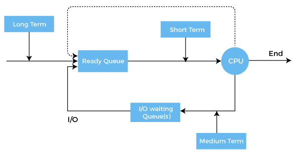
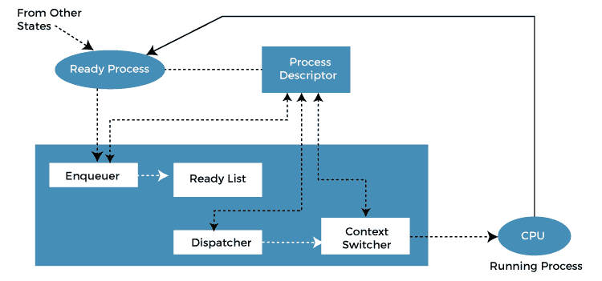

# 调度程序和调度程序之间的区别

> 原文：<https://www.javatpoint.com/scheduler-vs-dispatcher>

调度程序和调度程序与操作系统的进程调度相关联。调度是操作系统决定哪个进程应该分配给中央处理器来执行几个进程的过程。

调度程序和调度程序之间的主要区别在于，调度程序从几个要执行的进程中选择一个进程。相反，调度程序为调度程序选择的进程分配中央处理器。

### 什么是操作系统中的调度程序

调度程序是以各种方式处理进程调度的特殊系统软件。他们的主要任务是选择要提交到系统中的作业，并决定运行哪个进程。操作系统中有三种类型的调度程序。

1.  **长期调度器:**也叫**作业调度器**。长期调度程序确定哪些程序被允许进入系统进行处理。它从队列中选择进程，并将其加载到内存中执行。进程加载到内存中，用于中央处理器调度。
    作业调度器的主要目标是提供平衡的作业组合，例如输入/输出绑定和处理器绑定。它还控制多道程序设计的程度。如果多道程序设计的程度是稳定的，那么进程创建的平均速率必须等于进程离开系统的平均速率。
    在某些系统上，长期调度程序可能不可用或很少，分时操作系统没有长期调度程序。当一个进程从新状态变为就绪状态时，就有了一个长期的调度程序。
2.  **短期调度器:**也叫 **CPU 调度器**。它的主要目标是在选定的一组标准下提高系统性能。它是流程从就绪状态到运行状态的变化。中央处理器调度器从准备执行的进程中选择一个进程，并将中央处理器分配给其中一个进程。
    短期调度程序，也称为调度程序，决定下一步执行哪个进程。短期调度器比长期调度器更快。
3.  **中期调度:**中期调度是**交换**的一部分。它将进程从内存中移除，并降低了多道程序设计的程度。中期调度程序负责处理换出的进程。
    如果一个正在运行的进程发出输入/输出请求，它可能会被挂起，而一个被挂起的进程无法在完成方面取得任何进展。在这种情况下，挂起的进程将被移动到辅助存储，以从内存中删除该进程，并为其他进程腾出空间。这个过程叫做**对换**，这个过程称之为对换出或转出。交换可能是改善流程组合所必需的。

### 操作系统中的调度程序是什么

调度程序是在调度程序之后开始运行的特殊程序。当短期调度程序从就绪队列中选择时，调度程序执行将所选进程分配给中央处理器的任务。正在运行的进程进入等待输入输出操作等状态。，然后将 CPU 分配给其他进程。这种 CPU 从一个进程到另一个进程的切换称为**上下文切换**。

调度程序执行各种任务，包括上下文切换、设置用户寄存器和内存映射。这些是进程执行和将中央处理器控制转移到该进程所必需的。调度时，流程从就绪状态变为运行状态。

调度程序需要尽可能快，因为它在每个上下文切换上都在运行。调度员消耗的时间称为 ***调度等待时间*** 。

有时，调度程序被认为是短期调度程序的一部分，因此整个单元被称为 ***短期调度程序*** 。在这种情况下，短期调度器的任务是从就绪队列中选择一个进程，并为该进程分配 CPU。在操作系统中，调度员有以下职责:

*   **切换到用户模式:**所有的底层操作系统进程都在内核级安全访问上运行，但是所有的应用代码和用户发布的进程都在应用空间或者用户权限模式下运行。调度程序将进程切换到用户模式。
*   **寻址:**程序计数器(PC)寄存器指向下一个要执行的进程。调度员负责处理该地址。
*   **上下文切换的启动:**上下文切换是指当前正在运行的进程暂停，其所有数据及其进程控制块(PCB)都存储在主内存中，另一个进程加载到其位置执行。
*   **管理调度延迟:**调度延迟计算为停止一个进程并启动另一个进程所需的时间。对于相同的硬件配置，调度延迟越低，软件越高效。

#### 注意:调度程序不是线程。Dispatcher 在每个内核上运行，运行一个线程一段时间，保存其状态，加载另一个线程的状态并运行它。

### 调度程序和调度程序示例

假设有四个进程，P1、P2、P3 和 P4，在就绪队列中。它们的到达时间分别是 T1、T2、T3 和 T4。并且在整个过程或任务中使用先进先出(FIFO)调度算法。

进程 P1 首先到达，因此调度程序将决定它是第一个执行的进程，调度程序将从就绪队列中删除 P1，并将其交给中央处理器。

然后，调度程序将确定进程 P2 是下一个应该执行的进程，因此当调度程序返回到新进程的队列中时，它将获取进程 P2 并将其交给中央处理器。P3 进程和 P4 进程也是如此。

### 操作系统中调度程序和调度程序的区别

中央处理器无法同时执行所有驻留在就绪队列中等待执行的进程。因此，操作系统必须根据调度算法来选择特定的进程，调度程序会在各种进程中选择一个进程。

一旦调度程序从队列中选择了一个进程，调度程序就将它从就绪队列中取出，并将其移动到运行状态。因此，调度程序给调度程序一个有序的进程列表，调度程序随时间推移将这些进程移动到中央处理器。

调度程序和调度程序用于操作系统的进程调度，它们都完成相同的进程或任务。尽管如此，调度程序和调度程序之间的区别在于，调度程序从几个要执行的进程中选择一个进程。相反，调度程序为调度程序选择的进程分配中央处理器。在操作系统中，调度程序和调度程序还有一些不同之处，例如:

| 性能 | 调度程序 | 分配器 |
| 定义 | 调度程序是一种特殊的系统软件，通过选择要执行的进程来处理进程调度。 | 调度程序是一个模块，它控制中央处理器执行短期调度程序选择的进程。 |
| 算法 | 调度器工作在各种算法上，如 FCFS、SJF、RR 等。 | Dispatcher 没有实现它的特定算法。 |
| 类型 | 有三种类型的调度程序，如长期、短期、中期。 | Dispatcher 中没有不同的类型，它只是一个代码段。 |
| 属国 | 调度器独立工作，需要时立即工作。 | 调度程序的工作依赖于调度程序，这意味着调度程序必须等待调度程序选择一个进程。 |
| 花费的时间 | 调度程序花费的时间通常可以忽略不计。 | 调度程序花费的时间称为调度延迟。 |
| 功能 | 调度器唯一的工作就是选择进程。 | 调度程序还负责上下文切换，切换到用户模式，并在进程重新启动时跳转到适当的位置。 |
| 任务 | 调度器分三个阶段执行任务，例如:

*   **The long-term scheduler** selects the process from the job queue and brings it to the ready queue.
*   **The short-term scheduler** selects the process in the ready queue.
*   **The media scheduler** performs the swap-in and swap-out process.

 | 调度程序将中央处理器分配给短期调度程序选择的进程。 |

* * *