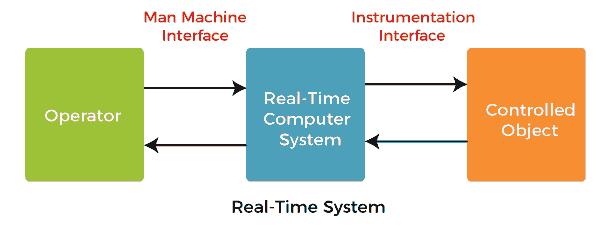
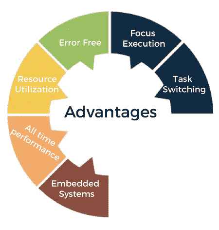
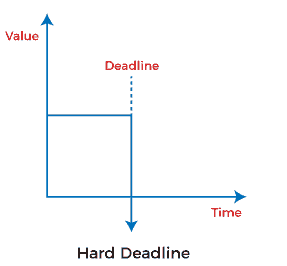
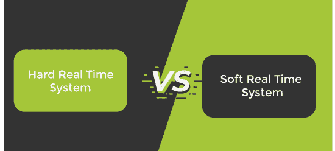

# 软硬实时操作系统

> 原文：<https://www.javatpoint.com/hard-and-soft-real-time-operating-system>

实时操作系统(RTOS)旨在为处理数据而没有缓冲延迟的实时应用程序提供服务。实时系统是一个有时间限制的系统，有明确定义和固定的时间限制，处理必须在定义的限制内完成；否则，系统将失败。在实时操作系统中，处理时间要求以 ***十分之一秒*** 来衡量。

实时系统用于我们要求更高和及时响应的地方。实时操作系统包括一组应用程序，在这些应用程序中，操作被按时执行，以运行外部系统中的活动。它使用时间的定量表达来分析系统的性能。

实时系统中的*截止时间是需要完成工作执行的时刻。大多数实时操作系统使用 ***先发制人的调度*** 算法。*

 *### 实时操作系统的例子

以下是实时操作系统的一些示例，例如:

*   微波炉的操作系统。
*   洗衣机的操作系统。
*   飞机的操作系统。
*   数码相机的操作系统等等。

在实时操作系统中，流程的快速响应是必须的。完成任何过程都不可能有任何延迟，因为一点点延迟会导致几个危险的问题。

### 实时操作系统的优势

**实时操作系统有以下优势，如:**

*   **任务切换:**设计了实时操作系统，使得启动切换是一个非常快速的过程。一个普通的传统操作系统在从一个人切换到另一个进程时需要花费大量时间。实时操作系统仅在几微秒内完成任务切换。
*   **关注执行:**实时操作系统的主要关注点是处理执行中的任务，只是稍微关注一下等待中的任务。
*   **无错:**实时操作系统设计得非常细致，将不同种类的软件测试技术应用到实时操作系统中，对系统进行测试。这种详细的测试使得实时操作系统几乎没有错误。
*   **最大化资源利用率:**实时操作系统被设计成在给定时间内秘密跟踪任务。这并不简单，也不容易在规定时间内完成任务。实时操作系统高效、完整地利用了所有硬件。实时操作系统的主要重点不是节约能源或资源。因此，我们可以看到实时操作系统完全且非常高效地利用资源。
*   **在嵌入式系统中的使用:**实时操作系统也可以和嵌入式系统一起工作。
*   **全时间性能:**实时操作系统设计为每天 24 小时工作。

### 实时系统的类型

实时操作系统分为两个系统，例如:

1.  硬实时系统
2.  软实时系统

硬实时系统和软实时系统是实时系统的变体，其中硬实时系统比软实时系统更具限制性。硬实时系统必须保证在规定的期限内完成实时任务。虽然在软实时系统中并非如此，但它为实时任务分配了更高的调度优先级。

## 硬实时系统

硬实时系统将时间表视为截止日期，在任何情况下都不应省略。硬实时系统不使用任何永久内存，因此它们的进程必须在第一时间内正确完成。

硬实时系统必须在规定的时间内对事件做出准确的响应。硬实时系统是一个纯粹确定性和时间约束的系统。

例如，用户期望给定输入的输出在 5 秒内，那么系统应该处理输入数据，并在第 5秒之前准确给出输出。它不应该以第 6 个秒或第 4 个秒的速度输出。这里，5 秒以上是完成给定数据处理的截止时间。在硬实时系统中，满足截止时间非常重要，如果不满足截止时间，系统性能就会失败。

### 硬实时系统的例子

以下是硬实时操作系统的一些示例，例如:

*   飞行控制系统
*   导弹制导系统
*   武器防御系统
*   医疗系统
*   喷墨打印机系统
*   铁路信号系统
*   空中交通管制系统
*   核反应堆控制系统
*   反导弹系统
*   化工厂控制
*   飞机自动驾驶系统
*   起搏器

## 软实时系统

软实时系统是这样一种系统，如果没有按照规定的时序要求产生结果，它的运行就会降级。在软实时系统中，并不是每个任务都必须遵守截止日期，但是过程应该得到处理并给出结果。即使是软实时系统也不能错过每个任务或过程的截止日期，根据它应该满足截止日期或错过截止日期的优先级。

如果一个系统每次都错过了最后期限，那么系统的性能会更差，不能被用户使用。软实时系统的最佳例子是个人计算机、音频和视频系统等。

软实时系统以进程为主要任务，控制整个任务。

### 软实时系统的例子

以下是软实时操作系统的一些常见示例，例如:

*   个人电脑
*   音频和视频系统
*   机顶盒
*   影碟机
*   天气监测系统
*   电子游戏
*   多媒体系统
*   网页浏览
*   在线交易系统
*   电话开关
*   虚拟现实
*   移动通信

## 硬实时系统和软实时系统的区别

操作系统是根据软件提供的指令管理计算机硬件的系统软件。操作系统提供各种任务。其中包括文件管理、内存管理、控制外围设备和进程调度。一类操作系统是实时操作系统，进一步分为*硬实时系统和 ***软实时*** 系统。*

*

硬实时系统和软实时系统的关键区别在于，硬实时系统是一个系统，在该系统中，单个未能满足截止日期可能会导致整个系统失败。相比之下，软实时系统是一个系统，其中一个或多个未能满足截止日期的故障不被视为完全系统故障，但其性能被视为降级。

| 条款 | 硬实时系统 | 软实时系统 |
| 定义 | 一个硬实时系统是这样一个系统，在这个系统中，一个未能满足甚至一个单一的截止日期可能会导致完全或可怕的系统故障。 | 软实时系统是这样一种系统，其中一个或多个未能满足截止日期的故障不被视为完全系统故障，但该性能被视为降级。 |
| 文件大小 | 在硬实时系统中，数据文件的大小是小的或中等的。 | 在软实时系统中，数据文件的大小很大。 |
| 响应时间 | 在这个系统中，响应时间是以毫秒为单位预先定义的。 | 在这个系统中，响应时间更长。 |
| 效用 | 硬实时系统更有用。 | 软实时系统的效用较小。 |
| 数据库ˌ资料库 | 一个硬实时系统有短数据库。 | 一个软实时系统有扩大的数据库。 |
| 表演 | 峰值负载性能应该是可预测的。 | 在软实时系统中，可以容忍峰值负载。 |
| 安全 | 在这个系统中，安全至关重要。 | 在这个系统中，安全性并不重要。 |
| 完整 | 硬实时系统具有短期数据完整性。 | 软实时系统具有长期的数据完整性。 |
| 限制性 | 硬实时系统限制很大。 | 软实时系统限制较少。 |
| 计算 | 在硬实时系统中出现错误的情况下，计算会回滚。 | 在软实时系统中，计算回滚到以前建立的检查点，以启动恢复操作。 |
| 灵活性和松散性 | 硬实时系统不灵活，松散程度较低，通常提供完全的截止日期合规性。 | 软实时系统更加灵活。他们有更大的松懈，可以容忍一定数量的最后期限错过。 |
| 确认 | 硬实时系统的所有用户在需要时都会得到验证。 | 软实时系统的所有用户都没有得到验证。 |
| 例子 | 卫星发射、铁路信号系统和安全关键系统是硬实时系统的好例子。 | DVD 播放器、电话交换机、电子游戏、Linux 和许多其他操作系统提供了一个软实时系统。 |

* * ***