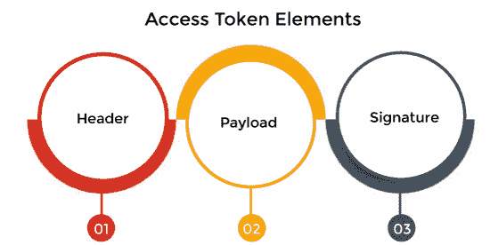
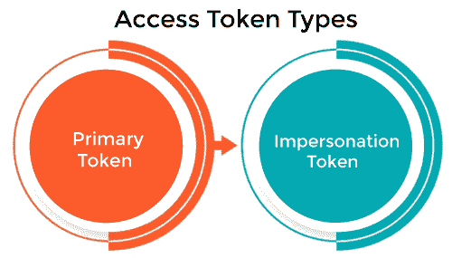

# 什么是操作系统中的访问令牌

> 原文：<https://www.javatpoint.com/what-is-access-token-in-operating-system>

*访问令牌*是描述*进程*或线程的*安全上下文*的对象。令牌用于做出安全决策和存储关于某个系统实体的防篡改信息。虽然令牌通常仅用于表示安全信息，但它可以保存创建令牌时附加的其他自由格式数据。

令牌可以在没有特殊权限的情况下复制，例如，创建一个具有较低访问权限的新令牌来限制已启动应用程序的访问。当进程或线程试图与具有安全描述符的对象进行交互时，Windows 会使用访问令牌。在 Windows 中，访问令牌由令牌类型的系统对象表示。

在令牌中，信息包括与进程或线程相关联的用户帐户的身份和权限。当用户登录到系统时，登录服务会生成一个访问令牌，用户提供的凭据将根据身份验证数据库进行身份验证。身份验证数据库包含构建登录会话的初始令牌所需的凭据信息，包括其用户 id、主要组 id 和其他信息。

令牌附加到用户会话中创建的初始进程，并由初始进程创建的后续进程继承。每当进程打开启用了访问控制的任何资源的句柄时，Windows 都会将目标对象的安全描述符中的数据与当前有效访问令牌的内容进行协调。该访问检查评估的结果指示是否允许任何访问，如果允许，则指示什么操作(读、写/修改等)。)允许调用应用程序执行。

### 访问令牌的使用

当线程与安全对象交互或试图执行需要权限的系统任务时，系统使用访问令牌来标识用户。

访问令牌是应用程序用来代表用户发出 API 请求的东西。访问令牌表示特定应用程序访问用户数据特定部分的授权。访问令牌包含以下信息:

*   用户帐户的安全标识符(SID)。
*   用户所属组的 sid。
*   标识当前登录会话的登录标识符。
*   用户或用户组拥有的权限列表。
*   系统使用的默认 DACL 是当用户创建安全对象而没有指定安全描述符时。

### 访问令牌示例

此示例显示了访问令牌的内容。令牌只包含关于应用程序在应用编程接口上的操作的授权信息，这种权限被称为范围。

```
{
  "iss": "https://my-domain.auth0.com/",
  "sub": "auth0|123456",
  "aud": 
  [
    "https://example.com/health-api",
    "https://my-domain.auth0.com/userinfo"
  ],
  "azp": "my_client_id",
  "exp": 1311281970,
  "iat": 1311280970,
  "scope": "openid profile read:patients read:admin"
}

```

### 访问令牌的元素

一个典型的访问令牌包含三个不同的部分，它们共同验证用户访问资源的权限。大多数访问令牌包含以下三个关键元素。



1.  **头:**包括关于令牌类型的数据和用于制作令牌的算法。
2.  **负载:**它有关于用户的信息，包括权限和过期时间。有效载荷也称为**索赔部分**，它对令牌的成功至关重要。如果您想访问特定的服务器资源，但在负载中没有给予适当的权限，您将无法获得访问权限。开发人员也可以在负载中放置各种自定义数据。
    例如，来自谷歌的访问令牌可以授予对多个应用程序的访问权限，而所有这些凭据都是用一个访问令牌指定的。
3.  **签名:**包含验证数据，让收件人可以保证令牌的真实性。这个签名通常是散列的，所以很难破解和复制。

### 访问令牌的类型

操作系统中有两种类型的访问令牌可用，**主令牌**和**模拟令牌**。每个进程都有一个描述与该进程关联的用户帐户的安全上下文的主令牌。默认情况下，当进程线程与安全对象交互时，系统使用主令牌。此外，线程可以模拟客户端帐户，模拟允许线程使用客户端的安全上下文与安全对象进行交互。模拟客户端的线程同时具有主令牌和模拟令牌。



**1。主令牌**

主令牌只能与流程相关联，它们代表流程的安全主体。主令牌的创建及其与进程的关联都是特权操作，以特权分离的名义需要两种不同的特权。典型的场景是身份验证服务创建令牌，登录服务将其关联到操作系统外壳。进程最初继承父进程主令牌的副本。

**2。模拟令牌**

模拟是在 Windows NT 中实现的一个安全概念，它允许服务器应用程序在访问安全对象方面暂时充当客户端。模拟有四种可能的级别:

*   **匿名**将服务器访问权授予匿名或未识别的用户。
*   **标识**让服务器检查客户端的身份，但不使用该身份访问对象。
*   **模拟**，让服务器代表客户端行动。
*   而**委派**与模拟相同，但扩展到服务器连接的远程系统(通过保存凭证)。

客户端可以选择服务器可用的最大模拟级别(如果有)作为连接参数。委托和模拟是特权操作。模拟令牌只能与线程相关联，它们代表客户端进程的安全主题。模拟令牌由 IPC 机制隐式创建并与当前线程相关联，如 DCE RPC、DDE 和命名管道。

### 访问令牌是如何工作的？

用户不写自己的访问代码。服务器与设备进行通信，所有工作都可以在几分钟内轻松完成。您需要遵循以下步骤，例如:

1.  **登录:**使用已知的用户名和密码证明身份。
2.  **验证:**服务器对数据进行认证，并颁发令牌。
3.  **存储:**令牌发送到你的浏览器进行存储。
4.  **通信:**每次您访问服务器上的新内容时，您的令牌都会被再次验证。
5.  **删除:**当您的会话结束时，令牌将被丢弃。

您也可以将访问令牌用于单点登录。您在一个站点的凭据将成为您进入另一个站点的密钥。只需遵循以下步骤，例如:

1.  **授权:**您同意使用您的凭证从一个站点进入另一个站点。
2.  **连接:**第一个站点连接第二个站点，请求帮助。第二个站点创建一个访问令牌。
3.  **存储:**访问令牌存储在您的浏览器中。
4.  **入口:**来自第二个站点的访问令牌为您提供了进入第一个站点的入口。

单点登录请求很快到期。大多数请求在大约 10 分钟内到期，但有些仅在 60 秒后就关闭了进程。

### 访问令牌的安全性

访问令牌在互联网的开放空间中移动时应该受到保护。不使用加密或受保护通信渠道的公司可能允许第三方获取令牌，这意味着未经授权访问非常敏感的数据。非常小心是有好处的。

大多数访问令牌也会过期。这个简单的步骤允许网站确保用户仍然在线和活跃，这可能有助于避免大规模的复制或删除。到期日期可能因公司而异。

* * *