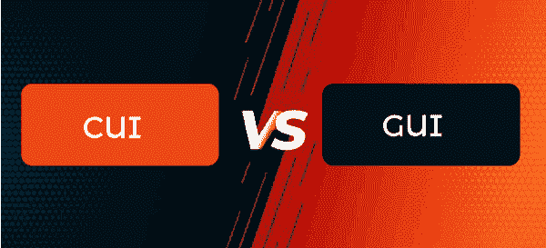

# CUI 与图形用户界面的区别

> 原文：<https://www.javatpoint.com/cui-vs-gui>

在本文中，您将了解操作系统中 CUI 和 GUI 之间的区别。但是在讨论差异之前，您必须了解操作系统中的 CUI 和 GUI。

## 什么是 CUI？

CUI 代表**字符用户界面**。它是一个用户界面，用户仅通过键盘与计算机交互，并且需要命令来执行任何任务。CUI 是图形用户界面的前身，在大多数早期计算机中使用。大多数计算机使用图形用户界面而不是 CUI。它的工作原理是允许用户以多行文本向程序提供命令**(命令行)**。CUIs 的基本实例是 **MS-DOS** 和 **Windows 命令提示符**。CUI 的应用之一是它简化了编程脚本的创建。

### CUI 的优缺点

CUI 有各种各样的优点和缺点。一些优点和缺点如下:

**优势**

1.  CUI 界面没有那么吸引人。
2.  CUI 不能提供在一个屏幕上操作各种程序的简单易用性或能力。
3.  CUI 中没有明显的反馈。在同样的情况下，需要多个附加命令来确认文件传输操作。
4.  用户必须记住各种命令来操作和管理 CUI。
5.  在 CUI 中，一次只能完成一个任务。
6.  CUI 仅支持使用键盘。

**缺点**

1.  与图形用户界面相比，CUI 使用的内存更少。
2.  因为可以使用较低分辨率的屏幕，所以使用成本较低。

## 什么是 GUI？

图形用户界面代表**图形用户界面**。图形用户界面使用户能够与操作系统或应用程序交互。它执行快速的算术计算，并释放 CPU 来执行其他任务。它提供按钮、窗口、滚动条、图标图像、向导和其他图标来方便用户。它为初学者提供了一个用户友好的界面。它易于使用、学习，也减少了认知负荷。

### 图形用户界面的优缺点

GUI 有各种各样的优点和缺点。一些优点和缺点如下:

**优势**

1.  图形用户界面是一种更容易使用的用户界面。用户可以对选项进行分类和导航，因为数据被表示为符号、表单和图标。用户只需要点击它们就可以获取它们的功能。
2.  当您使用图形用户界面时，管理几个作业也很容易。用户可以同时工作和查看多个程序。例如，当电影文件在后台播放时，可以使用网络浏览器浏览互联网。
3.  快捷键的使用是图形用户界面最重要的功能之一。如果您需要执行一项需要几个动作的工作，快捷键非常有用。

**缺点**

1.  尽管图形用户界面使用起来很简单，但是在创建时它们并不相同。图形用户界面有许多文本解释，需要花费大量的时间和精力来创建。程序员必须创建、链接，然后为图像分配特定的功能，这将花费很长时间。
2.  图形用户界面的实现并不像使用它时看起来那么容易。程序员必须知道如何正确地创建函数，以便用户可以更容易地使用这个界面。编码员的一个错误就可能使他们所有的努力白费。
3.  由于所有图形表示，它通常比其他界面使用更高的功率和计算机内存。它不节约资源。因此，它将使用大量的计算机资源。
4.  图形用户界面的设计使得开发更加复杂和昂贵。此外，图形用户界面必须与额外的硬件相链接，这可能会增加总体成本。

## 用户界面和图形用户界面的主要区别

在这里，您将了解 CUI 和 GUI 之间的主要区别。CUI 和图形用户界面之间的各种主要区别如下:

1.  它是一个用户界面，用户仅通过键盘与计算机交互，并且需要命令来执行任何任务。相反，图形用户界面允许用户与操作系统或应用程序交互。
2.  CUI 是 GUI 的前身，用户必须在键盘上打字才能进行 CUI。相比之下，图形用户界面使使用鼠标代替键盘成为可能。
3.  窗口命令提示符是用户界面的一个实例，而窗口是图形用户界面的一个例子。
4.  GUI 比 CUI 更用户友好。
5.  CUI 只有文字，相比之下，GUI 有图形等视觉线索。
6.  CUI 和 GUI 是与计算机结合使用的用户界面。

## 用户界面和图形用户界面的直接比较

在这里，您将学习 CUI 和图形用户界面之间的面对面比较。用户界面和图形用户界面之间的区别如下:

| 特征 | 崔 | 图像使用者界面 |
| **全格式** | CUI 代表字符用户界面。 | 图形用户界面代表图形用户界面。 |
| **互动** | 用户使用文本等命令与计算机交互。 | 用户使用图标、图像等图形与系统交互。 |
| **导航** | 导航不容易。 | 导航很容易使用。 |
| 用法 | 用法简单易用。 | 用法很难，需要专业知识。 |
| **速度** | 它速度很快。 | 它的速度很低。 |
| **内存需求** | 它对内存的要求很低。 | 它对内存的要求很高。 |
| **使用的外设** | 用户通过在键盘上键入命令与计算机系统进行交互。 | 用户使用图形界面与计算机系统交互，包括菜单和鼠标点击。 |
| **精度** | 它的精度很高。 | 精度低。 |
| **灵活性** | 它有一个灵活的用户界面。 | 它有一个高度灵活的用户界面。 |
| **自定义** | 它不容易改变。 | 它具有高度可定制性。 |

## 结论

CUI 和 GUI 是各种类型的用户界面系统的缩写，这些是在计算机环境中使用的术语。然而，两者都是服务于运行程序的功能的接口，并且它们在它们的特性和它们给用户的控制水平上是不同的。

* * *