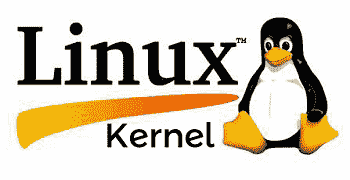
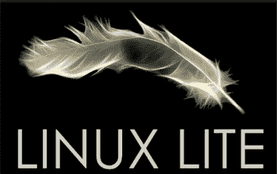
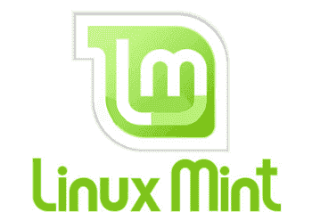
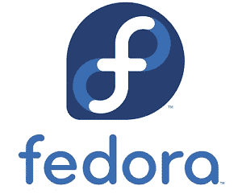
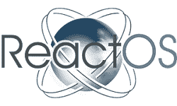
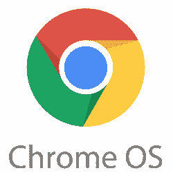

# 开源操作系统

> 原文：<https://www.javatpoint.com/open-source-operating-system>

在本文中，您将了解开源操作系统及其工作优缺点和一些最佳开源操作系统。

## 什么是开源操作系统？

术语**“开源”**是指计算机软件或应用程序，其中所有者或版权所有者使用户或第三方能够使用、查看和编辑产品的源代码。开源操作系统的源代码是公开可见和可编辑的。苹果的 iOS、微软的 Windows、苹果的 Mac OS 等通常的操作系统都是封闭的操作系统。开源软件是以这样一种方式获得许可的，即允许你生产你想要的任何数量的副本，并在你喜欢的任何地方使用它们。它通常比其商业对手使用更少的资源，因为它缺少任何用于许可、推广其他产品、认证、附加广告等的代码。

开源操作系统允许使用免费分发的代码，任何人都可以使用，并用于商业目的。作为开源应用或程序，开源操作系统的程序源代码是可用的。用户可以修改或改变这些代码，并根据用户要求开发新的应用程序。开源操作系统的一些基本例子有 **Linux、开放 Solaris、自由 RTOS、开放 BDS、自由 BSD、Minix、**等。

**1997 年**，第一个开源软件发布。尽管有这个行业，现在每个软件程序都有开源的替代品。得益于技术的发展和创新，自**21 世纪**伊始，许多开源操作系统已经被开发出来。

## 开源操作系统是如何工作的？

除了用户可以修改程序或应用程序的源代码之外，它的工作方式类似于封闭的操作系统。即使性能没有差别，功能也可能有差别。

例如，信息被打包并存储在专有(封闭)操作系统中。在开源中，同样的事情也会发生。但是，因为源代码对您来说是可见的，所以您可能会更好地理解这个过程，并更改数据的处理方式。

虽然前者操作系统安全无忧，而后者需要一些技术知识，但您可以定制这些并提高性能。在开源操作系统上没有具体的方法或框架，但可以根据用户需求进行定制。

## 最佳开源操作系统

大多数开源操作系统都是基于 Linux 的。一些最好的开源操作系统如下:

### 1.Linux 内核

Linux 内核是由 Linus Torvalds 开发的。它提供了操作系统所需的基本功能，如数据消除、内存处理和与计算机硬件的交互。它是开源软件，许多开发人员研究了源代码，并生产了大量有用的插件和操作系统来满足他们的需求。

### 2.Linux 操作系统

Linux Lite 是另一个可以在低端硬件上运行的免费开源操作系统。这是一个轻量级操作系统，旨在帮助不熟悉基于 Linux 的操作系统的用户。操作系统包括所有必需的程序、功能、工具和桌面。它有一个最小的接口，并且完全基于 Ubuntu 系统。在过去的五年里，操作系统一直很稳定，并定期更新。它在安装后很快就能高效运行。安装后，用户无需再安装任何驱动程序。如果你想要一个轻量级的开源操作系统在你的电脑上，那就用 Linux Lite 吧。

### 3.Linux 作为

Linux Mint 是一个强大的基于 Linux 的操作系统，散发着现代感和力量。它使用简单，并包括完整的多媒体功能，使其成为一个用户友好的开源操作系统。这是一个基于 Ubuntu 的发行版，在初学者和专家中都很受欢迎。它建立在 Debian 平台上，包括最强大的软件管理器之一。它比 Ubuntu 更稳定，有更好的视觉美感。

### 4.一种男式软呢帽

Fedora 是另一个流行的基于 Linux 的操作系统，被广泛认为是继 Ubuntu 之后最好的开源操作系统。这是一个基于 RPM 的通用操作系统，由红帽支持，由 Fedora 项目社区构建。它的目的是免费开发和共享尖端开源技术。因此，Fedora 开发人员更喜欢进行上游改进，而不是专门为 Fedora 创建修复程序。Fedora 开发人员的更新适用于所有 Linux 发行版。

它有一个基于 GNOME 的桌面，可以定制。Fedora 自带一个可定制的基于 GNOME 的桌面。它的 Fedora Spins 功能允许您定制和运行多个用户界面和桌面环境。

### 5.对操作系统做出反应

ReactOS 是另一个免费的开源操作系统，在超过 **100** 个国家拥有近 100 万次下载。这种基于社区的操作系统可能运行视窗应用程序，使其成为视窗操作系统的绝佳替代品。尽管 ReactOS 仍在增长，但喜爱高度可定制操作系统的用户可以选择 ReactOS。然而，操作系统是以开发者为中心的。

### 6.Solus

Solus 是一个免费的开源桌面电脑操作系统。这是 Linux 家族的新操作系统，发布于 **2012** 。目前有超过 **6000** 注册用户在使用该软件。VLC、XChat、Transmission、雷鸟、OpenShot 视频编辑器、火狐、Budgie 桌面环境和 LibreOffice 套件都包含在 Solus 中。Solus 的最新版本 **Solus 3** 于【2017 年 8 月发布。

### 7.铬作业系统

Chrome OS 是一个部分开源的操作系统，具有各种吸引人的特性。它是 Chrome 和 Linux 系列的一部分，具有包括更好的安全性、支持的 Android 和 Chrome 应用程序的兼容性、Aura windows 管理器、谷歌云打印、集成媒体播放器、虚拟桌面访问和基于云的管理等功能。操作系统唯一的问题是它只支持 Nexus 设备或其硬件。因此，如果你是谷歌的粉丝，你会喜欢 Chromebook 上的 Chrome OS。

## 开源操作系统的优缺点

开源操作系统的各种优缺点如下:

### 优势

**1。可靠高效**

开源操作系统是最可靠和最有效的。成千上万的眼睛监视这些，因为源代码是公开的。因此，如果有任何 bug 或错误，都会由世界上最好的开发人员来修复。

**2。性价比高**

大多数开源操作系统都是免费的。其中一些比商业封闭产品便宜得多。

**3。灵活性**

最大的好处是你可以根据自己的要求定制。还有创作自由。

### 不足之处

**1。复杂**

它不像那些关闭的那样方便用户。要使用这个软件，你必须对技术有基本的了解。

**2、安全风险**

尽管已经检测到缺陷，但由于攻击者可以访问源代码，因此存在攻击风险。

**3。无支撑**

如果您遇到问题，没有客户支持可以帮助您。

* * *