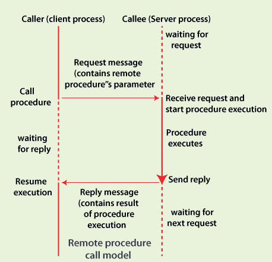
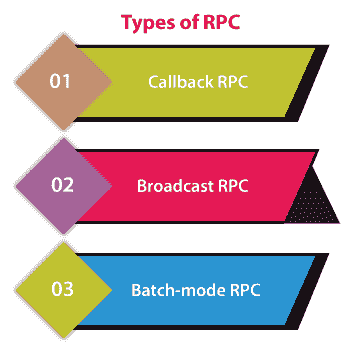

# 什么是操作系统中的 RPC？

> 原文：<https://www.javatpoint.com/what-is-rpc-in-operating-system>

远程过程调用(RPC)是构建分布式、基于客户机-服务器的应用程序的强大技术。它也被称为函数调用或子程序调用。远程过程调用是指计算机程序使一个过程在不同的地址空间中执行，编码为本地过程调用，而程序员没有明确说明远程交互的细节。无论子程序是在执行程序的本地还是远程，程序员编写的代码基本上是相同的。这是一种通过请求-响应消息传递系统实现的客户机-服务器交互形式。

RPC 模型暗示了*的位置透明性，无论是本地的还是远程的，调用过程在很大程度上是相同的。通常，它们不完全相同，因此本地呼叫可以与远程呼叫区分开来。远程呼叫通常比本地呼叫慢几个数量级，不太可靠，因此区分它们很重要。*

 *RPC 是进程间通信(IPC)的一种形式，因为不同的进程有不同的地址空间。它们在同一台主机上有不同的虚拟地址空间，即使物理地址空间相同。而如果它们在不同的主机上，物理地址空间是不同的。

### 如何进行远程过程调用

调用环境被挂起，过程参数通过网络传输到过程要执行的环境，并且过程在那里执行。

当过程完成并产生其结果时，它被传送回调用环境，在那里执行恢复，就像从常规过程调用返回一样。

#### 注意:RPC 特别适合客户机-服务器(例如，查询-响应)交互，在这种交互中，控制流在调用者和被调用者之间交替。从概念上讲，客户端和服务器不会同时执行；相反，执行线程从调用者跳到被调用者，然后再跳回来。

### RPC 的类型

操作系统中有三种类型的远程过程调用(RPC)，例如:

**1。回调 RPC**

这种类型的 RPC 支持参与进程之间的 P2P 模式。它有助于一个进程既是客户机服务又是服务器服务。回调 RPC 具有以下功能，例如:

*   远程处理的交互式应用程序问题。
*   提供带有客户端句柄的服务器。
*   回调使客户端进程等待。
*   管理回调死锁。
*   它促进了参与进程之间的对等范例。

**2。广播 RPC**

广播 RPC 是客户端在网络上广播的请求，由所有服务器使用处理该请求的方法进行处理。广播 RPC 具有以下功能，例如:

*   允许您指定必须广播客户端的请求消息。
*   您可以声明广播端口。
*   它有助于减少物理网络的负载。

**3。批处理模式 RPC**

批处理模式 RPC 有助于在客户端的传输缓冲区中对 RPC 请求进行排队和分离，然后在网络上将它们成批发送到服务器。批处理模式 RPC 具有以下功能，例如:

*   通过在网络上将请求成批发送到服务器，可以最大限度地减少发送请求的开销。
*   这种类型的 RPC 协议只对需要较低调用速率的应用程序有效。
*   它需要一个可靠的传输协议。

### RPC 是做什么的？

当使用 RPC 框架的程序语句被编译成可执行程序时，一个存根包含在表示远程过程代码的编译代码中。

当程序运行并发出过程调用时，存根接收请求并将其转发给本地计算机中的客户端运行时程序。第一次调用客户端存根时，它会联系名称服务器以确定服务器所在的传输地址。

客户端运行时程序知道如何寻址远程计算机和服务器应用程序，并通过网络发送请求远程过程的消息。类似地，服务器包括一个运行时程序和与远程过程本身接口的存根，响应请求协议以同样的方式返回。

### 活性粉末混凝土的特点

在操作系统中，远程过程调用(RPC)具有以下功能，例如:

*   RPC 向用户隐藏了消息传递过程的复杂性。
*   RPC 只使用 OSI 模型的特定层，如传输层。
*   客户端可以使用高级语言与服务器通信。
*   RPC 适用于本地环境和远程环境。
*   RPC 的程序是用简单的代码编写的，程序员很容易理解。
*   操作系统可以轻松处理 RPC 中涉及的进程和线程。
*   操作系统对用户隐藏了 RPC 的抽象。

### RPC 是如何工作的？

当调用远程过程调用时，调用环境被挂起，过程参数通过网络传输到过程要执行的环境，然后过程在该环境中执行。

当过程完成时，结果被传送回调用环境，在那里执行恢复，就像从常规过程调用返回一样。

远程过程调用(RPC)在操作系统中按以下步骤工作:

**步骤 1:** 客户端、客户端存根和 RPC 运行时在客户端机器上执行。

**步骤 2:** 客户端通过以通常的方式传递参数来启动客户端存根进程。程序参数的包装称为 ***编组*** 。客户端存根存储在客户端自己的地址空间中，并且它还要求本地 RPC 运行时发送回服务器存根。

**第三步:**在这个阶段，用户可以通过定期的本地过程调用来访问 RPC。RPC Runtime 管理网络中客户端和服务器之间的消息传输，它还执行重传、确认、路由和加密等工作。

**步骤 4:** 完成服务器过程后，它返回到服务器存根，服务器存根将返回值打包(封送)到消息中。然后，服务器存根将消息发送回传输层。

**第五步:**在这一步，传输层将结果消息发回客户端传输层，客户端传输层将消息发回客户端存根。

**步骤 6:** 在这个阶段，客户端存根解析(解包)结果包中的返回参数，执行过程返回给调用者。

### 远程过程调用问题

**在操作系统中，远程过程调用或 RPC 面临一些必须解决的问题，例如:**

**1。RPC 运行时**

RPC 运行时系统是一个例程和服务库，用于处理 RPC 机制下的网络通信。在 RPC 调用过程中，客户端和服务器端运行时系统代码处理绑定，通过适当的协议建立通信，在客户端和服务器之间传递调用数据，并处理通信错误。

2 个存根

存根的功能是为程序员编写的应用程序代码提供透明性。

*   **在客户端:**存根处理客户端的本地过程调用和运行时系统之间的接口，对数据进行封送处理和解封，调用 RPC 运行时协议，如果需要，执行一些绑定步骤。
*   **在服务器端:**存根在运行时系统和服务器执行的本地管理程序之间提供了一个类似的接口。

**3。装订**

客户如何知道打给谁以及服务驻留在哪里？

最灵活的解决方案是使用动态绑定，并在首次进行 RPC 时在运行时找到服务器。第一次调用客户端存根时，它会联系名称服务器以确定服务器所在的传输地址。绑定由两部分组成:

*   **命名:**有服务提供的服务器为其导出一个接口。导出接口会将其注册到系统中，以便客户端可以使用。
*   **定位:**客户端必须先导入(导出)接口，然后才能开始通信。

**4。与 RPC 相关的调用语义**

主要分为以下几种选择，

*   **重试请求消息:**当服务器出现故障，或者接收方没有收到消息时，是否重试发送请求消息。
*   **重复过滤:**删除重复的服务器请求。
*   **重发结果:**重发丢失的消息，而不在服务器端重新执行操作。

### 活性粉末混凝土的特性

以下是远程过程调用的基本特征:

*   被调用的过程在另一个进程中，该进程可能驻留在另一台机器上。
*   这些进程不共享地址空间。
*   参数仅通过值传递。
*   RPC 在服务器进程的环境中执行。
*   它不提供对调用过程环境的访问。

### RPC 的优点

下面是 RPC 的一些优点或好处，例如:

*   RPC 方法通过高级语言中过程调用的常规使用来帮助客户端与服务器通信。
*   RPC 方法是根据本地过程调用建模的，但是该过程最有可能在不同的进程中执行，并且通常在不同的计算机上执行。
*   RPC 支持面向进程和线程的模型。
*   RPC 使内部消息传递机制对用户隐藏。
*   重写和重新开发代码的工作量是最小的。
*   远程过程调用可用于分发和本地环境。
*   它提交了许多协议层来提高性能。
*   RPC 提供了抽象。例如，网络通信的消息传递本质仍然对用户隐藏。
*   RPC 允许在分布式环境中使用应用程序，而不仅仅是在本地环境中。
*   有了 RPC 代码，重新编写和重新开发的工作量就最小化了。
*   RPC 支持的面向进程和面向线程的模型。

### RPC 的缺点

下面是使用 RPC 的一些缺点或不足，例如:

*   远程过程调用仅通过值和指针值传递参数，这是不允许的。
*   远程过程调用(和返回)时间(即开销)可能明显低于本地过程。
*   这种机制非常容易出现故障，因为它涉及一个通信系统、另一台机器和另一个进程。
*   RPC 的概念可以用不同的方式实现，这是不能标准的。
*   没有为硬件架构的 RPC 提供任何灵活性，因为它主要是基于交互的。
*   由于远程过程调用，过程的成本增加了。

* * **