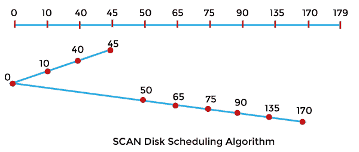
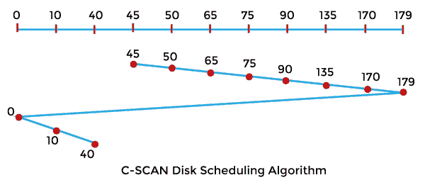
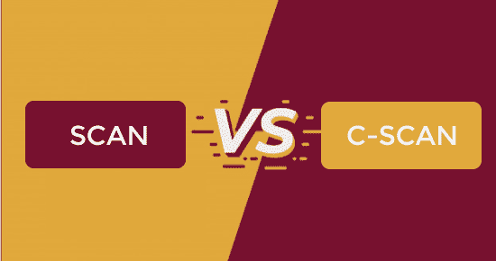

# 扫描和 C-SCAN 磁盘调度算法的区别

> 原文：<https://www.javatpoint.com/scan-vs-c-scan-disk-scheduling-algorithm>

在本文中，您将了解扫描和 C-SCAN 磁盘调度算法之间的区别。但是在讨论差异之前，您必须了解 SCAN 和 C-SCAN 磁盘调度算法。

## 什么是扫描磁盘调度算法？

也被称为**电梯算法**。在该算法中，磁头可以在两个方向上移动，即磁盘臂开始从磁盘的一端移动到另一端，并服务于所有请求，直到它到达磁盘的另一端。到达另一端后，磁头位置方向被改变，并进一步继续服务请求，直到磁盘结束。

**示例:**

让我们取一个带有 **180** 磁道 **(0-179)** 的磁盘，磁盘队列有输入/输出请求，顺序如下: **75、90、40、135、50、170、65、10** 。读/写磁头的初始磁头位置是 **45** ，并将在左侧移动。使用扫描算法计算读/写磁头的磁道移动总数。

**解决方案:**

头部运动总数，

初始水头点为 45°，

= (45-40) + (40-10) + (10-0) + (50-0) + (65-50) + (75-65) + (90-75) + (135-90) + (170-135)

= 5 + 30 +10 +50 +15 + 10 +15 + 45 + 35

= 215

### 扫描磁盘调度算法的优缺点

SCAN 磁盘调度算法有各种优缺点。这些优点和缺点如下:

**优势**

1.  在扫描磁盘调度算法中，等待时间和响应时间的方差较低。
2.  这种磁盘调度算法避免了饥饿。

**缺点**

1.  如果没有剩余的请求需要处理，磁头会移动到磁盘的末端。

## 什么是 C-SCAN 磁盘调度算法？

也被称为**圆形电梯算法**。它是 SCAN 磁盘调度算法的改进版本。在该算法中，头部处理单个方向上的请求，即它一直扫描到一个方向的末端，然后跳到另一个末端，并在同一方向上为请求提供服务。

**示例:**

让我们取一个带有 **180** 磁道 **(0-179)** 的磁盘，磁盘队列有输入/输出请求，顺序如下: **75、90、40、135、50、170、65、10** 。读/写磁头的初始磁头位置是 **45** ，并将在右侧移动。使用 C-SCAN 算法计算读/写磁头的磁道移动总数。

**解决方案:**

头部运动总数，

最初的头部点是 45 度，

= (50-45) + (65-50) + (75-65) + (90-75) + (135-90) + (170-135) + (179-170) + (179-0) + (10-0) + (40-10)

= 5 + 15 + 10 +15 + 45 + 35 + 9 +179 + 10 + 30

= 353

### C-SCAN 磁盘调度算法的优缺点

C-SCAN 磁盘调度算法有各种优缺点。这些优点和缺点如下:

**优势**

1.  它给出了统一的等待时间。
2.  它提供了更好的响应时间。
3.  磁头从一端移动到另一端，一路上为所有请求提供服务。
4.  C-SCAN 算法是 SCAN 调度算法的改进版本。

**缺点**

1.  如果没有剩余的请求需要处理，磁头将移动到磁盘的末端。
2.  它比扫描算法产生更多的搜索运动。

## 扫描和 C-SCAN 磁盘调度算法的主要区别

在这里，您将了解扫描和 C-SCAN 磁盘调度算法之间的主要区别。扫描和 C-SCAN 磁盘调度算法之间的不同之处如下:

1.  扫描磁盘调度算法也称为电梯算法。在这个算法中，头部可以双向移动。相比之下，在 C-SCAN 磁盘调度算法中，磁头只处理单个方向的请求。
2.  扫描也称为电梯算法。相比之下，C-SCAN 也被称为圆形电梯算法。
3.  扫描磁盘调度算法为请求位置提供了更长的等待时间。相比之下，C-SCAN 磁盘调度算法在请求位置时提供了统一的等待时间。
4.  扫描以正向和反向服务所有请求。相比之下，C-SCAN 磁盘调度仅在单个方向上服务请求。
5.  扫描具有更高的吞吐量，并给出了低方差的响应时间。相比之下，C-SCAN 算法提供了更好的响应时间。

## 扫描和 C 扫描磁盘调度算法的端到端比较

在这里，您将学习扫描和 C-SCAN 磁盘调度算法之间的面对面比较。扫描和 C-SCAN 磁盘调度算法之间的主要区别如下:

| 扫描磁盘调度算法 | 扫描磁盘调度算法 |
| 它也被称为电梯算法。 | 它也被称为圆形电梯算法。 |
| 它提供了更长的等待时间来请求位置。 | 它提供统一的等待时间来请求位置。 |
| 它包含更高的吞吐量，并给出一个低方差的响应时间。 | 它提供了更好的响应时间。 |
| 它服务于所有正向和反向的请求。 | 它只在一个方向上服务请求。 |
| 在 SCAN 算法示例中，头部从 45°向左移动，为该方向的所有请求提供服务，直到到达左端，它将头部位置更改为右端，处理从 0 到 179°的所有请求。 | 在 C-SCAN 算法示例中，磁头从 45°移动到右手边，服务所有请求，直到到达右端，然后它不反转方向，而是跳到磁盘的另一端，服务右端的请求。 |

* * *