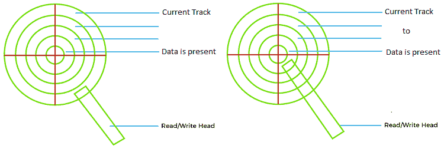

# 磁盘调度中寻道时间和传输时间的差异

> 原文：<https://www.javatpoint.com/seek-time-vs-transfer-time-in-disk-scheduling>

在本文中，您将了解**寻道时间**和**传输时间**之间的差异，但是在讨论差异之前，您必须了解磁盘调度中的寻道时间和传输时间。

## 什么是磁盘调度中的寻道时间？

寻道时间是硬盘控制器定位特定存储数据所需的时间。发送读/写请求时，寻道时间可能因磁头所在位置而异。

当任何东西被读取或写入磁盘驱动器时，磁盘的读/写头移动到正确的位置。光盘读/写头的实际物理定位称为**寻道**。盘的读/写头从一个盘移动到另一个盘所花费的时间被称为**寻道时间**。

对于给定的盘，寻道时间可能不同，这是由于从起始点到读/写头被指示去的地方的距离不同。因此，寻道时间通常以平均寻道时间来衡量。寻道时间也是用另外两种方式来衡量的，跟踪到跟踪和全行程。

1.  **磁道到磁道**是读/写磁头在相邻磁道之间搜索或寻道所用的时间。通常以毫秒、2 至 4 毫秒和最少 1 毫秒为单位。
2.  **全行程**是寻道整盘所需的时间。全冲程也是以毫秒为单位测量的，对于硬盘来说，低于 10ms 的寻道时间通常是可以接受的。

操作系统请求驱动器控制器固件获取硬盘来读取信息，这驱动读/写头移动到存储所需数据的位置。在轨道之间切换需要磁头致动器移动存取臂，这需要一定的时间。这被称为寻道时间。这个时间可以根据磁道之间的距离和每次读/写命令时的原点而变化。这也取决于以下几个方面，比如:

*   读/写磁头的速度。
*   当前位置和最终位置之间的距离

记录寻道时间没有行业标准，也没有单一数字决定整个驱动器的寻道时间。这就是为什么大多数光盘驱动器制造商以平均值来衡量寻道时间，有些制造商还包括全行程和磁道到磁道规格。

**例如**

考虑一个同心圆的硬盘叫做**磁道**，你想取一些数据。寻道时间是磁头从当前磁道移动到数据所在位置所需的时间，如下图所示。



即使在此之后，它可能还需要等待一段时间，因为数据出现在磁道的另一侧，这种延迟称为 ***【旋转延迟】*** ，但这不计入寻道时间。

## 磁盘调度中的传输时间是多少？

传输时间是指从磁盘传输数据所需的时间。它随磁盘的转速而变化。磁盘旋转得越快，我们读取数据的速度就越快，一个磁道上的字节数也可以称为磁盘的密度。如果我们传输数据的速度更快，那么传输时间就会更短。这取决于以下情况，例如:

*   圆盘的旋转速度(越快越好)。
*   磁道和扇区密度(越多越好)。
*   要传输的数据量。

从磁盘到 r 的传输时间取决于磁盘的转速，计算如下。

```

T = b/rN

```

其中，T =传输时间，b =要传输的字节数，N =磁道上的字节数，r =转速，单位为每秒转数。

## 寻道时间和传输时间之间的差异

在可移动磁头系统中，磁头在磁道上的定位时间称为 ***寻道时间*** 。选择磁道后，磁盘控制器会等待，直到适当的扇区旋转到与磁头对齐。扇区开始到达头部所需的时间称为 **a *旋转延迟*** 。


寻道时间和旋转延迟的总和等于 ***访问时间*** ，即进入读取或写入位置所需的时间。一旦磁头就位，当扇区在磁头下方移动时，就执行读或写操作。该数据传输操作中的时间称为 ***传输时间*** 。以下是磁盘调度中寻道时间和传输时间之间的差异:

| 寻道时间 | 转移时间 |
| 寻道时间是磁头从当前磁道移动到有数据的磁道所用的时间。 | 传输时间是将数据从磁盘传输到主机系统所需的时间。 |
| 根据当前位置和最终位置之间的距离以及指令的执行方式，寻道时间可能会有很大差异。 | 传输时间用这个公式计算，T = b/rN
其中 T 是传输时间，b 是要传输的字节数，N 是一个磁道上的字节数，r 是转速，单位为 Rps。 |
| 测量平均寻道时间。 | 单位时间内传输的数据量，即秒 |
| 寻道时间通常在 10-20 毫秒之间，具体取决于转速和驱动器等级。 | 传输 30-60MB 的数据大约需要 1 秒钟。 |

* * *