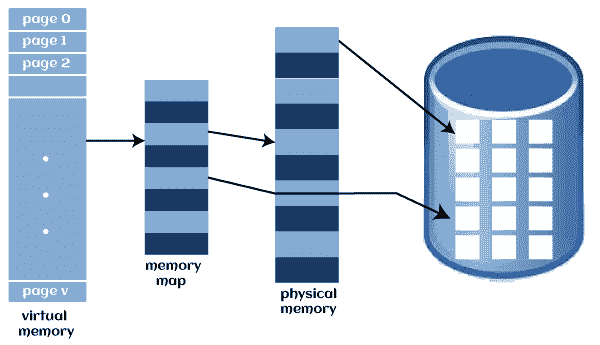

# 虚拟内存和作业池的区别

> 原文：<https://www.javatpoint.com/virtual-memory-vs-job-pool>

虚拟内存和作业池都将进程临时存储在磁盘上，并在以后将其带到内存中。当一个进程刚刚创建时，它首先进入作业池，然后被发送到就绪队列。虚拟内存仅在可用内存小于任何进程所需内存时使用。

在本文中，您将了解*和 ***作业池*** 的区别。不过，在讨论差异之前，您必须了解操作系统中的虚拟内存和作业池。*

 *### 什么是虚拟内存？

一台计算机可以处理的内存比系统上实际安装的内存多。这个额外的内存叫做*，它是硬盘的一部分，用来模拟计算机的内存。虚拟内存是计算机操作系统中常用的一种技术。*

 *虚拟内存使用硬件和软件来使计算机弥补物理内存的不足，将数据从内存临时传输到磁盘存储器。将内存块映射到磁盘文件使计算机能够将辅助内存视为主内存。

虚拟内存对于提高系统性能和多任务处理非常重要。这个方案的主要优点是程序可以比物理内存大。但是，用户不应该过度依赖虚拟内存，因为它比内存慢得多。如果操作系统在虚拟内存和内存之间交换数据过于频繁，计算机将会变慢。虚拟内存有两个用途。

1.  它允许我们通过使用磁盘来扩展物理内存的使用。
2.  它允许我们拥有内存保护，因为每个虚拟地址都被转换为物理地址。现代微处理器打算用于通用目的，内存管理单元，或 MMU，内置在硬件中，MMU 的工作是将虚拟地址转换成物理地址。

**使用虚拟内存的好处**

以下是使用虚拟内存的优势或好处，例如:

*   它可以处理两倍于主存储器的地址。
*   它可以同时使用更多的应用程序。
*   它将应用程序从管理共享内存中解放出来，并避免用户在内存空间耗尽时添加内存模块。
*   当只需要一个程序段来执行时，它的速度就提高了。
*   由于内存隔离，它提高了安全性。
*   它支持多个较大的应用程序同时运行。
*   分配内存相对便宜。
*   它不需要外部碎片。
*   CPU 使用对于管理逻辑分区工作负载非常有效。
*   数据可以自动移动。

### 什么是工作池？

作业池是批处理系统中的一种数据结构，当所有资源都可用时，各种作业将排队等待执行。它决定下一步将执行哪个作业。作业池包含当前正在执行的作业和已计划但尚未执行的作业。当作业正在执行时，它完全存在于内存中。

主要设计是，每当创建新作业时，它都存储在作业池中，当它准备好执行时，它必须存储在物理内存中。但是当需要非常大的内存时，只有一部分主内存被执行，而剩余的内存被存储在虚拟内存中。

现代系统不是这样工作的。大到足以运行多个任务的计算机有一个内存管理单元，它将虚拟内存地址转换为物理地址。操作系统用它在内存和磁盘之间移动每一页，这叫做 ***交换*** 或 ***分页*** 。这是从早期的多处理系统发展而来的。起初，流程是作为一个整体交换的。但是现在，如果没有足够的内存来容纳所有当前正在运行的进程，操作系统可以换出当前没有被使用的进程部分。

即使在今天，为大型非交互式计算设计的系统也普遍使用作业管理。如果活动进程需要的内存多于舒适运行所需的内存，交换需要时间，这会导致系统崩溃。为了避免这种情况，作业调度器使用*作业池，安排启动作业，并可能根据可用资源暂停作业。该系统工作在基于虚拟内存的操作系统之上，因此一旦作业暂停，它自然会被换出，因为它在内存中的页面被活动作业的页面替换。*

 ***使用职务库的好处**

以下是在操作系统中使用作业池的好处，例如:

*   作业是由一系列预设命令、数据和程序组成的单一单元。
*   处理按照接收的顺序进行，即先到先得，或根据优先级进行。
*   当作业成功运行时，操作系统释放其内存。
*   当进程完成时，作业假脱机的下一个作业将在没有任何用户交互的情况下运行。

### 虚拟内存和作业池的区别

虚拟内存和作业池用于将进程存储在硬盘上一段时间，然后将其加载到主内存中。

但是它们在许多方面都是不同的，所以下面是虚拟内存和作业池之间的区别，例如:

| 虚拟内存 | 作业池 |
| 虚拟内存是一种内存管理技术，它给用户一种无限内存的错觉。 | 作业池是位于操作系统中的操作系统程序，它存储新创建的进程，同时等待它们各自的资源。 |
| 虚拟内存表示 CPU 虚拟生成的地址。 | 作业池表示长期计划程序选择首先执行哪个作业的池。 |
| 进程的一部分需要在内存中执行。 | 新创建的进程存储在这里，等待所需的资源。 |
| 虚拟内存背后的概念是，当我们只使用一部分内存时，它会产生一种错觉，认为我们正在使用非常大的内存。 | 作业池的概念表明，一个新创建的进程存储在一个名为作业池的池中，这些进程在那里等待分配的资源被执行。 |
| 将进程从硬盘加载到主内存时，如果需要无限内存，则不需要虚拟内存。 | 将进程从硬盘加载到主内存时，总是需要一个作业池来存储新创建的进程。 |

* * ****