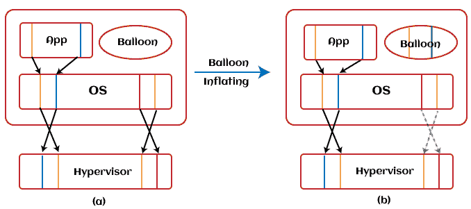
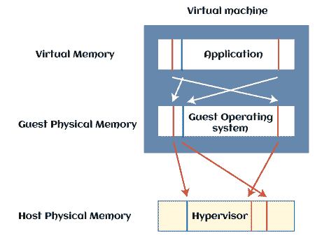

# 什么是内存膨胀？

> 原文：<https://www.javatpoint.com/what-is-memory-ballooning>

很多内存管理系统都是用来利用内存的，但是现在有一种特殊类型的内存管理被用来管理内存，这种系统被称为 ***内存膨胀*** 。

内存膨胀是大多数虚拟化平台中使用的内存管理功能，用于更有效地利用虚拟服务器的物理内存。内存膨胀是现代虚拟化数据存储体系结构的一个关键组成部分。由于物理和虚拟资产需要内存资源，因此需要各种方法来申请、释放和回收内存。

内存膨胀是一种利用虚拟机内存的常见虚拟化技术。它是大多数虚拟化平台中的内存管理功能，允许主机系统通过利用或回收以前分配给各种虚拟机的未使用内存来人为地扩大其内存池。

这是通过安装在来宾操作系统上的气球驱动程序来实现的，当虚拟机管理程序需要通过气球回收内存时，虚拟机管理程序会与其进行通信。

### 什么是虚拟机管理程序？

虚拟化虚拟机管理程序内存膨胀。虚拟机管理程序是一种使虚拟机能够运行的技术，它为软件提供了一个虚拟抽象层。虚拟机管理程序负责这些虚拟机之间的通信。

多种虚拟机管理程序技术被广泛使用，包括 ***VMware ESXi、微软 Hyper-V*** ，以及开源的 ***Xen*** 和 ***KVM*** 技术。每个虚拟机管理程序都可以用来启用来宾虚拟机，这些虚拟机以抽象的虚拟方式运行操作系统和应用程序。

虚拟机管理程序在运行的来宾虚拟机之间使用驱动程序来处理不同的需求，包括资源限制，如虚拟 CPU、磁盘空间和内存。气球驱动程序跨虚拟机运行，使虚拟机管理程序能够将内存从一个虚拟机重新分配给另一个虚拟机。

### 记忆膨胀的过程

理解虚拟机管理程序如何工作与内存膨胀的过程有着内在的联系。虚拟机管理程序抽象有限的系统资源，然后将它们分配给正在运行的虚拟机进程。

*   **主机物理内存:**底层服务器或云平台安装了一定数量的系统内存，代表可用内存的绝对总量。
*   **来宾物理内存:**为虚拟机管理程序分配一定数量的主机物理内存，为运行虚拟机提供资源。来宾物理内存是虚拟机管理程序的最大可用内存量。
*   **来宾虚拟内存:**虚拟机管理程序将其总内存资源的给定量作为虚拟内存分配给正在运行的来宾虚拟机。

在内存膨胀模型中，一台分配了 8 GB 来宾虚拟内存但未使用的虚拟机可以将一部分内存重新分配给另一台需要额外内存的运行中虚拟机。

气球驱动程序跟踪从一个虚拟机到另一个虚拟机的内存分配。内存膨胀的主要目标是使虚拟机获得满足某个进程或应用程序需求峰值所需的内存。即使通常没有足够的内存分配给它，也会发生这种情况。

### 为什么内存膨胀很重要？

在操作系统中，内存膨胀很重要，原因如下:

*   **资源优化:**内存取自当前没有使用所有可用内存的虚拟机，内存膨胀。未使用的内存被重新分配给需要额外资源的虚拟机。
*   **内存可用性:**内存膨胀不是简单地因为需求或进程激增而不为虚拟机提供所需的资源，而是在需要时提供更多内存。
*   **更低的成本:**通过更高效地使用内存，不需要部署更多物理服务器或分配更多物理内存，这将导致额外的运营和能源成本。

### 内存膨胀是如何工作的？

内存膨胀是虚拟机管理程序使用的一种计算机内存回收技术，允许物理主机系统从某些来宾虚拟机(虚拟机)中检索未使用的内存并与其他人共享。

1.  内存膨胀允许来宾虚拟机所需的内存总量超过主机上可用的物理内存量。
2.  当主机系统物理内存资源不足时，内存膨胀会有选择地将其分配给虚拟机。
3.  如果虚拟机仅使用分配给它的一部分内存，膨胀技术会使其可供主机使用。例如，如果主机上的所有虚拟机都分配了 8 GB 内存，则一些虚拟机将仅使用分配份额的一半。与此同时，一个虚拟机可能需要 12 GB 的内存来进行密集处理。内存膨胀允许主机借用未使用的内存，并将其分配给内存需求较高的虚拟机。
4.  来宾操作系统在虚拟机内部运行，虚拟机被分配了一部分内存。因此，来宾操作系统不知道可用的总内存。内存膨胀使客户操作系统意识到主机内存不足。
5.  虚拟化提供商，如 VMwareenable 内存膨胀。主机使用虚拟机上运行的气球驱动程序来确定它可以从未充分利用的虚拟机中获取多少内存。气球驱动程序必须安装在任何参与内存气球技术的虚拟机上。
6.  气球驱动程序从虚拟机管理程序获取目标气球大小，然后通过在虚拟机内分配适当数量的来宾物理页面来膨胀。这个过程被称为 ***给气球*** 充气，释放可用页面被称为 ***给气球*** 放气。

### 内存膨胀的问题

内存膨胀有一些问题，例如:

*   **高气球内存利用率:**可能出现的气球问题之一是高利用率。气球驱动程序可能会占用大量内存，以至于虚拟机管理程序缺乏以最高性能运行所需的全部资源。
*   **性能:**如果多个正在运行的虚拟机同时请求气球内存，则随着虚拟机管理程序通过内存交换技术拉取资源，可能会出现 CPU 和物理磁盘使用高峰，这将进一步降低整体系统性能。

### VMware 中不断膨胀的软件

VMware 要求您首先在虚拟机中安装膨胀软件，以便在 VMware 中开始使用您的虚拟机。

*   气球的大小取决于虚拟机需要多少内存。根据需要，可以增加或减少气球的大小，从而使内存气球更加动态。
*   为了确保性能保持在最高水平，您应该在所有主机上都有足够的大小，因为气球驱动程序会记住所有其他主机的活动内存使用情况。
*   该系统确保当前使用的内存或活动内存不会超过主机内存。
    **(活动内存)<(主机内存)**
*   如果多个虚拟机同时被激活，那么虚拟机管理程序上的工作负载会突然增加。尽管如此，使用内存膨胀的优势在于它不会降低性能。
*   当许多虚拟机加入时，会在连接中产生峰值。所以这个问题也不会造成连接的退化。

### 内存膨胀的优势

内存膨胀具有以下优点，例如:

*   即使连接中的工作负载增加，膨胀也不会使系统降级。
*   实现该系统的最大优点是它将利用连接中可用的大部分内存。
*   它是动态的，因此这项技术可以根据行业或公司的要求进行修改。

### 内存膨胀的缺点

内存膨胀似乎是一个非常好的实现选项，但它也有一些缺点，例如:

*   资源的过度利用是指气球占用了大量内存，而虚拟机管理程序无法将内存提供给需要内存的气球。
*   由于虚拟机管理程序使用内存交换和共享原则，如果多个处于非活动状态的虚拟机请求内存，可能会影响系统性能。所以，我们应该使用互斥原则。

* * *