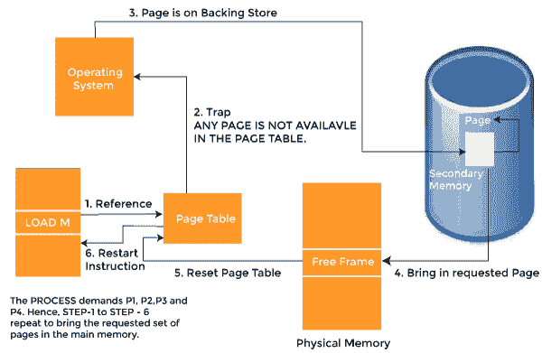
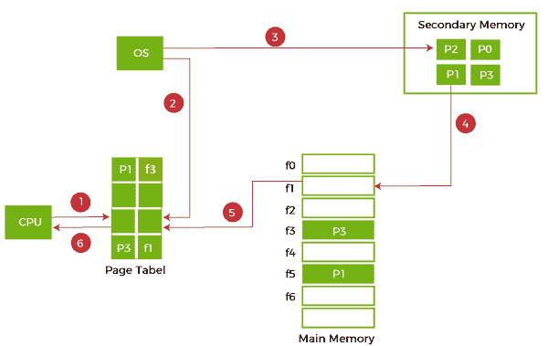
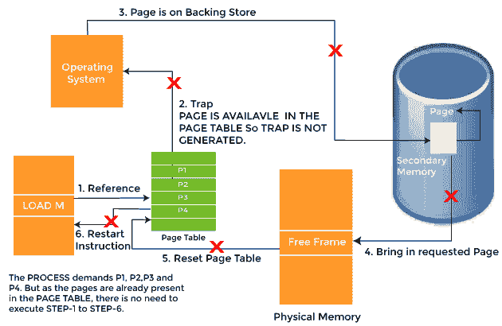
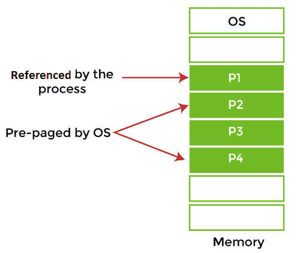

# 什么是按需分页和预分页？

> 原文：<https://www.javatpoint.com/what-are-demand-paging-and-pre-paging>

根据虚拟内存的概念，在给定的时间，不需要将整个进程加载到主内存中来执行任何进程。如果在特定时间只有一些页面存在于主存储器中，则可以有效地执行该过程。但是，这里的问题是，我们如何事先决定要加载到主内存中以执行进程的页面选择的基础。这意味着哪一页应该在特定的时间出现在主存储器中，哪一页不应该出现在那里。

为了解决这个问题，这里有一个操作系统中 ***需求分页*** 的概念。这个概念说，我们不应该加载任何页面到主内存，直到需要或保持所有页面在辅助内存，直到需要。相比之下，在 ***预分页*** 中，操作系统提前猜测进程将需要哪个页面，并将它们预加载到内存中。

***预分页*** 的概念用于减少进程开始时出现的大量页面错误，基本策略是在进程引用它们之前，将所有需要的页面同时带入内存。

## 什么是操作系统中的需求分页？

按需分页是虚拟内存系统中使用的一种技术，其中页面仅在中央处理器需要或要求时才被带入主内存。因此，它也被称为*，因为页面交换只有在中央处理器需要时才会进行。虚拟内存通常在按需分页中实现。*

 *在按需分页中，分页器只将那些必需的页面带入内存，而不是在整个过程中进行交换。因此，按需分页避免了读取无论如何都不会使用的内存页面，从而减少了交换时间和所需的物理内存量。

### 需求分页是如何工作的？

按需分页系统依赖于页表的实现，因为页表有助于将逻辑内存映射到物理内存。按位运算符在页表中实现，以指示页是否正常(有效或无效)。所有有效页面存在于 ***主内存*** 中，无效页面存在于 ***次内存*** 中。现在所有进程都可以访问所有页面，然后会发生以下情况，例如:

1.  尝试当前访问页面。
2.  如果页面正常(有效)，则所有处理指令正常工作。
3.  如果发现任何人的页面无效，就会出现页面错误问题。
4.  现在，确定辅助存储器上是否存在有效的引用。如果不存在，则进程终止，否则需要的页面被调入。
5.  现在执行磁盘操作，将所需页面提取到 ***主内存*** 中。

### 按需分页的示例

假设我们必须执行一个有四页 P0、P1、P2 和 P3 的进程。目前，在页面表中，我们有页面 P1 和 P3。

1.  如果中央处理器想访问进程 P 的页面 P2，它将首先在页面表中搜索该页面。
2.  由于页表不包含此页，因此它将是一个 ***陷阱*** 或 ***页错误*** 。一旦陷阱生成并发生上下文切换，控制就转到操作系统。
3.  操作系统会将进程置于等待/阻塞状态。操作系统现在将在后备存储器或辅助存储器中搜索该页面。
4.  然后，操作系统将从后备存储器中读取页面，并将其加载到主存储器中。
5.  接下来，操作系统将相应地更新页表条目。
6.  最后，从操作系统收回控制权，并恢复进程的执行。

因此，每当发生页面错误并且所需页面被带入内存时，操作系统都会遵循这些步骤。

所以每当出现页面错误时，如以上所有步骤 2 到 6 所示。这个为页面故障服务的时间称为 ***页面故障服务时间*** 。

**有效内存访问时间:**当执行任何进程时页面错误率为**‘p’**时，则有效内存访问时间计算如下:

有效内存访问时间= (p)*(s) + (1-p)*(m)

在哪里

*   p 是页面错误率。
*   s 是页面故障服务时间。
*   m 是主存储器访问时间。

#### 注意:EAT 与页面错误率成正比。

### 按需分页的优势

以下是操作系统中按需分页的优点，例如:

*   它提高了多道程序设计的程度，因为许多进程可以同时出现在主内存中。
*   内存的使用效率更高，因为大于主内存大小的进程也可以使用这种机制来执行，因为我们不是一次加载整个页面。
*   我们要对*的虚拟内存进行缩放。*
**   如果任何程序大于物理内存，它有助于在没有压缩的情况下运行该程序。*   分区管理更简单。*   它在 ***分时系统*** 中更有用。*   对 ***多编程*** 的水平没有限制。*   丢弃外部碎片。*   易于交换所有页面。*

 *### 按需分页的缺点

以下是操作系统中按需分页的一些缺点，例如:

*   用于处理页面错误的处理器开销和表的数量比简单的页面管理技术要多。
*   内部分裂的可能性更大。
*   它的内存访问时间更长。
*   页表长度寄存器(PTLR)对*虚拟内存有限制。*
**   页面映射表需要额外的内存和 ***寄存器*** 。*

 *## 什么是操作系统中的预分页？

**预分页**用于克服需求分页的一个主要缺点。 ***需求分页*** 的一个主要缺点是页面错误很多，一个进程开始执行就可能出现页面错误。这种情况是将初始局部性加载到内存中的结果，同样的情况可能会反复出现。

例如，当一个进程在被换出后重新启动时，它的所有页面都在磁盘上，因此每个页面都必须被带回主存储器，以便在最坏的情况下通过它自己的页面错误来执行该进程。

如果系统使用 ***工作集模型*** ，则在其工作集中的每个进程都会维护一个页面列表。如果一个进程由于缺少空闲帧或输入/输出等待而暂停，该进程的工作集不会丢失。当一个进程被恢复时，在该进程再次开始执行之前，整个工作集被带回内存。

上图显示，只有一个页面被 CPU 引用或请求，但另外三个页面被 OS 预分页*。操作系统试图预测处理器接下来需要哪个页面，并将该页面主动带入主内存。*

 *预分页的主要优点是，当进程引用连续地址时，它可以节省时间。在这种情况下，操作系统很容易猜测和加载适当的页面，并且，由于许多页面的猜测很可能是正确的，因此发生的页面错误会更少。

预分页可能并不总是有益的。预分页的优势基于对一个简单问题的回答:实现预分页的成本是否小于服务相应页面错误的成本。可能会出现这样的情况，即通过预分页带回内存的大量页面没有被使用。这个概念的缺点是，如果预加载的页面没有被使用，就会浪费时间和内存等资源。

### 预分页的优点

在操作系统中，预分页具有以下优点，例如:

*   当使用大型连续结构时，可以节省时间。考虑一个流程请求连续地址的例子。因此，在这种情况下，操作系统可以猜测下一页。而且，如果猜测是正确的，页面错误将会减少，有效的内存访问时间将会增加。

### 预分页的缺点

预分页也有以下缺点，例如:

*   如果那些预先分页的页面没有被使用，就会浪费时间和内存。

## 按需分页和预分页的区别

在按需分页中，只有那些页面被带入执行程序所需的主内存中。当一个程序需要其他页面时，它会从主内存中换出未使用的页面，并换入所需的页面。因此，允许它通过可用空间执行程序不足以将整个程序带入主存储器。需求分页导致的问题之一是页面错误，这是由于在我们需要交换的主内存中找不到所需的页面而导致的。

在预分页中，除了页面错误所要求的页面之外，还会引入其他页面。这种页面的选择是基于公共访问模式来完成的，尤其是对于辅助存储器设备。下面是请求分页和预分页之间的一些区别，例如:

| 请求页面调度 | 预分页 |
| 任何页面都不会被加载到主内存中，除非进程正在引用它。 | 所有的页面都被加载到内存中，在进程实际引用它们之前，同时需要这些页面。 |
| 页面错误的数量非常多。 | 在某些特定情况下，页面错误的数量可能会减少。 |
| 加载页面所花费的时间在任何情况下都不会减少。 | 当一个进程引用连续地址时，加载页面所需的时间会减少。 |
| 加载到主内存中的页面肯定会被使用。 | 加载到主内存中的页面可能会被使用，也可能不会被使用。 |
| 在需要时加载页面不会浪费资源。 | 由于页面很有可能未被使用，因此存在资源浪费。 |

* * *****