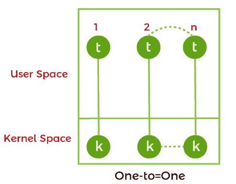
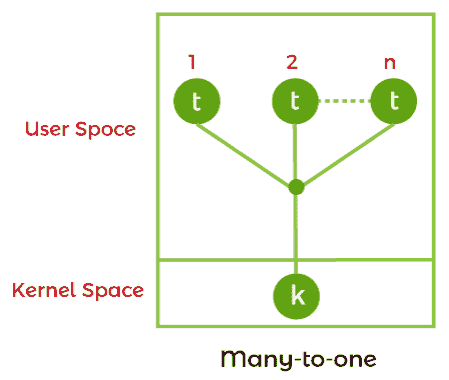

# 在用户空间中实现线程

> 原文：<https://www.javatpoint.com/implement-threads-in-user-space>

在本文中，您将了解用户空间中的实现线程及其优缺点。

操作系统是与用户共享计算机系统硬件和软件资源的程序的集合。它区分用户定义代码和操作系统代码，以确保不正确的应用程序不会对其他程序或操作系统造成伤害。其概念是，只有运行在操作系统上的任务才能获得硬件支持，这被称为内核模式。相反，在用户程序上执行的任务不被称为用户模式。

1.  内核模式是一种特权状态，在这种状态下，进程可以完全控制所有资源，包括硬件、内核数据和操作系统内核代码。
2.  主要区别在于内核在内核模式下可以直接访问硬件，而在用户模式下则没有这种情况。然而，当用户程序向操作系统请求服务时，系统必须从用户模式进入内核模式。

线程是一种执行单元，是进程的一部分。它分配流程的资源。调度程序对其进行调度。实现线程有两种方法:用户空间或内核空间。

线程可以在没有内核帮助的情况下在用户空间中实现。当我们在用户空间中实现一个线程时，会发生以下情况:

1.  在用户空间中，存储了相应的代码和数据结构。
2.  线程完全由运行时系统处理，不了解内核。
3.  调用应用编程接口时，会调用用户空间本地系统，而不是系统调用。

## 用户级线程模型

用户空间中的用户级线程可以使用以下四种方法中的任何一种来实现:-

1.  **一对一**
2.  **多对一**
3.  **多对多**
4.  **两级**

用户级线程被映射到所有模型中的内核级线程。内核线程相当于非线程系统中的进程。内核线程是内核调度在 CPU 上运行的执行单元。虚拟处理器这个术语经常被用来代替内核线程。

### 一对一

在这种一对一类型的模型中:

1.  用户空间中的每个用户级线程都运行在不同的内核级线程上。
2.  内核应该给出一个系统调用来创建一个新的内核线程。
3.  每个用户级线程都映射有不同的内核级线程。

### 多对一

在这种多对一类型的模型中:

1.  用户级线程可能只执行一个用户级线程，因为只有一个内核级线程与进程相关联。
2.  所有用户级线程都可以在同一个内核线程上运行。
3.  每个用户线程进行一次系统调用来创建一个新的内核线程。
4.  在内核级别，用户空间中的几个线程被映射到一个线程。

### 多对多

在这种多对多类型的模型中:

1.  该进程被分配 m 个内核级线程来运行 n 个用户级线程。

### 两级

在这种类型的模型中:

1.  它是一对一和多对多模型的混合版本。
2.  单个内核线程只能连接到有限数量的用户线程。

## 在用户空间中实现线程的优缺点

在这里，您将了解线程在用户空间中的优缺点。线程在用户空间中的一些优点和缺点如下:

### 优势

1.  它可能在操作系统不支持内核级线程的系统上执行。
2.  整个过程快速有效，因为不需要系统调用。
3.  组织很简单，因为线程是在不干扰内核的情况下产生、切换和控制的。

### 不足之处

1.  性能可能不一致。
2.  它的调度很差，例如将一个进程分配给一个空闲线程，或者由于一个线程持有锁而阻塞一个进程。

* * *