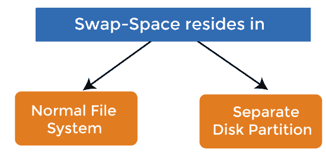

# 操作系统中的交换空间管理

> 原文：<https://www.javatpoint.com/swap-space-management-in-operating-system>

一台计算机有足够的物理内存，但是我们需要更多的物理内存，所以大部分时间我们在磁盘上交换一些内存。 ***交换空间*** 是硬盘上替代物理内存的空间。它用作虚拟内存，包含进程内存映像。每当我们的计算机物理内存不足时，它就会使用虚拟内存，并将信息存储在磁盘的内存中。

虚拟内存和真实内存之间的这种数据交换称为*交换，磁盘上的空间称为交换空间。交换空间有助于计算机的操作系统假装它拥有比实际更多的内存。也叫 ***互换文件*** 。*

 *虚拟内存是运行进程可以使用的内存和磁盘空间的组合。**交换空间**是硬盘上虚拟内存的**部分，在内存满的时候使用。交换空间可以通过以下各种方式对计算机有用，例如:**

*   它可以用作单个连续内存，减少读取或写入文件的输入/输出操作。
*   未使用或较少使用的应用程序可以保存在交换文件中。
*   拥有足够的交换文件有助于系统始终保持一些物理内存空闲。
*   由于交换空间而释放的物理内存空间可以被操作系统用于其他重要任务。

Windows、Linux 等操作系统。默认情况下，系统提供一定数量的交换空间，用户可以根据自己的需要进行更改。如果不想使用虚拟内存，可以一起轻松禁用。但是，如果内存不足，内核会终止一些进程，在物理内存中创建足够的空间，这样就完全取决于用户是否想使用交换空间。

### 什么是交换空间管理？

交换空间管理是操作系统的另一个低级任务。虚拟内存使用磁盘空间作为主内存的扩展。由于磁盘访问比内存访问慢得多，使用交换空间会显著降低系统性能。交换空间的设计和实现的主要目标是为虚拟内存系统提供最佳吞吐量。

根据使用的内存管理算法，不同的操作系统以不同的方式使用交换空间。例如，实现交换的系统可以使用交换空间来保存整个过程映像，包括代码和数据段。*分页系统可以简单地存储已经被推出主内存的页面。系统所需的交换空间量可能会有所不同，具体取决于物理内存量、它所支持的虚拟内存量以及它的使用方式。它的范围可以从几兆字节的磁盘空间到几千兆字节的磁盘空间不等。*

 *请注意，高估可能比低估所需的交换空间量更安全，因为如果系统用完交换空间，它可能会被迫中止进程或完全崩溃。高估会浪费原本可以用于文件的磁盘空间，但它不会造成其他危害。一些系统建议留出一定数量的空间用于交换空间。例如，Solaris 建议将交换空间设置为虚拟内存超过可分页物理内存的量。以前，Linux 建议将交换空间设置为物理内存的两倍，尽管大多数 Linux 系统现在使用的交换空间要少得多。目前在 Linux 社区中有很多关于是否要留出交换空间的争论。

包括 Linux 在内的一些操作系统允许多个交换空间。这些交换空间通常放在单独的磁盘上，因此通过分页和交换作用在输入/输出系统上的负载可以分散到系统的输入/输出设备上。

### 交换空间的使用

不同的操作系统以不同的方式使用交换空间。实现交换的系统可以使用交换空间来保存整个过程，包括图像、代码和数据段。

*   *交换是一种内存管理技术，用于多程序设计，以增加共享 CPU 的进程数量。这是一种从主内存中删除进程，将其存储到辅助内存中，然后将其带回主内存继续执行的技术。将进程从主内存移出到辅助内存的动作称为 ***换出*** 。将进程从辅助内存移出到主内存的动作称为 ***换入*** 。*
**   *分页系统可以简单地存储已经被推出主内存的页面。系统对交换空间的需求从兆字节到千兆字节不等。不过，这也取决于物理内存的数量、它所支持的虚拟内存以及它如何使用虚拟内存。**

 **高估比低估所需的交换空间量更安全，因为如果系统用完了交换空间，它可能会被迫中止进程或完全崩溃。高估会浪费可用于文件的磁盘空间，但不会损害其他空间。下表显示了使用交换空间的不同系统:

| 没有。 | 系统 | 交换空间 |
| 1. | 操作系统 | 交换空间等于物理内存量。 |
| 2. | Linux 操作系统 | 交换空间是物理内存的两倍。 |

***【Solaris】***将交换空间设置为虚拟内存超过可分页物理内存的量。此前， ***Linux*** 曾建议将交换空间设置为物理内存量的两倍。如今，这种限制已经不复存在，大多数 Linux 系统使用的交换空间也少得多。

包括 Linux 在内的一些操作系统允许使用多个交换空间，包括文件和专用交换分区。交换空间放在磁盘上，因此分页和交换对输入/输出的负载将分布在系统的带宽上。

### 交换空间在哪里？

交换空间可以位于这两个位置之一:普通文件系统或独立磁盘分区。

如果交换空间只是文件系统中的一个大文件，则可以使用正常的文件系统例程来创建、命名和分配其空间。这种方法虽然容易实现，但效率很低。浏览目录结构和磁盘分配数据结构需要额外的磁盘访问。

*   ***【外部碎片化】*** 通过在进程映像的读取或写入过程中强制多次寻道，可以大大增加交换时间。我们可以通过在物理内存中缓存块位置信息以及使用特殊工具为交换文件分配物理上连续的块来提高性能。然而，遍历文件系统数据结构的成本仍然存在。
*   或者，可以在单独的 ***原始分区*** 中创建交换空间，因为该空间中没有文件系统或目录结构。相反，单独的交换空间存储管理器用于从原始分区分配和解除分配块。该管理器使用针对速度而非存储效率优化的算法，因为交换空间的访问频率高于文件系统。
*   *内部碎片可能会增加，但这种权衡是可以接受的，因为交换空间中的数据寿命通常比文件系统中的文件短得多。交换空间在引导时被重新初始化，因此任何碎片都是短暂的。这种方法在磁盘分区期间创建固定数量的交换空间。添加更多交换空间需要对磁盘进行重新分区，或者在其他位置添加另一个交换空间。*

 *有些操作系统很灵活，可以在原始分区和文件系统空间中交换，例如 Linux。策略和实现是分开的，允许机器的管理员决定使用哪种类型的交换。在文件系统中分配和管理的便利性与原始分区中的交换性能之间进行权衡。

### 交换空间的分配

管理设备根据设备的内存大小分配特定数量的交换空间，并受可用磁盘空间的限制。

虚拟机所需的交换空间是其内存大小的两倍。这个数量为 RAM 不再需要的数据提供了足够的空间，可以放入交换空间。此外，还有足够的空间用于因虚拟机管理程序需求而需要清除内存的紧急情况。

管理设备无法将数据磁盘中的所有空间分配给交换空间，因为数据库需要空间。管理设备在分配交换空间时遵循一组特定的条件。这些条件如下:

1.  可专用于交换空间的正在进行的分区的最大数量为 25%。
2.  当管理设备增加交换空间大小时，单个实例的交换空间不会增加超过 20%。一个实例中最大 20%的增长使 Informix 和 analytics 能够在引导过程中分配它们的磁盘空间。
3.  您可以通过向管理设备添加新的数据磁盘来分配更多的数据磁盘空间。
4.  您可以按照增加设备代码磁盘大小的过程来增加代码磁盘的大小。

### 交换空间管理示例

传统的 UNIX 内核从交换开始，在连续的磁盘区域和内存之间复制整个过程。随着分页硬件的出现，UNIX 后来发展为交换和分页的结合。

在 **Solaris 1** 中，设计人员改变了标准的 UNIX 方法来提高效率。

*   当一个进程执行时，包含代码的文本段页面从文件系统中被引入，在主内存中被访问，如果被选择用于页面输出，则被丢弃。
*   从文件系统中重新读取一个页面比将它写入交换空间然后重新读取更有效。
*   交换空间仅用作匿名内存页的后备存储，包括为堆栈、堆和未初始化的进程数据分配的内存。

在 Solaris 的较高版本中进行了更多的更改。最大的变化是，Solaris 现在只在页面被强制从物理内存中取出时分配交换空间，而不是在第一次创建虚拟内存页面时。这种方案在现代计算机上有更好的性能，现代计算机比旧系统有更多的物理内存。

***Linux*** 几乎类似于 ***Solaris*** 系统。交换空间仅用于匿名内存或两个系统中几个进程共享的内存区域。在 Linux 系统中，可以建立一个或多个交换区。

*   交换区可以在常规文件系统或专用文件分区的交换文件中。
*   每个交换区由 4kb***页槽*** 组成，用于存放交换的页。
*   与每个交换区相关联的整数计数器阵列是对应于交换区中的页槽的 ***交换图*** 。
*   如果计数器的值为 0，则对应的页槽可用。
*   如果值大于 0，则表示交换的页面占用了页面槽。
*   计数器的值指示到交换页面的映射数量。例如，值 3 表示交换的页面映射到 3 个不同的进程。

* * ******