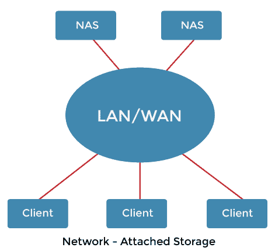

# 操作系统中的磁盘附件

> 原文：<https://www.javatpoint.com/disk-attachment-in-operating-system>

在本文中，您将学习操作系统中的磁盘附件及其方法。

## 磁盘附件

计算机有两种方法来访问磁盘存储。一种方法是在小型系统上使用输入/输出端口，也称为主机连接存储。另一种方法是通过分布式文件系统中的远程主机，这就是所谓的**网络连接存储。**

### 主机连接存储

**主机连接存储(HAS)** 是通过本地输入/输出端口访问的存储。这些端口利用各种技术。IDE 或 ATA 是大多数台式电脑使用的输入/输出总线架构。这种体系结构允许每个输入/输出总线最多有两个驱动器。SATA 是一种新的相关标准，简化了布线。高端工作站和服务器通常使用更高级的输入/输出体系结构，如小型计算机系统接口(SCSI)和光纤通道(FC)。

**SCSI(小型计算机系统接口)**为总线架构。它的物理介质通常是具有许多导体的带状导线。使用 SCSI 协议，最多可将 **16** 设备连接到总线。这些设备通常由主机上的一个控制器卡(SCSI 启动器)和多达 **15** 个存储设备(SCSI 目标)组成。SCSI 磁盘是典型的 SCSI 目标。尽管如此，该协议允许每个 SCSI 目标最多寻址 8 个逻辑单元。逻辑单元寻址广泛用于将命令导向 RATD 阵列或便携式媒体库组件。

光纤通道是一种高速串行架构，可以使用光纤或四导体铜线。它有两个品种。一种类型的结构是具有 24 位地址空间的大交换结构。这种变体预计将在未来占据领先地位，并将成为存储区域网络的基础。许多主机和存储设备可能会连接到光纤，这是因为通信的大地址空间和交换特性为输入/输出通信提供了更好的灵活性。另一个个人电脑版本是仲裁环(FC-AL)，它可以处理多达 **126** 设备，包括驱动器和控制器。

作为主机连接存储，各种存储设备都适用。硬盘设备、RAID 阵列、光盘、DVD 和磁带机都在其中。开始向主机连接的存储设备传输数据的输入/输出命令可以读写路由到特定存储单元的逻辑数据块。

### 网络连接存储

一个**网络连接存储(NAS)** 设备是一个可以通过数据网络访问的专用存储系统。客户端通过远程过程调用接口访问网络连接存储，就像 Windows 计算机的 CIFS 或 Unix 的网络文件系统。**远程过程调用(RPC)**通过 TCP 或 UDP 经由 IP 网络传输，IP 网络通常是将所有数据流量传送到客户端的同一局域网。通常，网络连接存储单元被构建为带有支持 RPC 接口的软件的 RAID 阵列。很容易将网络连接存储视为另一种存储访问协议。例如，网络连接存储系统可以通过 TCP/IP 通过 RPC 访问存储，而不是通过 SCSI 设备驱动程序和 SCSI 协议。

NAS 允许局域网上的所有系统共享一个存储池，其命名和访问方式与本地主机连接存储提供的方式一样简单。但是，它的效率较低，性能也比其他直连存储解决方案差。

**ISCSI(互联网小型计算机系统接口)**是最新的网络连接存储协议。SCSI 协议是通过 IP 网络协议传输的。因此，与 SCSI 电缆相比，SCSI 协议使用网络来互连主机及其存储。

### 存储区域网络

网络连接存储系统的一个缺点是存储输入/输出活动会占用数据网络的带宽，从而增加网络延迟。这个问题在大型客户机-服务器配置中最为严重，因为服务器-客户机通信与服务器-存储通信争夺带宽。

存储区域网络是一种专用网络，它使用存储协议来连接服务器和存储设备，而不是网络标准。存储区域网络的灵活性就是它的优势。多个主机和存储阵列可以连接到同一个存储区域网络，存储可以动态分配给主机。

存储区域网络交换机允许或禁止主机和存储之间的访问。例如，如果主机的磁盘空间不足，存储区域网络可能会被设置为向该服务器分配更多存储。San 使服务器集群能够共享相同的存储和存储阵列，以包含多个直接的主机连接。与存储阵列相比，San 通常以更低的成本拥有更多端口。最常见的是 FC。InfiniBand 是服务器和存储单元高速连接网络的新选项。它是一种专用总线架构，为服务器和存储单元高速连接网络提供硬件和软件支持。

* * *