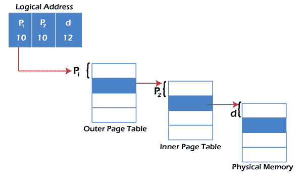
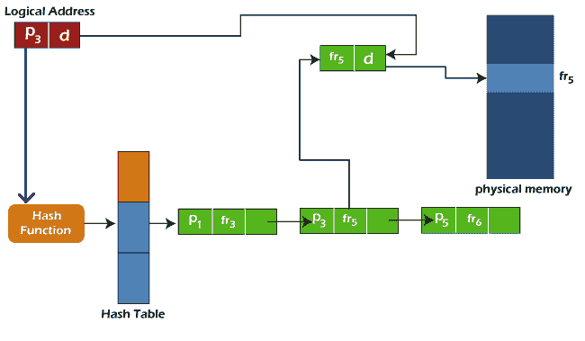
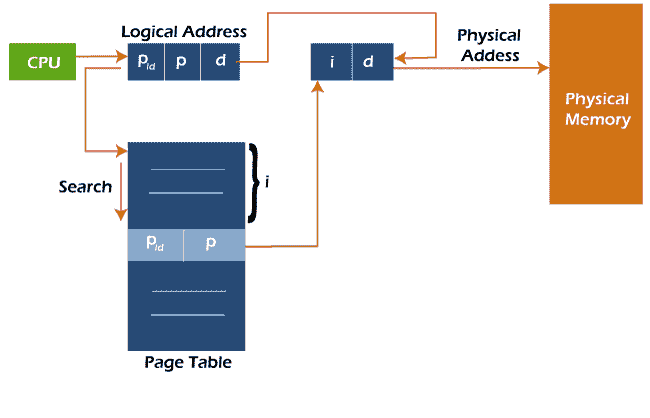

# 什么是操作系统中的散列页表？

> 原文：<https://www.javatpoint.com/what-is-hashed-page-table-in-operating-system>

在本教程中，我们将学习一些最常用的技术来构建 ***页表*** 。操作系统中虚拟内存系统用来存储物理地址和逻辑地址之间映射的数据结构，俗称 ***页表*** 。

中央处理器产生的逻辑地址在页表的帮助下被转换成物理地址。因此，页表主要提供相应的帧号(帧的基址)，其中该页存储在主存储器中。页表的一些特征如下:

*   它存储在主存储器中。
*   页表中的条目数等于进程被划分的页数。
*   页表基址寄存器(PTBR)基本上用于保存当前进程页表的基址。
*   每个进程都有自己独立的页表。

以下是一些用于构建页面表的常用技术，例如:

1.  分级分页
2.  散列页表
3.  倒排页表格

### 什么是分层分页？

分层分页的另一个名称是多级分页。当中央处理器访问任何进程的页面时，它必须在主内存中。与页面一起，同一进程的页面表也必须存储在主存储器中。可能会出现页表太大而无法容纳在连续空间中的情况，因此我们可能有一个包含多个级别的层次结构。

在这种类型的分页中，逻辑地址空间被分成多个页表。分层分页是最简单的技术之一，两级页表和三级页表可以用于此目的。让我们借助一个例子来理解这些层次。

**1。两级页表:**页表本身被分页的两级分页。所以我们将有两页表的内页表和外页表。考虑一个具有 32 位逻辑地址空间和 1 KB 页面大小的系统。它进一步分为由 20 位组成的页码和由 12 位组成的页面偏移量。

当我们对页表进行分页时，页码被进一步划分为由 10 位组成的页码和由 12 位组成的页偏移量。

因此，逻辑地址如下:

上图中，P1 是 ***外页*** 表的索引，P2 表示 ***内页*** 表的页内位移。

由于地址转换是从外部页表向内进行的，因此被称为 ***前向映射页表*** 。

上图显示了两级页表的地址转换方案。

**2。三级分页表:**两级分页方案不适用于具有 64 位逻辑地址空间的系统。假设页面大小为 4KB。如果我们使用两页级别的方案，那么地址将如下所示:

因此，为了避免这样大的表，有一个解决方案来划分外部页表，然后它将产生一个 ***三级页表*，如下所示。**

### 什么是散列页表？

*散列页表是一种在内存中构造页表的技术。在散列页表中，虚拟地址被散列到哈希表中。表中的每个元素都包含一个链接的元素列表，以避免冲突。使用的哈希值是虚拟页码，即不属于页面偏移量的所有位。*

 *哈希表中的每个元素都有虚拟页码、映射页面的值和指向下一个元素的指针。散列页表常见于大于 32 位的地址空间。对于哈希表中的每个元素，有三个字段可用，

1.  虚拟页码(哈希值)。
2.  映射页面框架的值。
3.  指向链表中下一个元素的指针。

将虚拟页号与第一字段即虚拟地址进行匹配，如果找到匹配，则使用第二字段中对应的映射地址来形成所需的存储器地址。如果没有找到匹配项，则使用下一个指针遍历链表，直到找到匹配项。

虽然我们可以使用多级页表来构造大型页表，但是它将由几个级别组成，这增加了页表的复杂性。

### 散列页表的工作

借助一个例子，我们可以理解散列页表的工作原理。中央处理器为它需要的页面生成一个逻辑地址。现在，这个逻辑地址需要映射到物理地址。这个逻辑地址有两个条目，即页码(P 3 )和偏移量，如下所示。

*   逻辑地址的页码指向散列函数。
*   散列函数产生对应于页码的散列值。
*   该哈希值指向哈希表中的一个条目。
*   正如我们之前所研究的，哈希表中的每个条目都有一个链接列表。这里，页码与第一个元素的第一个条目进行比较。如果找到匹配，则检查第二个条目。

在这个例子中，逻辑地址包括页码 P 3 ，它与链接列表的第一个元素不匹配，因为它包括页码 P 1 。所以我们将继续检查下一个元素；现在，这个元素有一个页码条目，即 P3，所以进一步，我们将检查元素的框架条目，它是 fr 5 。我们将把逻辑地址中提供的偏移量附加到这个帧号上，以到达页面的物理地址。这就是散列页表如何将逻辑地址映射到物理地址。

群集页表也用于使该算法适用于 64 位地址空间。

**什么是聚集页表？**

聚集页表类似于散列页表，除了散列表中的每个条目引用许多页而不是单个页(如散列页表)。因此，集群页表的单个条目可以存储多个物理页帧的映射。

群集页表对于稀疏地址空间很有用，在稀疏地址空间中，内存引用分散在整个地址空间中(不连续)。

### 什么是倒排页表？

正常分页的概念是，每个进程都维护自己的页表，其中包括属于该进程的所有页的条目。大型进程可能有一个包含数百万条目的页表。这样的页表会消耗大量内存。假设我们有六个正在执行的过程。因此，六个进程将在主内存中拥有它们的一些或另一个页面，这将迫使它们的页表也在主内存中，消耗大量空间。这是分页概念的缺点。

倒排页表是解决这种内存浪费的方法。倒排页表的概念由主存储器每一帧的一页表条目组成。因此，倒排页表中页表条目的数量减少到物理内存中的帧数。单页表代表所有进程的分页信息。

通过倒排页表消除了为每个进程存储单独页表的开销。只需要一个固定的内存部分来存储所有进程的分页信息。这种技术称为反向分页，因为索引是相对于帧号而不是逻辑页码来完成的。页表中的每个条目都包含以下字段。

*   **页码:**指定逻辑地址的页码范围。
*   **进程 id:** 一个倒排页表包含所有正在执行的进程的地址空间信息。由于两个不同的进程可以有一组相似的虚拟地址，因此有必要存储每个进程的进程标识，以便在反向页表中唯一地标识其地址空间。这是通过使用 Pid 和页码的组合来完成的。因此，该进程标识充当地址空间标识符，并确保特定进程的虚拟页面正确映射到相应的物理帧。
*   **控制位:**这些位用于存储额外的寻呼相关信息。其中包括有效位、脏位、参考位、保护位和锁定信息位。
*   **链式指针:**有时两个或多个进程可能共享一部分主内存。在这种情况下，两个或多个逻辑页映射到同一个页表条目，然后使用链接指针将这些逻辑页的详细信息映射到根页表。

### 倒排页表的制作

中央处理器为它需要访问的页面生成逻辑地址。逻辑地址由三个条目组成进程 id、页码和偏移量，如下所示。

进程 id 标识请求页面的进程，页码指示请求进程的哪个页面，偏移值指示所需的位移。

在页表中搜索进程 id 和相关页号的匹配，并表示如果在页表的第 i 个条目中找到该搜索，则 I 和 offset 一起生成所请求页的物理地址。这是如何使用反向页表将逻辑地址映射到物理地址的。

虽然倒排页表减少了内存浪费，但增加了搜索时间，这是因为倒排页表中的条目是根据物理地址排序的。相反，使用逻辑地址执行查找。有时会搜索整个表来查找匹配项。

因此，这三种技术可用于构建页表，帮助操作系统将 CPU 所需的页的逻辑地址映射到其物理地址。

* * **