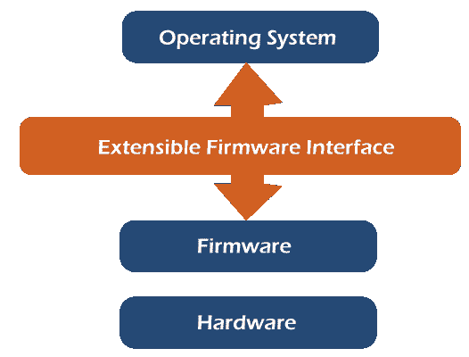
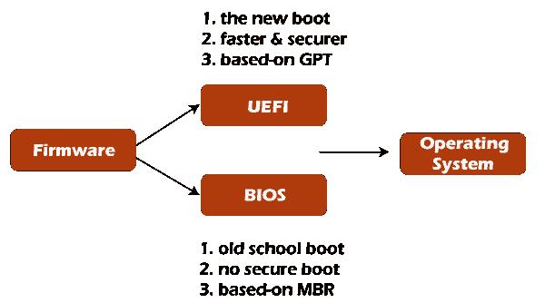
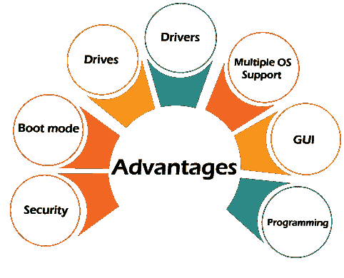

# 什么是 UEFI，它与 BIOS 有何不同？

> 原文：<https://www.javatpoint.com/what-is-uefi-and-how-it-differ-from-bios>

统一可延伸韧体介面(UEFI)是一个公开可用的规范，它定义了操作系统和平台固件之间的软件接口。它在计算机启动时运行。它初始化硬件并将操作系统加载到内存中。

UEFI 取代了最初存在于所有 IBM PC 兼容个人计算机中的基本输入输出系统(BIOS)固件接口，大多数 UEFI 固件实现都支持 BIOS 服务。UEFI 可以支持远程诊断和修复计算机，即使没有安装操作系统。

***英特尔*** 开发了最初的 ***可扩展固件接口*** (EFI)规格。2005 年，UEFI 否决了 EFI 1.10(EFI 的最终版本)。统一 EFI 论坛是管理整个 UEFI 规范的行业机构。

UEFI 有许多传统 BIOS 无法实现的新特性和新优势，其目标是在未来完全取代 BIOS。UEFI 将所有关于初始化和启动的信息存储在一个**中。efi** 文件，一个存储在名为 ***EFI 系统分区*** (ESP)的特殊分区上的文件。

ESP 分区还将包含计算机上安装的操作系统的引导加载程序。因为有了这个分区，UEFI 可以直接引导操作系统，省去了 BIOS 自检过程，这对 UEFI 更快的引导很重要。

### UEFI 是做什么的？

UEFI 定义了一种新的操作系统和平台固件通信方法，提供了一种轻量级的 BIOS 替代方案，只使用启动操作系统引导过程所需的信息。UEFI 提供增强的计算机安全功能，并支持大多数向后兼容的现有 BIOS 系统。

UEFI 是可编程的，使原始设备制造商开发人员能够添加应用程序、驱动程序和 UEFI，以充当轻量级操作系统。UEFI 包含操作系统加载程序使用的平台相关数据表、引导和运行时服务调用。该信息定义了支持 UEFI 的固件和硬件设备必须实现的所需接口和结构。

BIOS 通常被认为是早期计算的遗迹，而 UEFI 被认为是未来的浪潮。然而，为了便于理解，一些信息技术用户将这些过程统称为***【UEFI BIOS】***，尽管它们有很大的不同。

### BIOS 过时的原因是什么？

自 20 世纪 70 年代末以来，基本输入输出系统就出现在所有与 IBM 个人电脑兼容的个人电脑中。从那以后，它加入了一些重大改进，例如增加了用户界面和高级电源管理功能，允许基本输入输出系统配置电脑，并轻松创建更好的电源管理计划。但是，自 70 年代以来，它仍然没有像计算机硬件和软件技术那样先进。

**BIOS 的限制**

BIOS 有以下限制，例如:

*   BIOS 可以从小于 2 TB 的驱动器启动。3 TB 或以上的驱动器现在是标准配置，带有 BIOS 的系统无法从它们启动。
*   基本输入输出系统必须在 16 位处理器模式下运行，并且只有 1 MB 的执行空间。它很难同时初始化多个硬件设备，这导致在初始化现代电脑上的所有硬件接口和设备时启动过程较慢。
*   它不能一次初始化多个硬件设备，从而导致启动过程缓慢。

### 使用 UEFI 的引导过程和使用 BIOS 的引导过程

在计算机中，引导过程或计算机引导按照以下步骤进行，例如:

1.  按下桌面上的电源按钮。中央处理器启动，但需要一些指令来工作。由于主内存在这个阶段是空的，所以中央处理器按照从主板上的固件芯片加载指令，并开始执行指令。
2.  固件代码执行开机自检(POST)，初始化其余硬件，检测连接的外围设备，并检查所有连接的设备是否正常。您可能记得它是台式机在开机自检成功后发出的“哔哔声”。
3.  最后，固件代码在所有存储设备中循环，并寻找引导加载程序(通常位于磁盘的第一个扇区)。如果找到了引导加载程序，固件会将计算机的控制权移交给它。
4.  因此，现在已经加载了引导加载程序，它的工作是加载操作系统的其余部分。GRUB 就是这样一个引导加载器，它能够加载类似 Unix 的操作系统，也能够链式加载 Windows 操作系统。引导加载程序仅在第一个磁盘扇区可用，该扇区为 512 字节。考虑到现代操作系统的复杂性，一些引导加载程序倾向于进行多阶段加载。主引导加载程序在不限于 512 字节的环境中加载第二阶段引导加载程序。
5.  然后，引导加载程序将内核加载到内存中。类似 Unix 的操作系统随后运行 **init** 进程(主进程，从该进程分叉/执行其他进程)，并最终初始化运行级别。
6.  在 Windows 中， **exe** 加载了其他进程，如用于服务控制的**【services.exe】**、**【lsass.exe】**(类似于运行级别)和用于本地会话管理的**lsm.exe**。
7.  在完成所有这些之后，并且在一些其他驱动程序被初始化之后，图形用户界面(GUI)被加载，并且您会看到登录屏幕。

BIOS 和 UEFI 都使用低级软件在引导操作系统之前管理启动功能，尽管使用的技术不同。

*   **BIOS 引导过程:**BIOS 开始执行时，首先进行开机自检(POST)，确保硬件设备运行正常。
    
    之后，它会在所选引导设备的第一个扇区中检查 ***主引导记录*** 。从引导程序中检索引导加载程序的位置，引导加载程序由基本输入输出系统加载到计算机的随机存取存储器后，将操作系统加载到主存储器中。
*   **使用 UEFI 引导过程:**与 BIOS 不同，UEFI 不会在引导设备的第一个扇区中查找 MBR。它维护一个名为 EFI 服务分区的有效引导卷列表。
    
    UEFI 固件会扫描连接到系统的所有可引导存储设备，寻找有效的 GUID 分区表(GPT)，这将在开机自检过程中改善 MBR。与 MBR 不同，GPT 不包含引导加载程序。固件扫描 GPT，找到一个电喷服务分区来引导，并直接从正确的分区加载操作系统。如果找不到，它会返回到名为“ ***【传统引导】*** ”的 BIOS 类型引导过程。

### UEFI 相对于 BIOS 的优势

BIOS 和 UEFI 是计算机的两个固件接口，作为操作系统和计算机固件之间的解释器。这些接口在计算机启动时用于初始化硬件组件和启动存储在硬盘上的操作系统。但是 UEFI 在 BIOS 上提供了许多显著的增强，包括以下内容:

*   **引导模式:**微软 Windows 用户可以运行 32 位 UEFI 或 64 位 UEFI，不过专家建议 OS 位模式和固件位模式应该相同，以避免运行时出现通信问题。
*   **驱动器:**根据 UEFI 论坛，UEFI 支持 2.2 TB 及更高容量的引导驱动器，包括理论容量为 9.4 zettabytes 的驱动器。这远远超过了目前可用的最大驱动器容量。
*   **驱动程序:** UEFI 支持分立驱动程序，而 BIOS 驱动程序支持存储在只读存储器中，需要在换出驱动器或进行更改时对其进行兼容性调整。
*   **图形用户界面(GUI):** UEFI 可以更轻松地将新模块添加到 GUI 中，包括主板硬件和附加外围设备的设备驱动程序。
*   **多 OS 支持:**虽然 BIOS 允许单个引导加载程序，但 UEFI 允许用户在同一个 EFI 系统分区中安装基于 Debian 的 Ubuntu 和其他 Linux 变体的加载程序，以及 Windows OS 加载程序。
*   **编程:** UEFI 固件主要用 C 语言编写，用户可以用比 BIOS 更少的编程来添加或删除功能，BIOS 是用汇编语言编写的，有时会与 C 结合使用。
*   **安全性:**安全引导是 Windows 8 或更高版本的 UEFI 协议。安全引导使系统固件成为验证设备和系统完整性的信任根。目标是防止黑客在启动和切换到操作系统之间安装 rootkits。安全引导还使授权用户能够远程配置网络和解决问题，BIOS 管理员必须亲自到场。

随着计算机制造商逐渐远离基本输入输出系统，他们通常会在现代设备中集成与兼容性支持模块(CSM)一起运行的 UEFI 固件。虽然不是长期解决方案，但 CSM 使基于 UEFI 的机器能够以传统的 BIOS 模式启动，以与旧的 Windows 版本和其他操作系统一起工作。然而，用户可能会发现最好升级到最新版本的操作系统，以实现 UEFI 的价值。

* * *