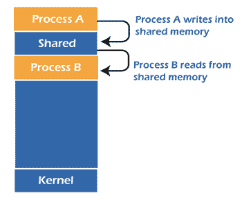
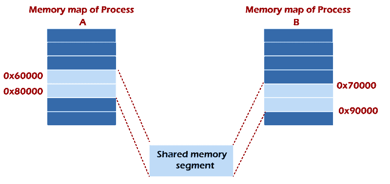

# 通过共享内存的仪表板组合仪表

> 原文：<https://www.javatpoint.com/ipc-through-shared-memory>

共享内存是两个或多个进程之间共享的内存。每个进程都有自己的地址空间；如果任何一个进程想要将自己地址空间中的一些信息传递给其他进程，那么只有使用 IPC(进程间通信)技术才有可能。

共享内存是最快的进程间通信机制。操作系统将几个进程的地址空间中的一个内存段映射为在该内存段中读写，而不调用操作系统函数。



对于交换大量数据的应用程序，共享内存远远优于消息队列等消息传递技术，后者要求每次数据交换都需要系统调用。要使用共享内存，我们必须执行两个基本步骤:

1.  向操作系统请求可以在进程间共享的内存段。
2.  将部分内存或整个内存与调用进程地址空间相关联。

共享内存段是由多个进程共享的物理内存的一部分。在这个区域中，进程可以建立结构，其他进程可以在其上读/写。当在两个或多个进程中建立共享存储区域时，不能保证这些区域将被放置在相同的基址上。当需要同步时，可以使用信号量。



例如，一个进程的共享区域可能从地址 0x60000 开始，而另一个进程使用 0x70000。理解这两个地址指的是完全相同的数据非常重要。因此，将数字 1 存储在第一个进程的地址 0x60000 中意味着第二个进程在 0x70000 处的值为 1。这两个不同的地址指的是完全相同的位置。

### 为什么通过共享内存选择 IPC

通常，使用管道或命名管道来执行相互关联的流程通信。并且不相关的进程通信可以使用命名管道或者通过共享内存和消息队列的流行 IPC 技术来执行。

但是管道、先进先出和消息队列的问题是，两个进程之间的信息交换通过内核，其工作原理如下。

*   服务器读取输入文件。
*   服务器使用管道、先进先出或消息队列将这些数据写入消息。
*   客户端从 IPC 通道读取数据，同样需要将数据从内核的 IPC 缓冲区复制到客户端的缓冲区。
*   最后，从客户端的缓冲区复制数据。

总共需要四份数据拷贝(两次读取和两次写入)。因此，共享内存提供了一种让两个或多个进程共享一个内存段的方法。使用共享内存，数据只复制两次，从输入文件复制到共享内存，从共享内存复制到输出文件。

### 使用共享内存的工控机的功能

两个功能 **shmget()** 和 **shmat()** 用于使用共享内存的 IPC。shmget()函数用于创建共享内存段，而 shmat()函数用于用进程的地址空间附加共享内存段。

**1。shmget()功能**

第一个参数指定标识共享段的唯一编号(称为密钥)。第二个参数是共享段的大小，例如 1024 字节或 2048 字节。第三个参数指定共享段的权限。成功时，shmget()函数返回一个有效的标识符，失败时，它返回-1。

**语法**

```

#include #include <sys>int shmget (key_t key, size_t size, int shmflg);</sys> 
```

**2。shmat()功能**

shmat()函数用于将创建的与 ***shmid*** 指定的共享内存标识符相关联的共享内存段附加到调用进程的地址空间。这里的第一个参数是 shmget()函数成功返回的标识符。第二个参数是将其附加到调用进程的地址。第二个参数的空值意味着系统将自动选择合适的地址。如果第二个参数为空，则第三个参数为“0”。否则，该值由 SHM_RND 指定。

**语法**

```

#include #include <sys>void *shmat(int shmid, const void *shmaddr, int shmflg);</sys> 
```

### 使用共享内存的 IPC 是如何工作的？

进程使用 **shmget()** 创建共享内存段。共享内存段的原始所有者可以通过 **shmctl()** 将所有权分配给另一个用户。它还可以撤销此分配。拥有适当权限的其他进程可以使用 **shmctl()** 对共享内存段执行各种控制功能。

一旦创建，就可以使用 **shmat()** 将共享段附加到进程地址空间。可以使用 **shmdt()** 拆卸。附加过程必须具有 **shmat()** 的相应权限。一旦附加，进程就可以在附加操作中请求的权限允许的情况下读取或写入该段。同一进程可以多次附加一个共享段。

共享内存段由一个控制结构描述，该结构具有指向物理内存区域的唯一标识。该段的标识符称为 **shmid** 。共享内存段控制结构和原型的结构定义可以在 **< sys/shm.h >** 中找到。

### 例子

我们将以共享内存为例为 IPC 编写两个程序。程序 1 将创建共享段，附加它，然后在其中写入一些内容。那么程序 2 将把自己附加到共享段，并读取程序 1 写入的值。

**程序 1:** 这个程序创建一个共享内存段，把自己附加到上面，然后把一些内容写入共享内存段。

```

#include #include <stdlib.h>#include <unistd.h>#include <sys>#include <string.h>int main()
{
int i;
void *shared_memory;
char buff[100];
int shmid;
shmid=shmget((key_t)2345, 1024, 0666|IPC_CREAT); 
//creates shared memory segment with key 2345, having size 1024 bytes. IPC_CREAT is used to create the shared segment if it does not exist. 0666 are the permissions on the shared segment
printf("Key of shared memory is %d\n",shmid);
shared_memory=shmat(shmid,NULL,0); 
//process attached to shared memory segment
printf("Process attached at %p\n",shared_memory); 
//this prints the address where the segment is attached with this process
printf("Enter some data to write to shared memory\n");
read(0,buff,100); //get some input from user
strcpy(shared_memory,buff); //data written to shared memory
printf("You wrote : %s\n",(char *)shared_memory);
}</string.h></sys></unistd.h></stdlib.h> 
```

**输出**

```
Key of shared memory is 0
Process attached at 0x7ffe040fb000
Enter some data to write to shared memory 
Hello World
You wrote: Hello World 

```

**它是如何工作的？**

在上面的程序中， **shmget()** 函数创建一个键值为 2345，大小为 1024 字节的段，对所有用户都有读写权限。它返回段的标识符，该标识符存储在 **shmid** 中。该标识符在 **shmat()** 中用于将共享段附加到进程的地址空间。

**shmat()** 中的空表示操作系统本身会将共享段附加到该进程的合适地址。然后使用 **read()** 系统调用从用户处读取一些数据，最后使用 **strcpy()** 函数将其写入共享段。

**程序 2:** 该程序将自身附加到程序 1 中创建的共享内存段，并读取共享内存的内容。

```

#include #include <stdlib.h>#include <unistd.h>#include <sys>#include <string.h>int main()
{
int i;
void *shared_memory;
char buff[100];
int shmid;
shmid=shmget((key_t)2345, 1024, 0666);
printf("Key of shared memory is %d\n",shmid);
shared_memory=shmat(shmid,NULL,0); //process attached to shared memory segment
printf("Process attached at %p\n",shared_memory);
printf("Data read from shared memory is : %s\n",(char *)shared_memory);
}</string.h></sys></unistd.h></stdlib.h> 
```

**输出**

```
Key of shared memory is 0
Process attached at 0x7f76b4292000
Data read from shared memory is: Hello World 

```

**它是如何工作的？**

在本程序中， **shmget()** 在此生成与程序 1 中创建的相同段的标识符。记住给出相同的键值。唯一的变化是，不要写 IPC_CREAT，因为共享内存段已经创建。接下来， **shmat()** 将共享段附加到当前进程。

之后，从共享段打印数据。在输出中，您将看到与执行程序 1 时相同的数据。

* * *