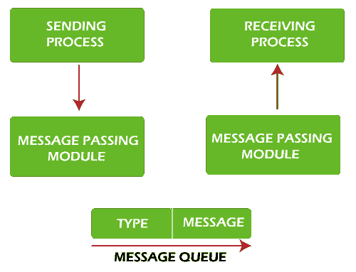
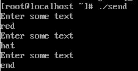
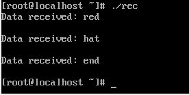

# 使用消息队列的仪表板组合仪表

> 原文：<https://www.javatpoint.com/ipc-using-message-queues>

一个**消息队列**是一个进程间通信(IPC)机制，允许进程在两个进程之间以消息的形式交换数据。它允许进程通过向彼此发送消息进行异步通信，消息存储在队列中，等待处理，并在处理后删除。


消息队列是在非共享内存环境中使用的缓冲区，在这种环境中，任务通过相互传递消息而不是通过访问共享变量来进行通信。任务共享一个公共缓冲池。消息队列是一个无界的先进先出队列，可以防止不同线程的并发访问。

事件是异步的。当一个类将一个事件发送到另一个类，而不是直接发送到目标反应类时，它会将事件传递到操作系统消息队列。当准备好处理事件时，目标类从消息队列的头部检索事件。相反，可以使用触发操作来传递同步事件。

许多任务可以将消息写入队列，但一次只能有一个任务从队列中读取消息。读取器等待消息队列，直到有消息要处理。消息可以是任何大小。

### 消息队列的功能

我们将在程序中使用四个重要的函数来实现使用消息队列的 IPC。

**1\. int msgget （key_t key， int msgflg）;**

我们使用 msgget 函数来创建和访问消息队列。它需要两个参数。

*   第一个参数是命名系统中消息队列的键。
*   第二个参数用于为消息队列分配权限，如果队列尚不存在，则与 IPC_CREAT 进行“或”运算以创建队列。如果队列已经存在，则忽略 IPC_CREAT。成功时，msgget 函数返回一个正数作为队列标识符，而失败时，它返回-1。

**2 . int msgid(int msqid，const void *msg_ptr，size_t msg_sz，int msgid flg)；**

这个函数允许我们将消息添加到消息队列中。

*   第一个参数(msgid)是 msgget 函数返回的消息队列标识符。
*   第二个参数是指向要发送的消息的指针，它必须以 long int 类型开始。
*   第三个参数是消息的大小。它不能包含长整型消息类型。
*   第四个也是最后一个参数控制如果消息队列已满或达到排队消息的系统限制时会发生什么。函数在成功时返回 0，并将消息数据的副本放在消息队列中。失败时，它返回-1。

有两个与消息结构相关的约束。首先，它必须小于系统限制，其次，它必须以 long int 开头。这个 long int 在接收函数中用作消息类型。消息的最佳结构如下所示。

```

struct my_message 
{
long int message_type;
/* The data you wish to transfer */
}

```

因为 message_type 用于消息接收，所以您不能简单地忽略它。您必须声明您的数据结构来包含它，并且将它初始化为包含一个已知的值也是明智的。

**3 .int msgrcv (int msqid，请参阅*msg_ptr，size_t msg_sz，long int msgtype，int msgid flg)；**

该函数从消息队列中检索消息。

*   第一个参数(msgid)是 msgget 函数返回的消息队列标识符。
*   如上所述，第二个参数是指向要接收的消息的指针，它必须以 long int 类型开始。
*   第三个参数是消息的大小。
*   第四个参数允许实现优先级。如果该值为 0，则检索队列中的第一条可用消息。但是如果该值大于 0，则检索具有相同消息类型的第一条消息。如果该值小于 0，则检索类型值与 msgtype 的绝对值相同的第一条消息。简单来说，0 值表示按照消息发送的顺序接收消息，非零值表示接收特定消息类型的消息。
*   最后一个参数控制如果消息队列已满或达到排队消息的系统限制时会发生什么。函数在成功时返回 0，并将消息数据的副本放在消息队列中。失败时，它返回-1。

**4 .int msgctl (int msqid、int command、struct msqid _ ds * buf)；**

最后一个函数是 msgctl，它是控制函数。

*   第一个参数是 msgget 函数返回的标识符。
*   第二个参数可以有以下三个值中的一个。

| 命令 | 描述 |
| IPC_STAT | 它设置 msqid_ds 结构中的数据，以反映与消息队列相关联的值。 |
| 仪表板组合仪表 _ 设置 | 如果进程有这样做的权限，这将把与消息队列相关联的值设置为 msqid_ds 数据结构中提供的值。 |
| ipc _ rmid | 它会删除消息队列。 |

msgctl 函数成功时返回 0，错误时返回-1。当进程在 msgsnd 或 msgrcv 函数中等待时，如果消息队列被删除，发送或接收函数将失败。

### 使用消息队列执行仪表板组合仪表的步骤

消息队列是存储在内核中并由消息队列标识符标识的消息链表。以下是使用消息队列执行通信的步骤。



1.  由 **msgget()** 创建新队列或打开现有队列。
2.  新消息由 **msgsnd()** 添加到队列末尾。每个消息都有一个长正整数类型字段、一个非负长度和实际数据字节(对应于长度)，当消息被添加到队列中时，所有这些都被指定给 msgsnd()。
3.  消息由 **msgrcv()** 从队列中获取。我们不必按照先进先出的顺序获取消息。相反，我们可以根据消息的类型字段获取消息。所有进程都可以通过访问公共系统消息队列来交换信息。发送进程将消息放入另一个进程可以读取的队列中。每个消息都有一个标识或类型，以便进程可以选择合适的消息。该进程必须共享一个公共密钥，才能首先访问队列。
4.  对消息队列 **msgctl()** 进行控制操作。

### 例子

**程序 1:** 让我们为 IPC 编写一个使用消息队列向消息队列发送数据的程序。

```

#include #include <stdio.h>#include <string.h>#include <unistd.h>#include <sys>#include <sys>#include <sys>#define MAX_TEXT 512   //maximum length of the message that can be sent allowed
 struct my_msg{
         long int msg_type;
         char some_text[MAX_TEXT];
 };
 int main()
 {
         int running=1;
         int msgid;
         struct my_msg some_data;
         char buffer[50]; //array to store user input
         msgid=msgget((key_t)14534,0666|IPC_CREAT);
         if (msgid == -1) // -1 means the message queue is not created
         {
                 printf("Error in creating queue\n");
                 exit(0);
         }

         while(running)
         {
                 printf("Enter some text:\n");
                 fgets(buffer,50,stdin);
                 some_data.msg_type=1;
                 strcpy(some_data.some_text,buffer);
                 if(msgsnd(msgid,(void *)&some_data, MAX_TEXT,0)==-1) // msgsnd returns -1 if the message is not sent
                 {
                         printf("Msg not sent\n");
                 }
                 if(strncmp(buffer,"end",3)==0)
                 {
                         running=0;
                 }
         }
 }</sys></sys></sys></unistd.h></string.h></stdio.h> 
```

**输出**

上面的程序给出了这个输出。



**它是如何工作的？**

结构 my_msg 声明 long int 变量和 char 数组来存储发送到消息队列的数据。然后使用 msgget()函数创建消息队列。接下来，使用 fgets()将用户的数据读入缓冲区，然后将其复制到结构 some_data 的变量 some_text 中。最后，使用 msgsnd()函数将数据发送到队列。strcmp 函数用于通过比较数据的前三个字符来停止发送数据。如果数据以“end”开头，则意味着不再发送数据。

**程序 2:** 现在，让我们为 IPC 编写一个程序，使用消息队列从上面创建的消息队列中接收或读取消息。

```

#include #include <stdio.h>#include <string.h>#include <unistd.h>#include <sys>#include <sys>#include <sys>struct my_msg{
         long int msg_type;
         char some_text[BUFSIZ];
 };
 int main()
 {
         int running=1;
         int msgid;
         struct my_msg some_data;
         long int msg_to_rec=0;
         msgid=msgget((key_t)12345,0666|IPC_CREAT);
         while(running)
         {
                 msgrcv(msgid,(void *)&some_data,BUFSIZ,msg_to_rec,0);                 
                 printf("Data received: %s\n",some_data.some_text);
                 if(strncmp(some_data.some_text,"end",3)==0)
                 {
                         running=0;
                 }
         }
          msgctl(msgid,IPC_RMID,0);
 }</sys></sys></sys></unistd.h></string.h></stdio.h> 
```

**输出**

上面的代码给出了以下输出。



**它是如何工作的？**

msg_to_rec 变量设置为 0，这样数据接收的顺序与发送的顺序相同。while 用于使用 mgrcv()函数连续接收数据，直到接收到的文本为“end”，我们使用 strcmp 函数进行检查。使用 my_msg 结构读取数据。

* * *