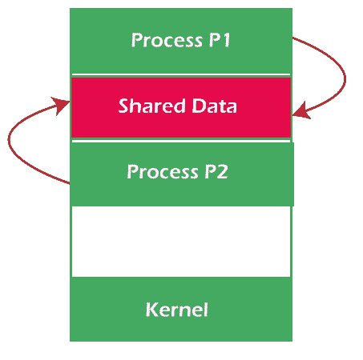
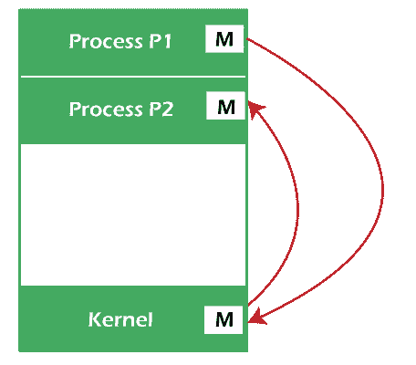

# 操作系统中的协作过程

> 原文：<https://www.javatpoint.com/cooperating-process-in-operating-system>

在本文中，您将了解操作系统中的协作过程及其各种方法。

## 什么是合作过程？

计算机系统中有各种进程，这些进程可以是独立的，也可以是在操作系统中运行的协作进程。当系统上运行的任何其他进程可能不会影响某个进程时，它被认为是独立的。独立于流程的流程不会与其他流程共享任何数据。另一方面，协作进程可能会受到系统上执行的任何其他进程的影响。一个协作进程与另一个进程共享数据。

## 操作系统中协作过程的优势

操作系统中协作进程有各种各样的优点。协作系统的一些优点如下:

**1。信息共享**

协作进程可用于在不同进程之间共享信息。它可能包括访问相同的文件。需要一种技术，以便进程可以同时访问文件。

**2。模块化**

模块化是指将复杂的任务分成更小的子任务。不同的协作进程可以完成这些较小的子任务。因此，所需的任务可以更快、更有效地完成。

**3。计算加速**

协作过程可用于同时完成单个任务的子任务。它允许任务更快地完成，从而提高了计算速度。但是，只有当系统包含多个处理元素时，这才是可能的。

**4。便利**

用户需要执行多项任务，如打印、编译、编辑等。如果这些活动可以通过协作过程来管理，那就更方便了。

协作流程的并发执行需要能够使流程进行通信并同步其动作的系统。

## 合作过程的方法

协作进程可以通过共享数据或消息来相互协调。方法如下:

### 1.分享合作

这些进程可以通过共享数据进行合作，包括变量、内存、数据库等。关键部分提供数据完整性，而写入是互斥的，以避免数据不一致。



在这里，你可以看到一个通过分享来展示合作的图表。在此图中，P1 进程和 P2 进程可以通过使用共享数据(如文件、数据库、变量、内存等)进行合作。

### 2.交流合作

协作进程可以通过使用消息来协作。如果每个进程都等待来自另一个进程的消息来执行任务，这可能会导致死锁。如果一个进程没有收到任何消息，它可能会导致饥饿。



在这里，你已经看到了一个通过交流来展示合作的图表。在此图中，P1 进程和 P2 进程可以通过使用消息进行通信来进行合作。

### 例子:生产者-消费者问题

让我们举一个两个合作过程的例子。它被称为生产者-消费者问题，它涉及两个过程:生产者和消费者。

**生产者流程**

它产生消费者会消费的信息。

**消费者流程**

它消耗生产者产生的信息。

两个进程同时运行。如果没有可消费的东西，顾客会等待。

有生产者和消费者；生产者创建项目并将其存储在缓冲区中，而消费者消费它。例如，打印软件生成打印机驱动程序使用的字符。编译器可以生成汇编程序可以使用的汇编代码。此外，汇编程序可以生成加载程序使用的目标模块。

**生产者流程**

```

while(true)
    {  
        produce an item &
        while(counter = = buffer-size);
        buffer[int] = next produced;
        in = (in+1) % buffer- size;
        counter ++;
    }

```

**消费者流程**

```

While(true)
    { 
        while (counter = = 0);
        next consumed = buffer[out];
        out= (out+1) % buffer size;
        counter--;
    }

```

哪里，

*   生成器使用 in 变量来确定缓冲区中的下一个空槽。
*   消费者使用 out 变量来确定项目的位置。
*   生产者和消费者使用计数器来确定缓冲区中已填充插槽的数量。

### 共享资源

有两种共享资源:

1.  **缓冲**
2.  **计数器**

当生产者和消费者没有按时执行时，就会出现不一致。如果生产者和消费者在没有任何控制的情况下同时执行，那么两者使用的计数器的值将是不正确的。这些过程共享以下变量:

```

var n;
    type item = .....;
    var Buffer : array [0,n-1] of item;
    In, out:0..n-1;

```

默认情况下，输入和输出变量都设置为 **0** 。共享缓冲区包含两个逻辑指针，输入和输出，它们被实现为一个循环数组。输入变量指向缓冲区的下一个空闲位置，而输出变量指向缓冲区的第一个满位置。当**进=出**时，缓冲器为空，当**进+1** 模式 **n =出**时，缓冲器为满。

* * *