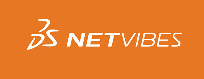
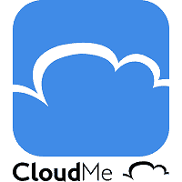
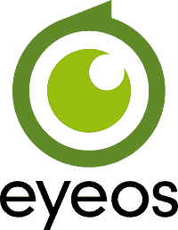
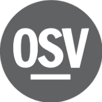
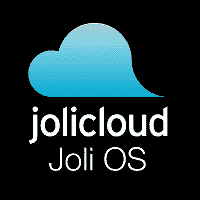
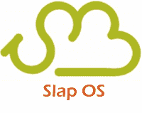

# 最佳云操作系统

> 原文：<https://www.javatpoint.com/best-cloud-operating-systems>

在本文中，您将了解最佳的云操作系统。但是在去最好的云操作系统之前，你必须了解云操作系统。

## 什么是云操作系统？

云操作系统是一个基于浏览器的操作系统，支持实时操作。它是为云计算中的可视化开发的。它提供了一个运行在云计算上的虚拟化环境。它有助于管理虚拟机、虚拟服务器的进程、执行和基础架构。它还管理软件和后端硬件资源。尽管如此，云操作系统的功能因所使用的虚拟环境和云服务而异。这是一个轻量级操作系统，可以存储数据并连接到远程服务器来访问基于网络的应用程序。云操作系统包括**谷歌 Chrome** 操作系统和**微软 Windows Azure。**

作为云，用户可以从他们的移动互联网设备和平板电脑管理任务，就像他们可以从他们的系统管理任务一样，因为基于互联网的用户可以在移动中使用云操作系统。云操作系统通过提高存储、处理和数据中心网络等资源的利用率来提高生产率。同时，它通过跨所有云(包括公共云、私有云和混合云)更快、更有效地交付应用程序，提高了员工的工作效率。此外，它还提高了安全性和合规性。

## 云操作系统的优缺点

云操作系统有各种各样的优缺点。云操作系统的一些优点和缺点如下:

### 优势

1.  **性价比高**
    云操作系统性价比很高。你必须只付一次钱才能得到服务。另一方面，当您使用常规操作系统时，会有许多额外的成本，例如防病毒应用程序、存储成本和每月操作系统会员价格。此外，人们需要一些实用软件来保持系统的更新。没有必要对基于云的操作系统进行如此大的投资。
2.  **无病毒风险**
    云杀毒管理是云服务提供商关心的问题。因为它不直接接触你的电脑，所以病毒的难度和风险较小。它减轻了你的痛苦，提高了生产力，并给你提供了一个没有压力的生活。传统操作系统存在病毒风险，但如果您使用基于在线的操作系统，则不存在病毒风险。
3.  **轻松软件升级**
    当你使用基于云的操作系统时，你不必担心更新你的操作系统。升级不需要消耗额外的金钱、时间或精力。传统系统似乎需要很长时间来升级操作系统，但您总能在在线操作系统上获得最新版本的操作系统。
4.  **高速**
    造成 OS 性能问题的原因有很多，比如打开应用、内存不足、电脑病毒等。在云操作系统的情况下，速度没有妥协的余地。这是一个非常快速的操作系统，因为它不依赖于任何系统硬件。因此，如果您使用云操作系统同时利用少量内存和运行大量程序，这并不重要。

### 不足之处

1.  它提供的功能有限。
2.  云操作系统硬件故障可能会导致数据丢失。
3.  它需要持续的互联网连接。
4.  它不能在低速连接上运行。

## 顶级云操作系统

由于云操作系统的简单性，它的引导只需要几秒钟。它可以用作独立的操作系统，也可以根据喜好立即引导到主操作系统。在这里，您将逐一学习顶级云操作系统。

1.  **Netvibes**
2.  **云我**
3.  **我爱 OS**
4.  **眼睛**
5.  **幽灵 OS**
6.  **等**
7.  **漂亮的 OS**
8.  **放开我们**
9.  滑动
10.  **LucidLink OS**

## 内维斯

**Netvibes** 是一款云操作系统，通过在浏览器内运行，可以作为无广告云计算解决方案使用。此外，定制它的选项使它更进一步，因为它的特性与众不同，并且适合环境。发生的一切都记录在仪表板上:最喜欢的网站、新闻、应用程序、社交媒体和智能小工具。

### 网络振动的特点

Netvibes 有各种各样的特性。Netvibes 的一些特性如下:

1.  它包括文字编辑器、群件兼容环境、演示应用程序、电子邮件 SMTP 客户端等。
2.  它是一个免费的操作系统，可以作为插件下载并安装在任何常见的浏览器中。它主要关注平台和设备的独立性以及与浏览器和操作系统的协作。
3.  如果您升级到高级版本，您将能够与您的个人数据协作，评估业务矩阵，创建拖放图表等。
4.  它支持 100 多种移动设备，您可以在需要时更改文件进行共享。
5.  您可以通过从仪表板定义触发器来自动化操作，也可以通过查看监视器上的可视化来做出数据驱动的决策。
6.  保持数据在线使用户能够使用本地和云应用程序进行操作，同时保持最佳安全性。

## CloudMe

**CloudMe** 原名 **iCloud。**这是一个基于欧洲的云系统，允许您从任何地方访问数据以及文件共享、音乐流和照片存储。CloudMe 对个人用户是免费的，但也有商业可能性。它提供了一个图形用户界面，可以通过与他人协作轻松处理。它适合自由职业者、小企业和有类似兴趣的组织。它是基于云的桌面，具有信息共享和任务管理功能。

### 云的特点

CloudMe 有各种各样的特性。CloudMe 的一些特性如下:

1.  它提供了最新的 Hive 活动列表，并允许用户向用户和组发送消息。
2.  用户可以从 Flickr 上传或导入照片，从 YouTube 和 Vimeo 上传或导入消息和视频。
3.  在不同的帐户之间导航、与其他成员互动以及管理任务都很简单。
4.  它包括各种设施，如书签、在线笔记、推文和聊天室。
5.  它提供模块化的应用架构，用于插入计划和完成工作所需的工具。

## 我爱你们

在这个列表中，它是一个高级且重要的云操作系统。它是一个通用的分布式操作系统。它是由 Andrew S. Tanenbaum 和其他一些开发人员设计和开发的。它的主要目的是作为一个单一的集成系统工作。在过去的 23 年里，它没有推出任何新版本。

它是一个基于微内核的操作系统，提供多线程程序。它像远程过程调用机制一样工作，在威胁之间进行交互。它是用 Python 编程语言编写的。它有四个基本设计:性能、并行、透明和分布。它使用高性能的 FLIP 网络协议进行局域网连接。它包括各种受支持的平台，如 Sun 3/50 和 3/60、68030、MIPS、NS 32016、i386/i486、和。

### 阿米巴操作系统的特点

阿米巴 OS 有各种各样的特性。阿米巴操作系统的一些特性如下:

1.  它的设计使得它可以在分布式和并行模式下运行，这取决于项目的需要。
2.  使用阿米巴时，不必允许不同处理器有不同的远程登录指令。同样，对于远程文件，不需要不同的远程装载操作。
3.  即使没有机器，机器也可以通过局域网分布在整个建筑物中。
4.  用户级程序决定应用程序的策略。因此，用户不需要知道文件的位置或处理器的位置。

## 眼睛！眼睛

**EyeOS** 是一款云计算网络桌面，正在寻找促进协作和沟通的方法。这是一个运行在私有云上的基于网络的桌面应用程序。由于其独特的用户界面，它被称为云桌面。它提供各种功能，包括文件管理系统、客户端应用程序、协作工具、信息工具等。这个免费的云操作系统是建立在 JavaScript、XML 和 PHP 之上的。

### 眼的特征

EyeOS 有各种各样的特性。EyeOS 的一些特性如下:

1.  它提供了 67 个程序和系统优势的桌面界面。
2.  它在公共图书馆网络、学术界和其他网络场所提供免费的互联网接入点，允许用户与网络管理员合作并与其交流。
3.  它支持动态内容。它还配备了过多的应用程序和远程存储功能。同时，它支持独立的浏览器和具有复杂测试功能的平台。
4.  只需要一个网络浏览器就可以访问 EyeOS 及其应用程序。

## 幽灵二号

**Ghost OS** 代表全球托管操作系统。它是最著名的云操作系统之一。它是一个开源操作系统，与 x86 平台兼容。它为存储服务提供安全性。它也可以用作具有各种网站渠道的分布式系统。它可以用于个人和商业用途。

### Ghost 操作系统的特性

Ghost 操作系统有多种功能。Ghost 操作系统的一些功能如下:

1.  它非常容易使用。它还配有快速文件和文件夹管理设施。
2.  任何类型的数据都可以从任何设备上传到此操作系统，并且可以使用任何浏览器进行查看和编辑。
3.  文件可以非常容易地从硬盘移动到云，或者从云移动到具有在线编辑功能的硬盘。
4.  您可以通过发送这些链接并将其挂载为 Windows 驱动器(就像 u 盘一样)来快速共享或传输文件。

## 支持船

**OSv** 是一款开源 OS。它是为更好的性能和轻松的管理而设计和开发的。系统管理程序的开销可以最小化，因为它可以提供极端的优化。它为管理任何虚拟机组件提供了一个简单的应用编程接口，并使其符合虚拟机映像的要求。它提供了执行 Linux 应用程序的能力，但它不是 Linux 本身。

### OSv 的特点

OSv 有各种各样的特性。OSv 的一些特性如下:

1.  它对关键的管理界面很有用，并作为传递配置数据的机制。
2.  用户可以根据 BSD 许可证从任何可用资源下载并在云服务器上执行该接口。
3.  它有自己的图像系统应用程序，名为卡斯坦。
4.  它还包含用于直接控制 JAVA 应用程序并使过程变得简单的服务。

## 不错的骨头

它是另一个重要的云操作系统。它是为回收和笔记本电脑设计和开发的。这是一个跨浏览器、多用户和用户友好的网络桌面环境。它包括许多有用的网络办公程序，使系统更具适应性。这是一个运行在 LAMP 上的多用户操作系统，是一个独立的平台。它在全球拥有超过 200 万用户。它在 15 年里有超过 15000 份申请。

### 朱莉操作系统的特点

Joli OS 有各种各样的功能。Joli OS 的一些特性如下:

1.  您可以使用所有的云程序，如谷歌驱动、Dropbox 和 Mediafire，同时使用 Jolicloud Me 管理您的整个云生活。
2.  几个操作系统用户可以在 Jolicloud 服务器上共享一个帐户。用户有他们的桌面、工作区和工作区。
3.  其功能可通过应用编程接口访问，并得到脸书、Flickr、Instagram、Picasa、Tumblr 和 Twitter 等社交媒体网络的支持。
4.  它拥有超过 15 年的云计算经验，提供超过 15，000 个应用程序，您可以将其用于任何目的。

## 放我们走

**Slap OS** 是云 OS 中主要的重要 OS 之一。它混合了网格计算和商业资源建模，任何人都可以用它来销售软件或服务。云操作系统使用简单的语言管理和配置操作系统。SLAP 操作系统主机和节点可以在家里使用，也可以与分布式云计算的 3 到 4 个主要用例的流程集成。

### Slap 操作系统的特点

Slap OS 有多种功能。Slap OS 的一些特性如下:

1.  它为自动化资源调配、灾难恢复问题跟踪、监控和记帐等提供了一个有用的解决方案。
2.  它有两种方法:初始化连接和注册计算机分区。这些方法用于确定软件配置和服务级别。
3.  它通常覆盖在操作系统之上，用于分布式 POSIX 基础设施，侧重于服务管理。
4.  它的会计模型基本上是为业务应用程序设计的，基本概念包括移动、路径、项目、节点和资源。

## 滑动操作系统

它是云操作系统的重要操作系统。它基于 Silverlight。这是一个免费的开源云操作系统，让在线共享文件变得自信和舒适。此 Silverlight 操作系统中的所有应用程序都安装在远程服务器上，可以通过浏览器访问。用户安装应用程序没有问题，并且可以共享、拖放文件。它使用户能够写作、玩纸牌、做笔记、听音乐等。它还内置了文件和互联网浏览器、视频和音频播放器、富文本编辑器、计算器、记事本、绘画、推特客户端、Flickr 查看器、YouTube 查看器、游戏、RSS 阅读器、绘画等应用程序。

### Slive 操作系统的特性

Slive 操作系统有多种功能。Slive 操作系统的一些特性如下:

1.  这是一个免费的开源操作系统。
2.  它提供了各种功能，包括壁纸、主题、用户图片管理等。
3.  主页有类似微软的元素，如开始菜单、任务栏、侧边栏小工具和其他工具。
4.  它为用户提供了从传统桌面应用到浏览器的舒适体验。
5.  对于在非个人电脑上灵活工作来说，这可能是一个非常有用的工具。

## 我们要逃走了

它是另一个重要的云操作系统。这是一个免费的在线开源操作系统，附带了几个应用程序来阅读新闻、定制文档、使用推特等。它还可以帮助 RSS 阅读器、游戏、类似 bash 的终端应用和第三方服务。它为处理建筑性能提供了一个更好的软件平台，被称为“Lucid BuildingOS”。

### LucidLink 操作系统的特性

LucidLink 操作系统有各种功能。LucidLink 操作系统的一些特性如下:

1.  它在整个产品组合中存储数据，并促进与其他共享驱动器的操作和协作。
2.  任何类型的文档都可以编辑，甚至不需要使用计算机。简单地通过使用浏览器机器，可访问性变得非常用户友好。
3.  它提供高度可定制的服务，其中之一是多语言支持。

## 结论

云操作系统是一种易于使用的安全服务，用于实现云计算。云操作系统有助于同时管理多台虚拟计算机。它在控制云环境和配置仪表板以实现特定目标方面非常有用。您还可以通过在一个位置访问所有专业和个人使用的必要软件来节省时间和提高效率。

此外，其中一些云操作系统提供了业务解决方案，使您能够采取数据驱动的战略并实施结果驱动的解决方案。每个操作系统都有不同的特点，所以在开始使用云操作系统之前，先探索和验证这些信息。

* * *