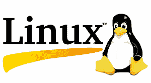

# Linux 和 Solaris 的区别

> 原文：<https://www.javatpoint.com/linux-vs-solaris>

在本文中，您将了解 Linux 和 Solaris 操作系统之间的区别。但是在讨论差异之前，您必须了解 **Linux** 和 **Solaris 操作系统**。

## 什么是 Linux 操作系统？

**Linux 操作系统**是基于 Linux 内核的 UNIX 操作系统的著名版本之一。在 **1991** 中，它是由**莱纳斯·托瓦兹**设计的。它是通用公共许可证下的免费开源操作系统。多年来，由于其低依赖性、高模块化和广泛的分布，它一直是行业中增长最快的操作系统。Linux 术语包括引导加载程序、初始化程序、内核、系统库和系统实用程序。它还以开源支持和灵活性而闻名。

最初，它是为个人电脑设计和开发的。它现在已经进入了各种其他平台，包括服务器、大型计算机、超级计算机等。现在广泛应用于嵌入式设备，如电视、游戏机、数字录像机、路由器、自动化控制、智能手表等。Linux 最成功的应用是安卓，它建立在 Linux 内核上，运行在智能手机和平板电脑上。由于安卓系统，Linux 拥有所有通用操作系统中最多的安装基础。它通常打包在一个 Linux 发行版中。

内核层和用户层是 Linux 体系结构的两个主要元素或层。每个 Linux 发行版都是不同的，有自己的一套接口。您可以根据自己的需求选择分销。

### Linux 操作系统的优缺点

Linux 操作系统有各种各样的优点和缺点。Linux 操作系统的一些优点和缺点如下:

**优势**

1.  它是一个开源操作系统，这意味着任何人都可以查看源代码并根据自己的需要进行修改。您可以在任意多个系统上安装 Linux，而无需支付许可证费用。与 Windows 或 Mac 相比，这些都是付费操作系统。
2.  Linux 上有各种各样的文本编辑器。大多数文本编辑器都是免费提供的，使用起来没有任何问题。如果你是一名程序员，你可以使用市场上任何可用的免费软件包，包括 Vim、Atom、Visual Studio Code、崇高文本编辑器等。
3.  如果您是 Windows 用户，您可能在安装或卸载软件时或系统变慢时看到系统重新启动。但是，在 Linux 的情况下，您不需要重新启动系统。
4.  如果您使用 Linux 操作系统，您不需要在您的系统上安装防病毒软件。Linux 不太可能感染病毒。高病毒防护的原因是 Linux 有很多开源开发者，他们不断关注病毒相关的问题。
5.  Linux 命令提示符非常强大。如果您是开发人员，可以通过命令行界面执行许多操作。您也可以在命令行界面的帮助下安装许多存储库和包。
6.  如果系统中的磁盘空间有限，可以运行 Linux。不需要额外的磁盘空间来长时间运行 Linux。

**缺点**

1.  Linux 没有一些硬件驱动程序，这是大多数 Linux 用户面临的问题之一。硬件公司更喜欢为 Windows 或 Mac OS 构建驱动程序，因为它们的用户比 Linux 多。
2.  很多运行在 Windows 或苹果操作系统上的应用程序并不运行在 Linux 上。如果您需要访问您工作中的特定程序，您应该检查它们在 Linux 上是否可用。微软应用程序就是 Linux 用户无法使用的软件的一个例子。
3.  如果操作系统有问题，找到解决方案可能会很困难。开始使用 Windows 很简单，但是对于新用户来说，理解 Linux 更复杂。
4.  大多数游戏都是为 Windows 而不是 Linux 设计的。视窗操作系统在世界范围内被广泛使用。这就是为什么开发人员对 windows 更感兴趣。

## 什么是 Solaris 操作系统？

**Solaris** 是基于 UNIX 的操作系统。它最初由太阳微系统公司开发，于 1992 年首次发布。它最初获得了软件许可，必须获得许可才能将其安装在系统上。 **2010** 年，甲骨文收购太阳微系统公司，并更名为甲骨文 Solaris。甲骨文停止了开源 Solaris。Solaris 是用 C 和 C++编程语言编写的。Solaris 设计用于 SPARC 和 Power PC 系统。

甲骨文提供该软件的 90 天免费试用版。如果您想在免费试用期结束后继续使用软件，您必须从甲骨文购买使用 Solaris 作为开发平台的许可证。

Oracle Solaris 被认为很容易更新云安装。通过提供最高的安全性和性能，它已被用于云上的传统应用程序。随着时间的推移，Oracle 向 Solaris 添加了新的功能和附加内容，包括服务管理工具、内核区域和其他服务。

### 甲骨文 Solaris 的特性

甲骨文 Solaris 有各种功能。甲骨文 Solaris 的一些功能如下:

1.  经过二十年的积极开发，操作系统已经相当安全和成熟。
2.  甲骨文提供了巨大的企业支持，这是值得称赞的，也是有益的。
3.  ZFS 文件系统高度可靠，读写性能更快。
4.  它允许你在任何当前系统上运行著名的遗留应用。
5.  它主要为商业和大规模应用而设计。

## Linux 和 Solaris 操作系统的主要区别

在这里，您将了解 Linux 和 Solaris 操作系统之间的主要区别。Linux 和 Solaris 操作系统之间的各种主要差异如下:

1.  Linux 是由 Linus Torvalds 在 1991 年设计并发布的。另一方面，Solaris 最初是由太阳微系统公司开发的，该公司于 1992 年首次发布。
2.  Linux 是独立于平台的操作系统。另一方面，并非所有平台都可以访问 Solaris 但是，它可用于几种架构。
3.  红帽主要提供 Linux OS 支持。另一方面，Solaris 操作系统支持由甲骨文提供。
4.  Linux 用于手机和嵌入式设备。另一方面，Solaris 操作系统用于服务管理。
5.  Linux 操作系统有不错的吞吐量。另一方面，Solaris 操作系统具有出色的吞吐量。
6.  Linux 操作系统提供的稳定性较差。另一方面，Solaris 操作系统提供了高稳定性。
7.  Linux 根据用途有不同的发行版。另一方面，Solaris 没有这样的发行版。
8.  Linux 提供了强大的管理能力。另一方面，Solaris 具有出色的管理员能力，可以轻松安装和管理系统。
9.  Linux 操作系统是使用 C 语言开发的。另一方面，Solaris 操作系统是使用 C 和 C++语言开发的。
10.  Linux 是一个免费的开源操作系统。另一方面，Solaris 操作系统是在甲骨文收购 Sun 微软后购买的。

## Linux 和 Solaris 操作系统之间的直接比较

在这里，您将了解 Linux 和 Solaris 操作系统之间的直接比较。Linux 和 Solaris 操作系统之间的区别如下:

| 特征 | Linux 操作系统 | 操作系统 |
| **开发** | 1991 年，它由 Linus Torvalds 设计。 | 它最初由太阳微系统公司开发，于 1992 年首次发布。 |
| **编程语言** | 它是用 C 语言开发的。 | 它是使用 C 和 C++语言开发的。 |
| **牌照** | 它是免费和开源的。 | 它是在甲骨文收购 Sun 微软后购买的。 |
| **分布** | 它根据用途有不同的分布。 | 它没有发行版。 |
| **吞吐量** | 它的吞吐量比 Solaris 低。 | 它有更好的吞吐量。 |
| **安装** | 它的安装通过 Kickstart 安装很简单。 | 在安装操作系统之前，它的安装需要一个自动安装程序。 |
| **已用** | 主要用于手机和嵌入式设备。 | 主要用于服务管理。 |
| **支持** | 它的定期更新获得了大量支持。 | 它有软件更新，并分批发布。 |
| **稳定性** | 它提供的稳定性较低。 | 它提供了高稳定性。 |

## 结论

Linux 和 Solaris 都是操作系统。这些都是类似 UNIX 的操作系统，具有虚拟内存、分页、系统调用、进程、内核、缓冲区、缓存、资源控制、映射文件、多处理器支持、CPU 调度和支持以及其他与 UNIX 相同的功能。Linux 和 Solaris 都有自己的一套命令行选项。如果你熟悉另一个，利用它会很简单。

Linux 由于其开源的特性而被广泛使用。这是一个广泛分发的免费操作系统。Linux 很容易根据需要在系统上下载和安装。Solaris 使用许可软件，在安装到系统上之前，必须从 Oracle 获得许可软件。您购买的许可证数量与您需要设置的计算机数量相同。Solaris 主要用于安全和性能功能。它简单、安全、云友好、云就绪，因为它与管理工具配合良好，可以快速高效地在云中运行基础架构。

* * *