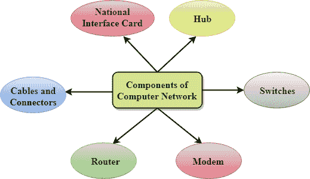

# 什么是计算机网络？

> 原文：<https://www.javatpoint.com/computer-network-introduction>

*   **计算机网络**是通过电线、光纤或光链路相互连接的一组计算机，使各种设备可以通过网络相互作用。
*   计算机网络的目的是在各种设备之间共享资源。
*   就计算机网络技术而言，有几种类型的网络从简单到复杂不等。

## 计算机网络的组件:

## 计算机网络的主要组成部分是:

### 国家接口卡

网卡是一种帮助计算机与其他设备通信的设备。网络接口卡包含硬件地址，数据链路层协议使用该地址来识别网络上的系统，以便将数据传输到正确的目的地。

网卡有两种:无线网卡和有线网卡。

*   **无线网卡:**所有现代笔记本电脑都使用无线网卡。在无线网卡中，使用采用**无线电波技术**的天线进行连接。
*   **有线网卡:**电缆使用**有线网卡**通过介质传输数据。

* * *

### 中心

集线器是将网络连接分成多个设备的中央设备。当计算机向计算机请求信息时，它会将请求发送到集线器。Hub 将此请求分发给所有互连的计算机。

* * *

### 开关

交换机是一种网络设备，它将网络上的所有设备分组，以便将数据传输到另一台设备。交换机比集线器更好，因为它不通过网络广播消息，也就是说，它将消息发送到它所属的设备。因此，我们可以说交换机将消息直接从源发送到目的地。

* * *

### 电缆和连接器

电缆是传输通信信号的传输介质。**电缆有三种类型:**

*   **双绞线:**是一种通过 **1Gbps** 或更高传输数据的高速电缆。
*   **同轴电缆:**同轴电缆类似电视安装电缆。同轴电缆比双绞线电缆贵，但它提供了高数据传输速度。
*   **光缆:**光缆是一种使用光束传输数据的高速电缆。与其他电缆相比，它提供了高数据传输速度。与其他电缆相比，它更贵，因此安装在政府层面。

* * *

### 路由器

路由器是连接局域网和互联网的设备。路由器主要用于连接不同的网络或将互联网连接到多台计算机。

* * *

### 调制解调器

调制解调器通过现有的电话线将计算机连接到互联网。调制解调器未与计算机主板集成。调制解调器是主板上电脑插槽上的独立部件。

* * *

## 计算机网络的用途

*   **资源共享:**资源共享是网络上用户之间对程序、打印机、数据等资源的共享，不需要资源和用户的物理位置。
*   **服务器-客户端模式:**计算机网络用于**服务器-客户端模式**。服务器是用于存储信息并由系统管理员维护的中央计算机。客户端是用于远程访问存储在服务器中的信息的机器。
*   **通信媒介:**计算机网络充当用户之间的通信媒介。例如，一个公司有多台电脑，电脑上有一个电子邮件系统，员工可以用它进行日常交流。
*   **电子商务:**计算机网络在商业中也很重要。我们可以通过互联网做生意。例如，Amazon.com 通过互联网开展业务，即他们通过互联网开展业务。

* * *