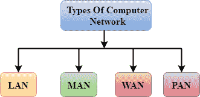
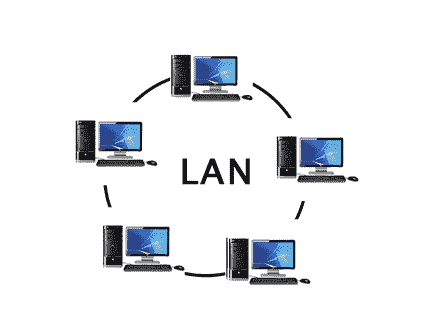
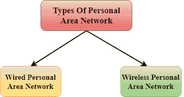
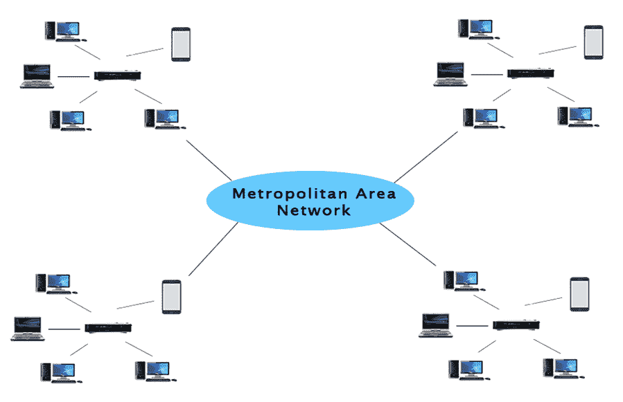
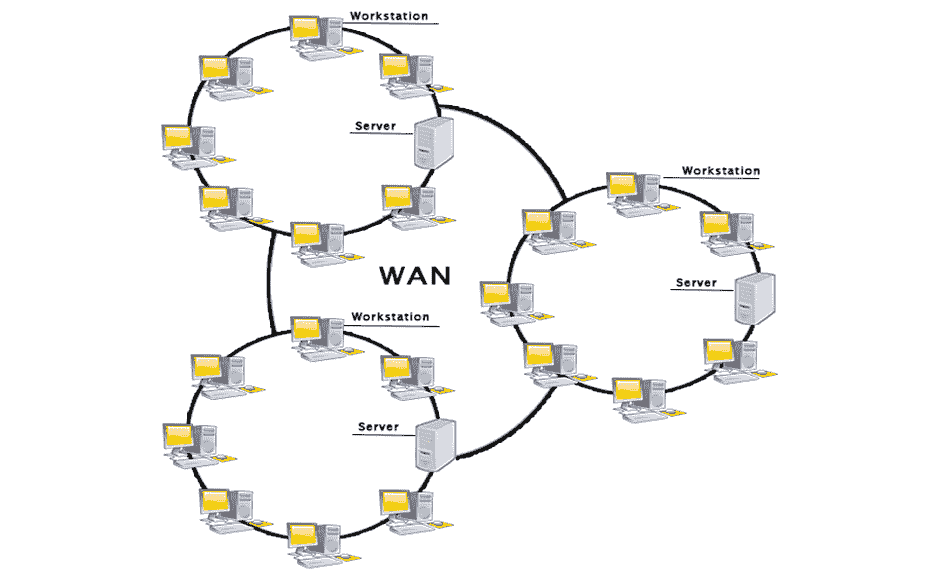

# 计算机网络类型

> 原文：<https://www.javatpoint.com/types-of-computer-network>

计算机网络是一组相互链接的计算机，使计算机能够与另一台计算机通信并共享它们的资源、数据和应用程序。

计算机网络可以按其大小分类。一**计算机网络**主要有**四种类型**:

*   局域网
*   个人区域网
*   城域网
*   广域网

* * *

## 局域网

*   局域网是在一个小区域(如大楼、办公室)内相互连接的一组计算机。
*   局域网用于通过双绞线、同轴电缆等通信介质连接两台或多台个人计算机。
*   它的成本较低，因为它是用廉价的硬件(如集线器、网络适配器和以太网电缆)构建的。
*   数据在局域网中以极快的速度传输。
*   局域网提供了更高的安全性。

* * *

## 个人区域网

*   个人区域网是安排在个人内部的网络，通常在 10 米范围内。
*   个人区域网络用于连接个人使用的计算机设备，被称为个人区域网络。
*   **托马斯·齐默曼**是第一个提出个人区域网想法的研究科学家。
*   个人区域网占地 **30 英尺**。
*   用于发展个人区域网络的个人计算机设备是膝上型电脑、移动电话、媒体播放器和游戏站。

**个人局域网有两种类型:**

*   有线个人区域网
*   无线个人区域网

**无线个人区域网:**无线个人区域网是简单利用 WiFi、蓝牙等无线技术发展起来的。这是一个短程网络。

**有线个人区域网:**有线个人区域网是使用 USB 创建的。

### 个人区域网络示例:

*   **体域网:**体域网是随人移动的网络。**比如**，移动网络随人移动。假设一个人建立了网络连接，然后与另一个设备建立连接以共享信息。
*   **离线网络:**家庭内部可以创建一个离线网络，因此也被称为**家庭网络**。家庭网络旨在集成打印机、计算机、电视等设备，但它们并未连接到互联网。
*   **小型家庭办公室:**它用于使用 VPN 将各种设备连接到互联网和公司网络

* * *

## 城域网

*   城域网是通过互连不同的局域网以形成更大的网络来覆盖更大地理区域的网络。
*   政府机构使用城域网连接市民和私营企业。
*   在城域网中，各种局域网通过电话线相互连接。
*   城域网中应用最广泛的协议有 RS-232、帧中继、ATM、ISDN、OC-3、ADSL 等。
*   它的范围比局域网更大。

### 城域网的用途:

*   城域网用于城市中银行之间的通信。
*   它可以用于航空公司预订。
*   它可以在一个城市的大学里使用。
*   它也可以用于军事通信。

* * *

## 广域网

*   广域网是一个延伸到大的地理区域的网络，如州或国家。
*   广域网是比局域网更大的网络。
*   广域网不局限于一个位置，而是通过电话线、光缆或卫星链路跨越一个大的地理区域。
*   互联网是世界上最大的广域网之一。
*   广域网广泛应用于商业、政府和教育领域。

### 广域网示例:

*   **移动宽带:**一个 4G 网络在一个地区或国家被广泛使用。
*   **最后一英里:**一家电信公司被用来通过光纤连接数百个城市的客户的家，为他们提供互联网服务。
*   **专网:**一家银行提供了连接 44 个办事处的专网。这个网络是利用电信公司提供的电话租用线路建成的。

### 广域网的优势:

广域网的优势如下:

*   **地理区域:**广域网提供了很大的地理区域。假设我们办公室的分支机构在不同的城市，那么我们可以通过广域网与他们连接。互联网提供了一条租用线路，我们可以通过这条线路与另一个分支机构连接。
*   **数据集中:**广域网情况下，数据集中。因此，我们不需要购买电子邮件、文件或备份服务器。
*   **获取更新文件:**软件公司在直播服务器上工作。因此，程序员可以在几秒钟内获得更新的文件。
*   **交换消息:**在广域网中，消息传输速度很快。像脸书、Whatsapp、Skype 这样的网络应用程序可以让你和朋友交流。
*   **软件和资源的共享:**在广域网中，我们可以像硬盘、RAM 一样共享软件和其他资源。
*   **全球业务:**我们可以通过互联网在全球范围内开展业务。
*   **高带宽:**如果我们为公司使用租用线路，那么这就提供了高带宽。高带宽提高了数据传输速率，进而提高了我们公司的生产率。

### 广域网的缺点:

以下是广域网的缺点:

*   **安全问题:**与局域网和城域网相比，广域网存在更多的安全问题，因为所有技术结合在一起会产生安全问题。
*   **需要防火墙&杀毒软件:**数据在互联网上传输，可以被黑客更改或黑客攻击，所以需要使用防火墙。有些人可以将病毒注入我们的系统，因此需要防病毒来抵御这种病毒。
*   **高安装成本:**广域网的安装成本很高，因为它涉及到购买路由器、交换机。
*   **故障排除问题:**占地面积大，很难修复问题。

* * *

## 互联网

*   互联网的定义是两个或多个计算机网络局域网或广域网或计算机网段使用设备连接，并通过本地寻址方案进行配置。这个过程被称为**互联**。
*   公共、私有、商业、工业或政府计算机网络之间的互联也可以定义为**互联**。
*   互联网使用**互联网协议**。
*   用于互联的参考模型是**开放系统互连(OSI)** 。

## 互联网的类型:

1.**外网:**外网是基于**传输控制协议****互联网协议**等互联网协议的通信网络。它用于信息共享。只有拥有登录凭证的用户才能访问外联网。外联网是最低级别的互联网络。可分为 **MAN** 、 **WAN** 或其他计算机网络。一个外联网不能有一个单独的**局域网**，至少它必须有一个到外部网络的连接。

2.**内网:**内网是基于**传输控制协议****互联网协议**等互联网协议的专网。内部网属于只有**组织的员工或成员才能访问的组织。内部网的主要目的是在组织员工之间共享信息和资源。内部网为小组工作和电话会议提供了便利。**

## 内部网优势:

*   **通信:**它提供了一个便宜又容易的通信。组织中的一名员工可以通过电子邮件、聊天与另一名员工交流。
*   **省时:**内网上的信息是实时共享的，所以省时。
*   **协作:**协作是内网最重要的优势之一。信息分布在组织的员工中，只能由授权用户访问。
*   **平台无关性:**它是一个中性架构，因为计算机可以连接到另一个不同架构的设备。
*   **经济高效:**人们可以使用浏览器查看数据和文档，并通过内部网分发副本。这导致成本降低。

* * *