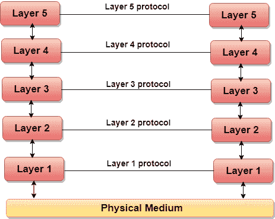

# 计算机网络模型

> 原文：<https://www.javatpoint.com/computer-network-models>

通信子系统是一个复杂的硬件和软件。为这些子系统实现软件的早期尝试是基于一个单一的、复杂的、非结构化的程序，该程序具有许多交互组件。最终的软件很难测试和修改。为了克服这个问题，国际标准化组织开发了一种分层方法。在分层方法中，网络概念被分成几层，每一层被分配一个特定的任务。因此，我们可以说，网络任务取决于层。

## 分层架构

*   分层架构的主要目的是将设计分成小块。
*   每一个较低层都将其服务添加到较高层，以提供一整套服务来管理通信和运行应用程序。
*   它提供模块化和清晰的接口，即提供子系统之间的交互。
*   它通过从低层到高层提供服务来确保层与层之间的独立性，而不需要定义服务是如何实现的。因此，层中的任何修改都不会影响其他层。
*   每层的层数、功能、内容因网络而异。然而，每一层的目的都是从较低层向较高层提供服务，并对服务如何实现的各层隐藏细节。
*   分层架构的基本元素是服务、协议和接口。
    *   **服务:**是一个层向更高层提供的一组动作。
    *   **协议:**它定义了一组规则，层用来与对等实体交换信息。这些规则主要涉及所用消息的内容和顺序。
    *   **接口:**是消息从一层传递到另一层的一种方式。
*   在第 n 层架构中，一台机器上的第 n 层将与另一台机器上的第 n 层进行通信，对话中使用的规则称为第 n 层协议。

**我们举一个五层架构的例子。**

*   在分层架构的情况下，没有数据从一台机器的第 n 层传输到另一台机器的第 n 层。相反，每一层都将数据传递到紧接其下的层，直到到达最低层。
*   第 1 层下面是进行实际通信的物理介质。
*   在分层架构中，不可管理的任务被分成几个小的和可管理的任务。
*   数据通过接口从上层传递到下层。分层体系结构提供了一个清晰的界面，以便在不同的层之间共享最少的信息。它还确保了一个层的实现可以很容易地被另一个实现替代。
*   一组层和协议被称为网络体系结构。

## 为什么我们需要分层架构？

*   **分而治之的方法:**分而治之的方法通过将不可管理的任务划分为可管理的小任务来进行设计过程。简而言之，我们可以说这种方法降低了设计的复杂性。
*   **模块化:**分层架构更加模块化。模块化提供了层的独立性，这更容易理解和实现。
*   **易修改:**保证了层与层的独立性，使得一层的实现可以改变，而不影响其他层。
*   **易于测试:**分层架构的每一层都可以单独进行分析和测试。