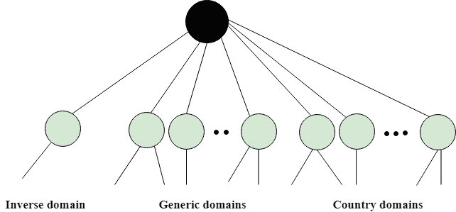
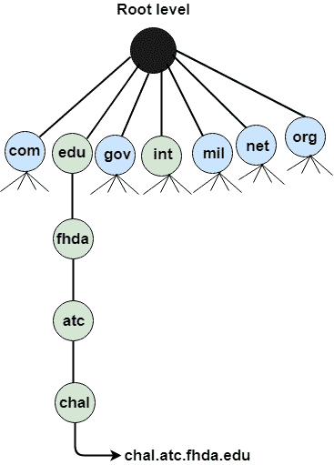

# 域名服务器(Domain Name Server)

> 原文：<https://www.javatpoint.com/computer-network-dns>

应用层协议定义了运行在不同系统上的应用程序进程如何相互传递消息。

*   域名系统代表域名系统。
*   DNS 是一种目录服务，它提供网络上主机的名称与其数字地址之间的映射。
*   互联网的运行需要域名系统。
*   树中的每个节点都有一个域名，完整的域名是由点指定的符号序列。
*   域名系统是一种将域名转换成 IP 地址的服务。这允许网络用户在寻找其他主机时使用用户友好的名称，而不是记住 IP 地址。
*   例如，假设教育软件的 FTP 站点的 IP 地址是 132.147.165.50，大多数人会通过指定 ftp.EduSoft.com 来访问该站点。因此，域名比 IP 地址更可靠。

DNS 是一种在不同平台上使用的 TCP/IP 协议。域名空间分为三个不同的部分:通用域、国家域和反向域。

## 通用域

*   它根据注册主机的一般行为来定义它们。
*   树中的每个节点都定义了域名，它是 DNS 数据库的索引。
*   它使用三个字符的标签，这些标签描述了组织类型。

| 标签 | 描述 |
| 飞机的 | 航空公司和航天公司 |
| 商业 | 企业或公司 |
| com | 商业组织 |
| 笼子 | 合作商业组织 |
| 电子显示器(electronic display unit)ˌ教育机构域名(education)ˌ实验发展处(Experimental Development Unit) | 教育机构 |
| 政府 | 政府机构 |
| 信息 | 信息服务提供商 |
| （同 Internationalorganizations）国际组织 | 国际组织 |
| 密耳 | 军事团体 |
| 博物馆 | 博物馆和其他非营利组织 |
| 名字 | 个人姓名 |
| 网 | 网络支持中心 |
| （同 organic）有机 | 非营利组织 |
| 赞成 | 专业个人组织 |

## 国家/地区

国家/地区域的格式与通用域相同，但它使用两个字符的国家/地区缩写(例如，us 代表美国)来代替三个字符的组织缩写。

## 逆域

反向域用于将地址映射到名称。当服务器收到来自客户端的请求，并且服务器只包含授权客户端的文件时。为了确定客户端是否在授权列表中，它会向 DNS 服务器发送查询，并要求将地址映射到名称。

## 域名系统的工作

*   DNS 是一种客户机/服务器网络通信协议。DNS 客户端向发送请求。服务器，而 DNS 服务器向客户端发送响应。
*   客户端请求包含一个名称，该名称被转换为称为正向域名系统查找的 IP 地址，而包含一个 IP 地址的请求被转换为称为反向域名系统查找的名称。
*   DNS 实现了一个分布式数据库来存储互联网上所有可用主机的名称。
*   如果像网络浏览器这样的客户端发送包含主机名的请求，那么像**域名解析器**这样的软件就会向域名系统服务器发送请求，以获取主机名的 IP 地址。如果 DNS 服务器不包含与主机名相关联的 IP 地址，则它会将请求转发给另一个 DNS 服务器。如果 IP 地址到达解析器，解析器通过互联网协议完成请求。