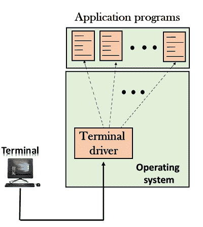
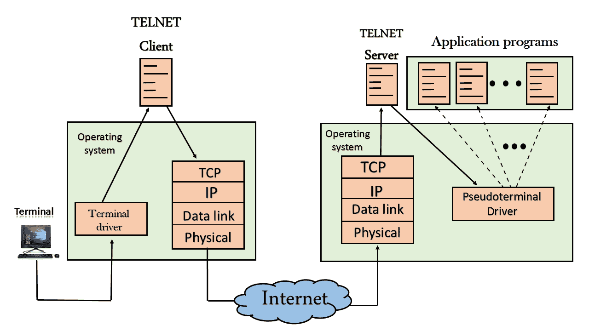
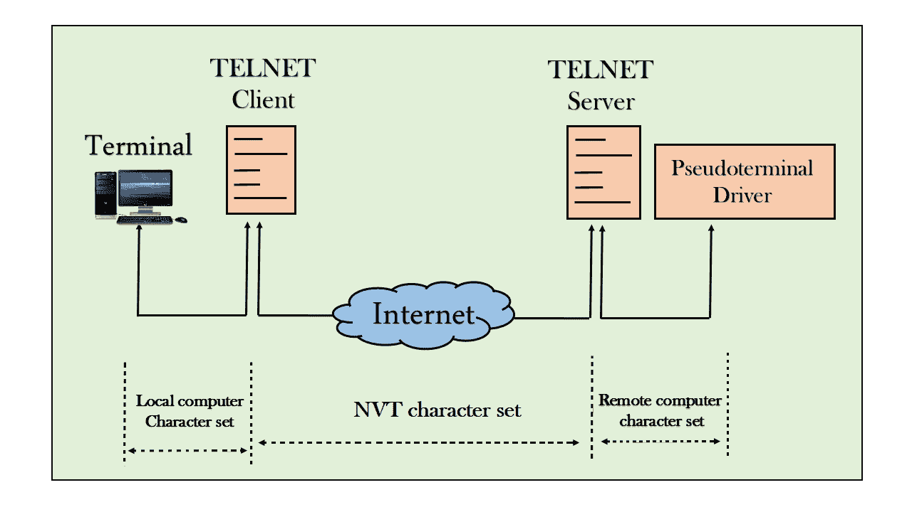

# 用于远程联接服务的标准协议或者实现此协议的软件(可为动词)

> 原文：<https://www.javatpoint.com/computer-network-telnet>

*   互联网的主要任务是为用户提供服务。例如，用户希望在远程站点运行不同的应用程序，并将结果传输到本地站点。这需要一个客户端-服务器程序，如 FTP、SMTP。但这不允许我们为每个需求创建一个特定的程序。
*   更好的解决方案是提供一个通用的客户端-服务器程序，允许用户访问远程计算机上的任何应用程序。因此，允许用户登录远程计算机的程序。一个流行的客户端-服务器程序 Telnet 被用来满足这样的需求。Telnet 是**终端网络**的缩写。
*   Telnet 提供到远程计算机的连接，使得本地终端看起来位于远程。

## 登录有两种类型:

### 本地登录

### 

*   When a user logs on to the local computer, it is called local login.
*   When the workstation runs the terminal emulator, the keys input by the user are accepted by the terminal driver. Then, the terminal driver passes these characters to the operating system, which then calls the required application program.
*   However, the operating system has a special meaning for special characters. For example, in UNIX, some character combinations have special meanings, for example, the control character with "z" means to suspend. This situation will not cause any problems, because the terminal driver knows the meaning of these characters. However, it will cause problems of remote login.

### 远程登录

*   When a user wants to access an application on a remote computer, the user must log in remotely.

## 如何在本地站点进行远程登录

用户将击键发送到终端驱动程序，然后字符被发送到远程登录客户端。TELNET 客户端依次将字符转换为称为网络虚拟终端字符的通用字符集，并将它们传送到本地 TCP/IP 堆栈

### 在远程站点

NVT 格式的命令被传输到远程机器上的 TCP/IP。在这里，字符被传递给操作系统，然后传递给远程登录服务器。远程登录服务器转换远程计算机可以理解的字符。但是，字符不能直接传递给操作系统，因为远程操作系统不会从远程登录服务器接收字符。因此，它需要一些软件，可以接受字符从远程登录服务器。然后，操作系统将这些字符传递给适当的应用程序。

## 网络虚拟终端(NVT)

*   网络虚拟终端是定义数据和命令如何通过网络发送的接口。
*   在当今世界，系统是异构的。例如，操作系统接受特殊的字符组合，如运行 DOS 操作系统的文件尾令牌 *ctrl+z* ，而运行 UNIX 操作系统的令牌为 *ctrl+d* 。
*   TELNET 通过定义一个称为网络虚拟接口的通用接口来解决这个问题。
*   TELNET 客户端将来自本地终端的字符翻译成 NVT 形式，然后将它们传送到网络。然后，远程登录服务器将数据从 NVT 格式转换成远程计算机可以理解的格式。