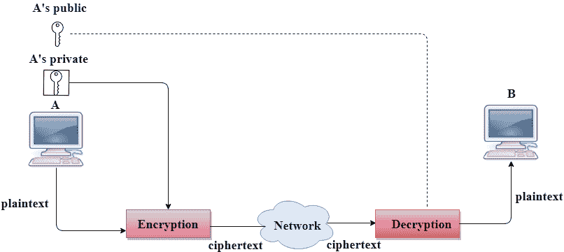
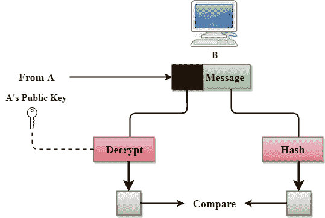

# 数字签名

> 原文：<https://www.javatpoint.com/computer-network-digital-signature>

数字签名是一种用于验证消息真实性和完整性的技术。我们知道安全性有四个方面:隐私、身份验证、完整性和不可否认性。我们已经讨论了安全性的第一个方面，其他三个方面可以通过使用数字签名来实现。

数字签名背后的基本思想是签署文档。当我们以电子方式发送文件时，我们也可以签署它。我们可以通过两种方式签署文件:签署整个文件和签署摘要。

## 签署整个文件

*   在数字签名中，公钥加密技术用于签署文档。然而，公钥和私钥的作用在这里是不同的。发送方使用私钥加密消息，而接收方使用发送方的公钥解密消息。
*   在数字签名中，私钥用于加密，而公钥用于解密。
*   数字签名不能通过使用密钥加密来实现。

### 数字签名用于实现以下三个方面:

*   **完整性:**数字签名保留了消息的完整性，因为如果任何恶意攻击拦截了消息并部分或全部更改它，那么解密的消息将是不可能的。
*   **认证:**我们可以用下面的推理来展示消息是如何被认证的。如果入侵者(用户 X)发送一条消息，假装它来自其他人(用户 A)，则用户 X 使用自己的私钥对消息进行加密。消息是使用用户 a 的公钥解密的。因此，这使得消息不可读。用 X 的私钥加密和用 A 的公钥解密会产生垃圾值。
*   **不可否认:**数字签名也提供不可否认性。如果发送者拒绝发送消息，那么她对应于公钥的私钥将在明文上进行测试。如果解密的消息与原始消息相同，那么我们知道发送者已经发送了消息。

#### 注意:数字签名不提供隐私。如果需要隐私，则应用另一层加密/解密。

## 签署摘要

*   如果消息很短，公钥加密是有效的。如果消息很长，公钥加密的使用效率很低。这个问题的解决方案是让发件人签署文档的摘要，而不是整个文档。
*   发送方创建文档的缩略版本(摘要)，然后签名，接收方检查缩略版本的签名。
*   哈希函数用于创建消息摘要。哈希函数从可变长度消息创建固定大小的摘要。
*   使用的两个最常见的哈希函数是:MD5(消息摘要 5)和 SHA-1(安全哈希算法 1)。第一个产生 120 位摘要，而第二个产生 160 位摘要。
*   哈希函数必须有两个属性才能确保成功:
    *   首先，摘要必须是单向的，即只能从消息创建摘要，而不能从消息创建摘要。
    *   其次，哈希是一对一的功能，即两条消息不应该创建相同的摘要。

### 以下是为确保安全而采取的步骤:

*   消息的缩略版本(摘要)是通过使用散列函数创建的。
*   摘要通过使用发件人的私钥进行加密。
*   在摘要被加密之后，加密的摘要被附加到原始消息并被发送到接收者。
*   接收方接收原始消息和加密摘要，并将两者分开。接收者在原始消息上实现散列函数来创建第二个摘要，并且它还通过使用发送者的公钥来解密接收到的摘要。如果两个摘要都相同，那么安全性的所有方面都会得到保留。

**发送方现场**

**在接收站**

