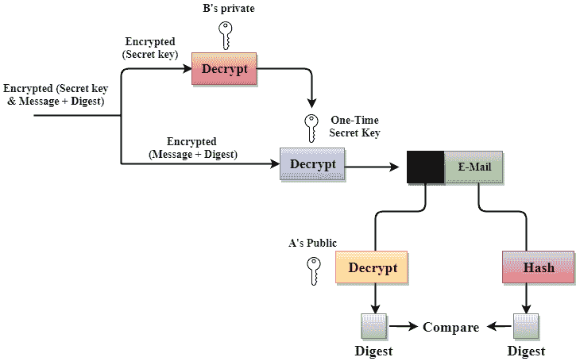

# 电子邮件加密程序

> 原文：<https://www.javatpoint.com/computer-network-pgp>

*   PGP 代表相当好的隐私，是由菲尔·齐默曼发明的。
*   PGP 旨在提供安全的所有四个方面，即电子邮件发送中的隐私、完整性、身份验证和不可否认性。
*   PGP 使用数字签名(散列和公钥加密的组合)来提供完整性、身份验证和不可否认性。PGP 使用秘密密钥加密和公开密钥加密的组合来提供隐私。因此，我们可以说数字签名使用一个散列函数、一个秘密密钥和两个私有-公共密钥对。
*   PGP 是一个开源且免费提供的电子邮件安全软件包。
*   PGP 通过使用数字签名来提供身份验证。
*   它通过使用对称块加密来提供机密性。
*   它通过使用 ZIP 算法提供压缩，并使用基数-64 编码方案提供电子邮件兼容性。

### 以下是 PGP 在发件人站点创建安全电子邮件所采取的步骤:

*   通过使用哈希函数创建摘要，对电子邮件进行哈希处理。
*   然后使用发件人的私钥对摘要进行加密以形成签名摘要，然后将签名摘要添加到原始电子邮件中。
*   原始邮件和签名摘要通过使用发送方创建的一次性密钥进行加密。
*   秘密密钥是通过使用接收者的公钥加密的。
*   加密密钥和消息与摘要的加密组合一起发送。

### 发送方站点的 PGP(一)

### 以下是显示 PGP 如何使用哈希和三个密钥的组合来生成原始消息的步骤:

*   接收方接收加密密钥和接收消息摘要的组合。
*   加密的密钥通过使用接收者的私钥解密，以获得一次性密钥。
*   然后使用密钥来解密消息和摘要的组合。
*   使用发送方的公钥解密摘要，并使用哈希函数对原始消息进行哈希处理以创建摘要。
*   如果两个摘要相等，则比较两个摘要，这意味着安全的所有方面都得到保留。

### 接收站的 PGP)

### PGP 加密的缺点

*   **给药困难:**PGP 的不同版本使给药复杂化。
*   **兼容性问题:**发送方和接收方都必须有兼容版本的 PGP。例如，如果您使用 PGP 和其中一种加密技术对电子邮件进行加密，则接收方拥有不同版本的 PGP，无法读取数据。
*   **复杂性:** PGP 是一种复杂的技术。其他安全方案使用使用一个密钥的对称加密或使用两个不同密钥的非对称加密。PGP 使用混合方法，使用两个密钥实现对称加密。PGP 更复杂，与传统的对称或非对称方法相比，它不太为人所熟悉。
*   **无法恢复:**电脑管理员面临密码丢失的问题。在这种情况下，管理员应该使用特殊程序来检索密码。例如，技术人员可以通过物理方式访问电脑，该电脑可用于检索密码。然而，PGP 并没有提供这种特殊的恢复计划；加密方法非常强大，因此它不会检索忘记的密码，从而导致丢失邮件或文件。