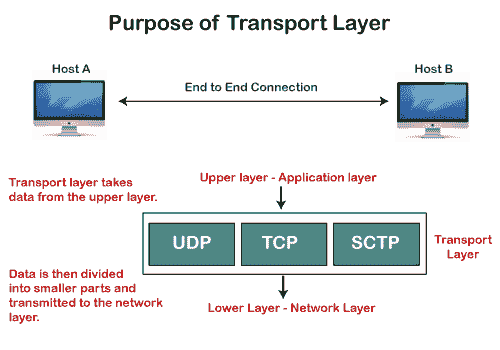
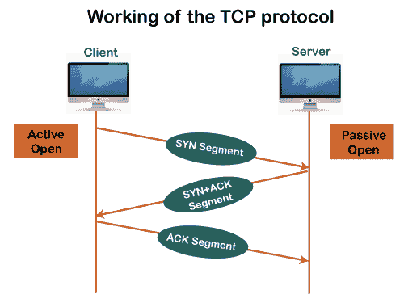

# 三氯苯酚

> 原文：<https://www.javatpoint.com/tcp>

TCP 代表**传输控制协议**。它是一种传输层协议，有助于数据包从源传输到目的地。这是一种面向连接的协议，意味着它在网络中的计算设备之间发生通信之前建立连接。该协议与 [IP](https://www.javatpoint.com/ip-full-form) 协议一起使用，因此它们一起被称为 [TCP/IP](https://www.javatpoint.com/tcp-ip-full-form) 。

TCP 的主要功能是从应用层获取数据。然后，它将数据分成几个数据包，对这些数据包进行编号，最后将这些数据包发送到目的地。另一方面，TCP 将重组数据包并将其传输到应用层。我们知道，TCP 是一种面向连接的协议，因此连接将保持建立，直到发送方和接收方之间的通信没有完成。

### TCP 协议的特点

**以下是 TCP 协议的特征:**

*   **传输层协议**

TCP 是一种传输层协议，因为它用于将数据从发送方传输到接收方。

*   **可靠**

TCP 是一种可靠的协议，因为它遵循流量和错误控制机制。它还支持确认机制，检查数据的状态和声音到达。在确认机制中，接收方向发送方发送肯定或否定的确认，以便发送方能够知道数据包是否已被接收或需要重新发送。

*   **保持数据的顺序**

该协议确保数据以发送的相同顺序到达预期的接收者。它对每个数据段进行排序和编号，以便目的端的 TCP 层可以根据它们的顺序对它们进行重组。

*   **面向连接**

这是一种面向连接的服务，意味着数据交换只在连接建立后发生。当数据传输完成时，连接将被终止。

*   **全双工**

全双工意味着数据可以同时双向传输。

*   **面向流**

TCP 是一种面向流的协议，因为它允许发送方以字节流的形式发送数据，也允许接收方以字节流的形式接受数据。TCP 创造了一种环境，在这种环境中，发送者和接收者都通过一个被称为虚电路的假想管道连接起来。这个虚拟电路通过互联网传输字节流。

### 传输控制协议的需求

在网络模型的分层体系结构中，整个任务被分成更小的任务。每个任务都被分配到处理该任务的特定层。在 [TCP/IP 模型](https://www.javatpoint.com/computer-network-tcp-ip-model)中，五层分别是[应用层](https://www.javatpoint.com/computer-network-application-layer)、[传输层](https://www.javatpoint.com/computer-network-transport-layer)、[网络层](https://www.javatpoint.com/network-layer)、[数据链路层](https://www.javatpoint.com/computer-network-transport-layer)和物理层。传输层在为直接应用程序进程提供端到端通信方面起着关键作用。它创建了 65，000 个端口，以便可以同时访问多个应用程序。它从上层获取数据，并将数据分成更小的数据包，然后将其传输到网络层。

### TCP 的工作原理

在 TCP 中，连接是通过使用三方握手来建立的。客户端发送带有序列号的数据段。作为回报，服务器发送其具有自己的序列号和确认序列的数据段，确认序列比客户端序列号多一个。当客户端收到其数据段的确认时，它会将该确认发送给服务器。这样，客户端和服务器之间就建立了连接。

### TCP 的优点

*   它提供了面向连接的可靠服务，这意味着它保证了数据包的传递。如果数据包在网络中丢失，TCP 将重新发送丢失的数据包。
*   它提供了一种使用滑动窗口协议的流量控制机制。
*   它通过使用校验和提供错误检测，并通过使用返回或 ARP 协议提供错误控制。
*   它通过使用网络拥塞避免算法来消除拥塞，该算法包括各种方案，如加法增加/乘法减少(AIMD)、慢速启动和拥塞窗口。

### TCP 的缺点

由于每个网段都有自己的 TCP 报头，这会增加大量开销，因此路由器的碎片会增加开销。

### 传输控制协议报头格式

*   **源端口:**定义发送数据的应用的端口。因此，该字段包含 16 位的源端口地址。
*   **目的端口:**定义接收端应用的端口。因此，该字段包含目的端口地址，为 16 位。
*   **序列号:**该字段包含特定会话中数据字节的序列号。
*   **确认号:**当设置了确认标志时，它包含数据字节的下一个序列号，并作为接收到的前一个数据的确认。例如，如果接收方接收到段号“x”，则它响应“x+1”作为确认号。
*   **HLEN:** 指定报头中 4 字节字指示的报头长度。报头的大小在 20 到 60 字节之间。因此，该字段的值将介于 5 和 15 之间。
*   **保留:**为 4 位字段，保留以备后用，默认全部置零。
*   **标志**
    **有六个控制位或标志:**
    1.  **URG:** 代表紧急指针。如果设置了，则数据被紧急处理。
    2.  **确认:**如果确认设置为 0，则意味着数据包不包含确认。
    3.  **PSH:** 如果设置了该字段，则请求接收设备将数据推送到接收应用程序，而不进行缓冲。
    4.  **RST:** 如果设置，则请求重新启动连接。
    5.  **SYN:** 用于在主机之间建立连接。
    6.  **FIN:** 用于释放连接，不会发生进一步的数据交换。

*   **窗口大小**
    这是一个 16 位字段。它包含接收者可以接受的数据大小。该字段用于发送方和接收方之间的流量控制，还决定了接收方为一个数据段分配的缓冲量。该字段的值由接收器决定。
*   **校验和**
    这是一个 16 位字段。此字段在 UDP 中是可选的，但在 TCP/IP 的情况下，此字段是必需的。
*   **紧急指针**
    如果 URG 标志设置为 1，则该指针指向紧急数据字节。它定义了一个值，该值将被添加到序列号中，以获得最后一个紧急字节的序列号。
*   **选项**
    它提供了额外的选项。可选字段用 32 位表示。如果该字段包含的数据少于 32 位，则需要填充以获得剩余的位。

* * *