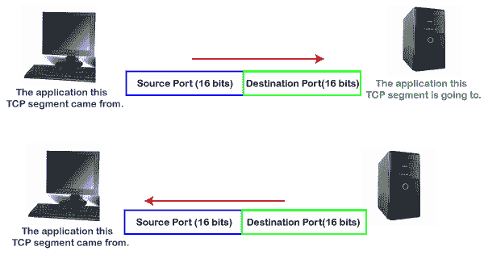
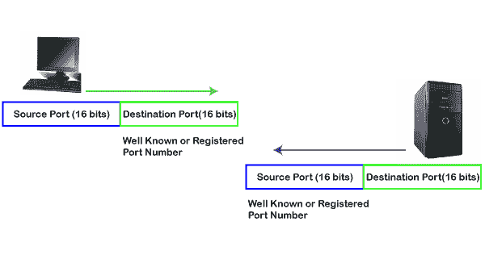
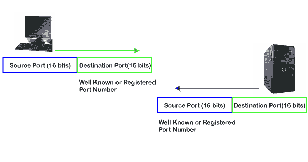
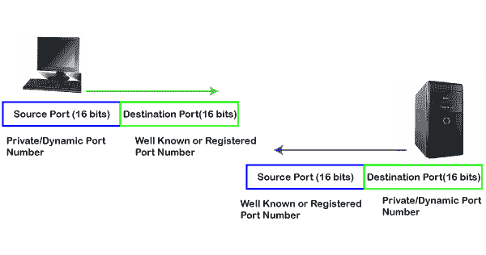

# 什么是 TCP 端口？

> 原文：<https://www.javatpoint.com/tcp-port>

TCP 端口是分配给不同应用程序的唯一号码。例如，我们已经在电脑上打开了电子邮件和游戏应用程序；通过电子邮件应用程序，我们想把邮件发送给主机，通过游戏应用程序，我们想玩网络游戏。为了完成所有这些任务，为这些应用程序分配了不同的唯一编号。每个协议和地址都有一个称为端口号的端口。 [TCP(传输控制协议)](https://www.javatpoint.com/tcp)和 UDP(用户数据报协议)协议主要使用端口号。

端口号是与 IP 地址一起使用的唯一标识符。端口是 16 位无符号整数， [TCP/IP 模型](https://www.javatpoint.com/computer-network-tcp-ip-model)中可用的端口总数为 65，535 个端口。因此，端口号的范围是 0 到 65535。在 TCP 的情况下，零端口号是保留的，不能使用，而在 UDP 中，零端口不可用。IANA(互联网号码分配机构)是一个分配端口号的标准机构。

**端口号示例:**

**192.168.1.100: 7**

在上述情况下， **192.168.1.100** 为 IP 地址， **7** 为端口号。

要访问特定服务，端口号与 [IP](https://www.javatpoint.com/ip-full-form) 地址一起使用。从 0 到 1023 的端口号范围是为标准协议保留的，其他端口号是用户定义的。

### 为什么我们需要端口号？

单个客户端可以与同一个服务器或多个服务器有多个连接。客户端可能同时运行多个应用程序。当客户端试图访问某项服务时，IP 地址不足以访问该服务。要从服务器访问服务，需要端口号。因此，传输层通过为应用程序分配端口号，在提供这些应用程序之间的多种通信方面发挥着重要作用。

### 端口号的分类

**端口号分为三类:**

*   **知名港口**
*   **注册港口**
*   **动态端口**

### 著名的港口

众所周知的端口范围是 0 到 1023。众所周知的端口与那些服务于常见应用和服务的协议一起使用，如 [HTTP(超文本传输协议)](https://www.javatpoint.com/http-tutorial)、IMAP(互联网消息访问协议)、SMTP(简单邮件传输协议)等。例如，我们想访问互联网上的一些网站；然后，我们使用 [http](https://www.javatpoint.com/computer-network-http) 协议； [http](https://www.javatpoint.com/http) 的端口号为 80，这意味着当我们在应用程序中使用 http 协议时，它的端口号为 80。定义每当使用 [http](https://www.javatpoint.com/http-full-form) 协议时，就使用端口号 80。同样，与其他协议如 [SMTP](https://www.javatpoint.com/simple-mail-transfer-protocol) 、IMAP 定义了众所周知的端口。其余端口号用于随机应用。

### 注册港口

注册端口的范围是 1024 到 49151。注册的端口用于用户进程。这些进程是单独的应用程序，而不是具有众所周知的端口的公共应用程序。

### 动态端口

动态端口的范围是 49152 到 65535。动态端口的另一个名称是临时端口。当客户端创建连接时，这些端口号会动态分配给客户端应用程序。动态端口是在客户端启动连接时识别的，而客户端在连接之前就知道已知的端口。当客户端连接到服务时，客户端不知道该端口。

### TCP 和 UDP 报头

我们知道，TCP 和 UDP 都包含源端口号和目的端口号，这些端口号用于在源端和目的端识别应用程序或服务器。TCP 和 UDP 都使用端口号将信息传递到上层。

**我们来了解一下这个场景。**

假设客户端正在访问网页。TCP 报头包含源端口和目的端口。

### 客户端

**在上图中，**

**源端口:**源端口定义了 TCP 段所属的应用，这个端口号由客户端动态分配。这基本上是一个分配端口号的过程。

**目的端口:**目的端口标识服务在服务器上的位置，以便服务器能够服务于客户端的请求。

### 服务器端

**在上图中，**

**源端口:**它定义了 TCP 段来自的应用程序。

**目的端口:**它定义了 TCP 段要到达的应用程序。

**在上述情况下，使用两个过程:**

**封装:**发送方使用端口号来告诉接收方应该使用哪个应用程序来处理数据。

**解封装:**接收器使用端口号来识别应该将数据发送到哪个应用程序。

让我们通过使用所有三个端口来理解上面的示例，即知名端口、注册端口和动态端口。

**首先，我们来看一个知名的港口。**

众所周知的端口是服务于常见服务和应用程序的端口，如 http、ftp、smtp 等。这里，客户端使用一个众所周知的端口作为目的端口，而服务器使用一个众所周知的端口作为源端口。例如，客户端发送一个 http 请求，那么，在这种情况下，目标端口将是 80，而 http 服务器正在处理该请求，因此它的源端口号将是 80。

**现在，我们来看看注册港口。**

注册端口被分配给非通用应用程序。许多供应商应用程序都使用这个端口。与众所周知的端口一样，客户端使用该端口作为目的端口，而服务器使用该端口作为源端口。

**最后，我们看看动态端口在这个场景中是如何工作的。**

动态端口是启动连接时动态分配给客户端应用程序的端口。在这种情况下，客户端使用动态端口作为源端口，而服务器使用动态端口作为目的端口。例如，客户端发送一个 http 请求；那么在这种情况下，目标端口将是 80，因为它是一个 http 请求，而源端口将仅由客户端分配。当服务器处理请求时，源端口将是 80，因为它是一个 http 服务器，目的端口将与客户端的源端口相同。注册端口也可以用来代替动态端口。

**我们来看看下面的例子。**

假设客户端正在与服务器通信，并发送 http 请求。因此，客户端将 TCP 段发送到众所周知的端口，即 80 个 HTTP 协议。在这种情况下，目标端口为 80，假设客户端动态分配的源端口为 1028。当服务器响应时，目标端口是 1028，因为客户端定义的源端口是 1028，当 HTTP 服务器响应客户端的请求时，服务器端的源端口将是 80。

* * *