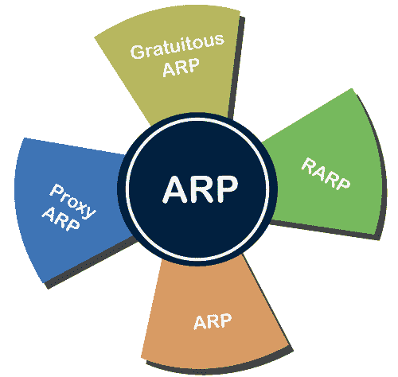

# 地址解析协议及其类型

> 原文：<https://www.javatpoint.com/address-resolution-protocol-and-its-types>

地址解析协议(ARP)是一种通信协议，用于从设备的 IP 地址中找到设备的媒体访问控制(MAC)地址。当一台设备想要与局域网或以太网上的另一台设备通信时，使用该协议。

## ARP 的类型

**地址解析协议有四种，如下所示:**

*   代理 ARP
*   免费 ARP
*   反向 ARP
*   逆向 ARP

**代理 ARP -** 代理 ARP 是一种方法，通过该方法，第 3 层设备可以响应与发送方位于不同网络中的目标的 ARP 请求。代理 [ARP](address-resolution-protocol) 配置的路由器响应 ARP，将路由器的媒体访问控制地址映射到目标 [IP](https://www.javatpoint.com/ip-full-form) 地址，欺骗发送方到达目的地。

在后端，代理路由器将其数据包发送到适当的目的地，因为数据包包含必要的信息。

**示例-** 如果主机 A 想要向主机 B 传输数据，而主机 B 在不同的网络上，那么主机 A 会发送一个 ARP 请求消息，为主机 B 接收一个 MAC 地址，路由器用自己的 MAC 地址来响应主机 A，假装自己是目的地。当数据被主机 A 传输到目的地时，它会发送到网关，以便发送到主机 b。这就是所谓的代理 ARP。

**无偿 ARP -** 无偿 ARP 是主机的 [ARP 请求](arp-request)，帮助识别重复的 IP 地址。这是对路由器 IP 地址的广播请求。如果交换机或路由器发送 ARP 请求以获取其 IP 地址，但没有收到 ARP 响应，则所有其他节点都无法使用分配给该交换机或路由器的 IP 地址。然而，如果路由器或交换机发送了一个对其 IP 地址的 ARP 请求，并收到了一个 ARP 响应，则另一个节点会使用分配给该交换机或路由器的 IP 地址。

**下面给出了一些无偿 ARP 的主要用例:**

*   无偿 ARP 用于更新其他设备的 ARP 表。
*   它还会检查主机使用的是原始 IP 地址还是重复的 IP 地址。

**反向 ARP (RARP) -** 是局域网(LAN)中客户端系统向 ARP 网关路由表请求其 IPv4 地址时使用的一种组网协议。网关路由器中的网络管理员创建了一个表，用于查找对应 IP 地址的 MAC 地址。

当一个新的系统建立起来，或者任何没有内存存储 IP 地址的机器，那么用户必须找到设备的 IP 地址。设备发送一个 RARP 广播数据包，在发送方和接收方硬件的地址字段中包含自己的媒体访问控制地址。安装在本地网络内部的称为 RARP 服务器的主机准备响应这种类型的广播分组。然后，RARP 服务器试图在 IP 到 MAC 地址中找到一个映射表条目。如果任何条目与表中的项目匹配，则 RARP 服务器将响应数据包连同 IP 地址一起发送给请求计算机。

**逆向 ARP(InARP)—**逆向 ARP 是 ARP 的逆，用于从数据链路层地址中找出节点的 IP 地址。这些主要用于帧中继和自动柜员机网络，其中第 2 层虚电路寻址通常从第 2 层信令获取。使用这些虚电路时，相关的第 3 层地址是可用的。

ARP 将第 3 层地址转换为第 2 层地址。然而，它的相反地址可以由 InARP 定义。InARP 的数据包格式与 ARP 类似，但操作代码不同。

* * *