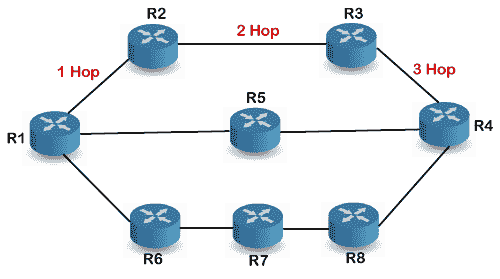
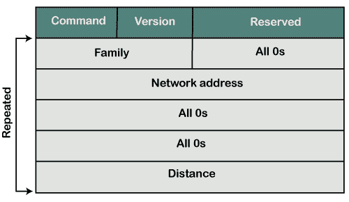
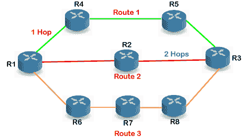
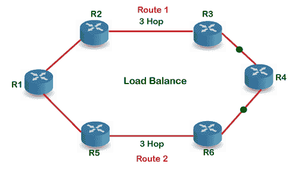

# RIP 协议

> 原文：<https://www.javatpoint.com/rip-protocol>

RIP 代表路由信息协议。RIP 是自治系统中使用的域内路由协议。这里，域内意味着在定义的域中路由分组，例如，机构区域内的网络浏览。要理解 RIP 协议，我们的主要重点是了解数据包的结构、它包含多少字段，以及这些字段如何决定路由表。

**在了解包的结构之前，我们先看以下几点:**

*   RIP 基于基于距离矢量的策略，因此我们将整个结构视为一个图，其中节点是路由器，链路是网络。
*   在路由表中，第一列是目的地，也可以说是网络地址。
*   成本指标是到达目的地的跳数。网络中可用的跳数就是成本。跳数是到达目的地所需的网络数量。
*   在 RIP 中，无穷大被定义为 16，这意味着 RIP 适用于较小的网络或小型自治系统。RIP 可以包含的最大跳数是 15 跳，即不应超过 15 跳，因为 16 是无穷大。
*   下一列包含数据包到达目的地的路由器地址。

### 跳数是如何确定的？

当路由器将数据包发送到网段时，它被视为单跳。

在上图中，当路由器 1 将数据包转发给路由器 2 时，它将计为 1 跳数。类似地，当路由器 2 将分组转发到路由器 3 时，它将计为 2 跳计数，而当路由器 3 将分组转发到路由器 4 时，它将计为 3 跳计数。同样的， [RIP](https://www.javatpoint.com/rip-full-form) 最多可以支持 15 跳，也就是说一个 RIP 中可以配置 16 台路由器。

### RIP 消息格式

现在，我们来看看 RIP 消息格式的结构。消息格式用于在不同路由器之间共享信息。RIP 在消息中包含以下字段:

*   命令:这是一个 8 位字段，用于请求或回复。请求的值是 1，回复的值是 2。
*   版本:这里，版本是指我们使用的协议版本。假设我们使用版本 1 的协议，那么我们将 1 放在这个字段中。
*   保留:这是一个保留字段，所以用零填充。
*   Family:这是一个 16 位字段。因为我们使用的是 TCP/IP 系列，所以我们在这个字段中放入了 2 个值。
*   网络地址:定义为 14 字节字段。如果我们使用 IPv4 版本，那么我们使用 4 个字节，其他 10 个字节都是零。
*   距离:距离字段指定跳数，即到达目的地所用的跳数。

### RIP 是如何工作的？

如果网络中有 8 台路由器，路由器 1 希望将数据发送到路由器 3。如果网络配置了 RIP，它将选择跳数最少的路由。上述网络中有三条路由，即 1 号路由、2 号路由和 3 号路由。路由 2 包含最少的跳数，即 2，其中路由 1 包含 3 跳，路由 3 包含 4 跳，因此 RIP 将选择路由 2。

### 让我们看另一个例子。

假设 R1 想把数据发送到 R4。从 r1 向 r2 发送数据有两种可能的路由。由于两条路由包含相同的跳数，即 3 跳，因此 RIP 将同时向两条路由发送数据。这样，它可以管理负载平衡，数据到达目的地的速度会快一点。

### RIP 的缺点

**以下是 RIP 的缺点:**

*   在 RIP 中，路由是根据跳数度量来选择的。如果有另一条带宽更好的路由可用，则不会选择该路由。让我们通过一个例子来理解这个场景。

我们可以看到，上图中选择了路由 2，因为它的跳数最少。1 号线是免费的，数据可以更快到达；取而代之的是，数据被发送到 2 号路线，这使得 2 号路线由于交通拥挤而变慢。这是 RIP 最大的缺点之一。

*   RIP 是一种有类路由协议，因此不支持 VLSM(可变长度子网掩码)。有类路由协议是一种在路由更新中不包含子网掩码信息的协议。
*   它向整个网络广播路由更新，从而产生大量流量。在 RIP 中，路由表每 30 秒更新一次。每当更新发生时，它都会将更新的副本发送给所有邻居，导致更新的邻居除外。向所有邻居发送更新会产生大量流量。这条规则被称为水平分割规则。
*   它面临着收敛缓慢的问题。每当路由器或链路出现故障时，通常需要几分钟才能稳定下来或采取替代路由；这个问题被称为慢收敛。
*   RIP 支持最大 15 跳，这意味着 RIP 中最多可以配置 16 跳
*   管理距离值为 120(广告值)。如果 Ad 值较小，则协议比 Ad 值较大的协议更可靠。
*   RIP 协议的 Ad 值最高，因此不如其他路由协议可靠。

### RIP 如何更新路由表

以下计时器用于更新路由表:

*   **RIP 更新定时器:30 秒**

配置了 RIP 的路由器每 30 秒向所有相邻路由器发送一次更新。

*   **RIP 无效计时器:180 秒**

RIP 无效计时器为 180 秒，这意味着如果路由器与网络断开连接或某条链路断开，则邻居路由器将等待 180 秒进行更新。如果它在 180 秒内没有收到更新，那么它会将特定路由标记为不可到达。

*   **RIP 刷新定时器:240 秒**

RIP 刷新计时器为 240 秒，几乎等于 4 分钟，这意味着如果路由器在 240 秒内没有收到更新，则邻居路由将从路由表中删除该特定路由，这是一个非常缓慢的过程，因为等待 4 分钟是很长的时间。

### RIP 的优势

**RIP 协议的优势如下:**

*   它很容易配置
*   它没有那么复杂
*   CPU 利用率比较低。

* * *