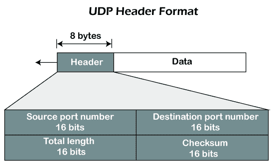
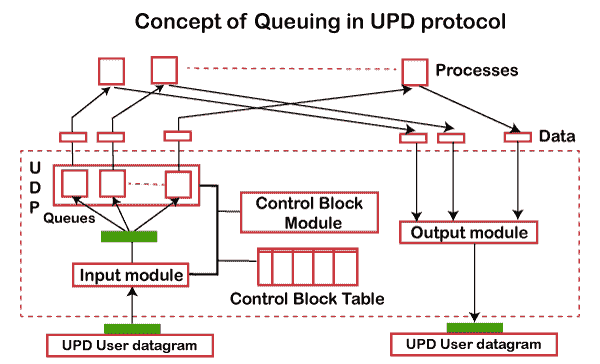

# UDP 协议

> 原文：<https://www.javatpoint.com/udp-protocol>

在计算机网络中，UDP 代表用户数据报协议。大卫·里德在 1980 年开发了 UDP 协议。在 RFC 768 中有定义，是 [TCP/IP](https://www.javatpoint.com/tcp-ip-full-form) 协议的一部分，所以是互联网上的标准协议。UDP 协议允许计算机应用程序通过[互联网协议(IP)](https://www.javatpoint.com/ip) 网络以数据报的形式将消息从一台机器发送到另一台机器。UDP 是 TCP 协议(传输控制协议)的替代通信协议。像 TCP 一样，UDP 提供了一组规则来管理数据应该如何在互联网上交换。UDP 的工作原理是将数据封装到数据包中，并向数据包提供自己的报头信息。然后，这个 UDP 数据包被封装到 IP 数据包中，并发送到目的地。 [TCP 和 UDP](https://www.javatpoint.com/tcp-vs-udp) 协议都通过互联网协议网络发送数据，因此也被称为 [TCP/IP](https://www.javatpoint.com/computer-network-tcp-ip-model) 和 UDP/IP。这两种协议有很多不同之处。UDP 使进程能够处理通信，而 TCP 提供主机到主机的通信。由于 UDP 以数据报的形式发送消息，因此它被认为是尽力而为的通信模式。 [TCP](https://www.javatpoint.com/tcp) 发送单个数据包，是一种可靠的传输介质。另一个区别是，TCP 是面向连接的协议，而 UDP 是无连接协议，因为它不需要任何虚电路来传输数据。

UDP 还提供了不同的端口号来区分不同的用户请求，还提供了校验和功能来验证完整的数据是否已经到达； [IP](https://www.javatpoint.com/ip-full-form) 层不提供这两种服务。

### UDP 协议的特点

**以下是 UDP 协议的特点:**

*   **传输层协议**

[UDP](https://www.javatpoint.com/udp-full-form) 是最简单的[传输层通信协议](https://www.javatpoint.com/computer-network-transport-layer)。它包含最少量的通信机制。它被认为是一个不可靠的协议，它基于尽力而为的交付服务。UDP 不提供确认机制，这意味着接收方不发送对收到的数据包的确认，发送方也不等待对其发送的数据包的确认。

*   **无连接**

UDP 是一种无连接协议，因为它不创建传输数据的虚拟路径。它不使用虚拟路径，因此数据包在发送方和接收方之间以不同的路径发送，这导致数据包丢失或接收顺序错误。

**不保证数据的有序交付。**

在 UDP 的情况下，数据报以某种顺序发送，但不能保证以相同的顺序接收，因为数据报没有编号。

*   **港口**

UDP 协议使用不同的端口号，以便将数据发送到正确的目的地。端口号定义在 0 到 1023 之间。

*   **更快的传输**

UDP 支持更快的传输，因为它是无连接协议，即不需要虚拟路径来传输数据。但个别数据包有可能丢失，影响传输质量。另一方面，如果数据包在 TCP 连接中丢失，该数据包将被重新发送，因此它保证了数据包的传递。

*   **确认机制**

UDP 确实有任何确认机制，即在 UDP 发送方和 UDP 接收方之间没有握手。如果消息是用 TCP 发送的，那么接收者确认我准备好了，然后发送者发送数据。在 TCP 的情况下，握手发生在发送方和接收方之间，而在 UDP 中，发送方和接收方之间没有握手。

*   **分段独立处理。**

每个 UDP 数据段被单独处理，因为每个数据段通过不同的路径到达目的地。由于发送方和接收方之间没有建立连接，UDP 数据段可能会丢失或无序传送以到达目的地。

*   **无状态**

这是一种无状态协议，意味着发送方无法获得已发送数据包的确认。

### 为什么我们需要 UDP 协议？

众所周知，UDP 是一种不可靠的协议，但在某些情况下，我们仍然需要 UDP 协议。UDP 部署在数据包和实际数据需要大量带宽的地方。例如，在视频流中，确认数千个数据包很麻烦，会浪费大量带宽。在视频流的情况下，一些数据包的丢失不会造成问题，也可以忽略。

### UDP 报头格式

在 UDP 中，报头大小为 8 字节，数据包大小高达 65，535 字节。但是这个包大小是不可能的，因为数据需要封装在 IP 数据报中，而一个 IP 包，报头大小可以是 20 字节；因此，UDP 的最大值为 65，535 减 20。UDP 数据包可以携带的数据大小为 65，535 减去 28，因为 UDP 数据包的报头为 8 字节，IP 报头为 20 字节。

**UDP 报头包含四个字段:**

*   **源端口号:**是 16 位信息，用于标识哪个端口将发送数据包。
*   **目的端口号:**标识哪个端口接受信息。它是 16 位信息，用于识别目标计算机上的应用程序级服务。
*   **长度:**它是一个 16 位字段，指定了包含报头的 UDP 数据包的整个长度。最小值是 8 字节，因为报头的大小是 8 字节。
*   **校验和:**16 位字段，可选字段。该校验和字段检查信息是否准确，因为信息在传输过程中有可能被破坏。它是一个可选字段，这意味着它取决于应用程序，它是否想要写入校验和。如果它不想写校验和，那么所有 16 位都为零；否则，它会写入校验和。在 UDP 中，校验和字段应用于整个数据包，即报头和数据部分，而在 IP 中，校验和字段仅应用于报头字段。

### UDP 协议中排队的概念

在 UDP 协议中，数字用于区分服务器和客户端上的不同进程。我们知道 UDP 提供了一个处理通信的过程。客户端生成需要服务的进程，而服务器生成提供服务的进程。两个进程都有队列，即每个进程有两个队列。第一个队列是接收消息的传入队列，第二个队列是发送消息的传出队列。该队列在进程运行时运行。如果进程被终止，那么队列也会被销毁。

UDP 在以下组件的帮助下处理 UDP 数据包的发送和接收:

*   **输入队列:**UDP 数据包为每个进程使用一组队列。
*   **输入模块:**该模块从 IP 中取出用户数据报，然后从同一端口的控制块表中查找信息。如果它在控制块表中找到与用户数据报端口相同的条目，它将数据排队。
*   **控制块模块:**管理控制块表。
*   **控制块表:**控制块表包含开放端口的条目。
*   **输出模块:**输出模块创建并发送用户数据报。

几个进程想要使用 UDP 的服务。UDP 多路复用和多路分解进程，以便多个进程可以在单个主机上运行。

### 限制

*   它提供了不可靠的连接传递服务。除了提供进程间通信外，它不提供任何 IP 服务。
*   UDP 消息可能会丢失、延迟、重复或出现故障。
*   它不提供可靠的运输服务。它不提供任何确认或流量控制机制。但是，它确实在某种程度上提供了错误控制。

### 优势

*   它产生最少的开销。

* * *