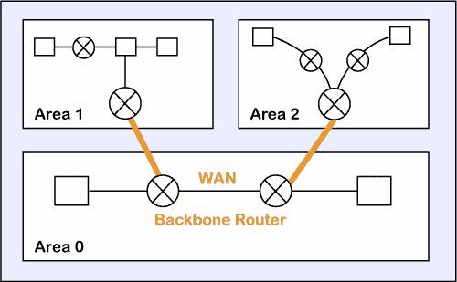
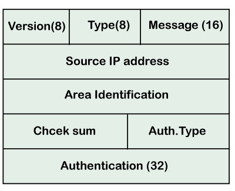
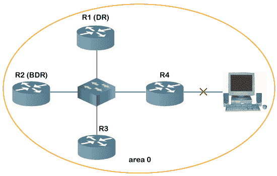

# OSPF 议定书

> 原文：<https://www.javatpoint.com/ospf-protocol>

OSPF 首先代表**开放最短路径**。它是一种广泛使用和支持的路由协议。它是一种域内协议，这意味着它在一个区域或网络中使用。这是一个内部网关协议，是在一个单独的自治系统中设计的。它基于链路状态路由算法，其中每台路由器包含每个域的信息，并基于该信息确定最短路径。路由的目标是学习路由。OSPF 通过了解整个网络中的每台路由器和子网来实现这一目标。每台路由器都包含相同的网络信息。路由器通过发送 LSA(链路状态通告)来获知该信息的方式。这些 LSA 包含关于每台路由器、子网和其他网络信息的信息。一旦 LSA 被淹没，OSPF 将信息存储在一个名为 LSDB 的链路状态数据库中。主要目标是在一个 LSDBs 中拥有关于每台路由器的相同信息。

### OSPF 地区

OSPF 将自治系统划分为多个区域，这些区域是网络、主机和路由器的集合。与互联网服务提供商一样，为了便于管理，OSPF 将互联网划分为不同的自治系统，并将自治系统进一步划分为区域。

该区域内的路由器向该区域发送大量路由信息

在区域中，特殊路由器也存在。特殊路由器是那些出现在区域边界的路由器，这些特殊路由器被称为区域边界路由器。该路由器汇总某个区域的信息，并与其他区域共享该信息。

自治系统内的所有区域都连接到骨干路由器，这些骨干路由器是主区域的一部分。主要区域的作用是提供不同区域之间的通信。

### OSPF 是如何运作的？

**有三个步骤可以解释 OSPF 的工作:**

**第一步:**第一步是成为 OSPF 邻居。两台在同一链路上运行 OSPF 的连接路由器创建了邻居关系。

**第二步:**第二步是交换数据库信息。成为邻居后，两台路由器相互交换 LSDB 信息。

**第三步:**第三步选择最佳路线。一旦彼此交换了 LSDB 信息，路由器就会根据 SPF 的计算结果选择最佳路由添加到路由表中。

### 路由器如何形成邻居关系？

关系形成之前发生的第一件事是每个路由器选择[路由器](https://www.javatpoint.com/router) [ID](https://www.javatpoint.com/id) 。

**路由器 ID (RID):** 路由器 ID 是唯一标识网络中每台路由器的数字。路由器标识采用 IPv4 地址的格式。设置路由器 ID 的方法很少，第一种是手动设置路由器 ID，另一种是让路由器自己决定。

以下是路由器选择设置路由器标识的逻辑:

*   手动分配:路由器检查路由器标识是否手动设置。如果是手动设置的，那么就是路由器 ID。如果不是手动设置，那么它会选择最高‘up’状态的环回接口 IP 地址。如果没有环回接口，那么它会选择最高‘up’状态的非环回接口 IP 地址。

两台通过点对点连接的路由器或多台连接的路由器可以通过 OSPF 协议相互通信。只有当两台路由器相互发送 HELLO 数据包时，这两台路由器才是相邻的。当两台路由器都收到 HELLO 数据包的确认时，它们就进入双向状态。由于 OSPF 是链路状态路由协议，因此它允许在路由器之间创建邻居关系。只有当两台路由器属于同一子网，共享相同的区域 id、子网掩码、计时器和身份验证时，它们才能成为邻居。OSPF 关系是路由器之间形成的一种关系，这样它们就可以相互了解。如果其中至少有一台路由器是网络中的指定路由器或备用指定路由器，或者通过点对点链路连接，则这两台路由器可以是邻居。

### OSPF 的链接类型

链路基本上是一种连接，因此两台路由器之间的连接称为链路。

**OSPF 有四种类型的链接:**

1.  **点对点链路:**点对点链路直接连接两台路由器，中间没有任何主机或路由器。
2.  **瞬时链路:**当一个网络中连接了几台路由器时，它们被称为瞬时链路。
    瞬态链路有两种不同的实现方式:
    不现实拓扑:当所有路由器都相互连接时，它被称为不现实拓扑。
    现实拓扑:当网络中存在某个指定路由器时，它被称为现实拓扑。这里指定的路由器是所有路由器都连接到的路由器。路由器发送的所有数据包都将通过指定的路由器。
3.  **Stub link:** 是连接到单个路由器的网络。数据通过单个路由器进入网络，并通过同一路由器离开网络。
4.  **虚拟链路:**如果两台路由器之间的链路断开，管理部门会在路由器之间创建虚拟路径，该路径也可能很长。

### OSPF 信息格式

**以下是 OSPF 消息格式的字段:**

*   **版本:**这是一个 8 位字段，用于指定 OSPF 协议版本。
*   **类型:**8 位字段。它指定了 OSPF 数据包的类型。
*   **消息:**它是一个 16 位字段，定义了消息的总长度，包括报头。因此，总长度等于消息长度和报头长度之和。
*   **源 IP 地址:**定义发送数据包的地址。这是一个发送路由 IP 地址。
*   **区域标识:**定义布线发生的区域。
*   **校验和:**用于纠错和检错。
*   **认证类型:**认证有两种，即 0 和 1。这里，0 表示无，表示没有身份验证可用，1 表示 pwd，表示基于密码的身份验证。
*   **认证:**是一个 32 位字段，包含认证数据的实际值。

### OSPF 包

**OSPF 有五种不同类型的小包:**

*   你好
*   数据库描述
*   链接状态请求
*   链接状态更新
*   链路状态确认

**我们来详细讨论一下每个包。**

**1。哈啰包**

Hello 数据包用于创建邻居关系并检查邻居的可达性。因此，当需要建立路由器之间的连接时，会使用 Hello 数据包。

**2。数据库描述**

建立连接后，如果邻居路由器第一次与系统通信，它会将有关网络拓扑的数据库信息发送给系统，以便系统可以相应地更新或修改。

**3。链接状态请求**

路由器发送链路状态请求以获取指定路由的信息。假设有两台路由器，即路由器 1 和路由器 2，路由器 1 想知道路由器 2 的信息，所以路由器 1 向路由器 2 发送链路状态请求。当路由器 2 收到链路状态请求时，它会将链路状态信息发送给路由器 1。

**4。链接状态更新**

路由器使用链路状态更新来通告其链路的状态。如果任何路由器想要广播其链路的状态，它会使用链路状态更新。

**5。链路状态确认**

链路状态确认通过强制每台路由器在每次链路状态更新时发送确认，使路由更加可靠。例如，路由器 A 向路由器 B 和路由器 C 发送链路状态更新，然后作为回报，路由器 B 和路由器 C 向路由器 A 发送链路状态确认，这样路由器 A 就知道两个路由器都收到了链路状态更新。

### OSPF 国家

**运行 OSPF 协议的设备经历以下状态:**

*   **Down:** 如果设备处于 Down 状态，则它没有收到 HELLO 数据包。这里，停机并不意味着设备物理停机；这意味着 OSPF 进程尚未开始。
*   **Init:** 如果设备进入 Init 状态，则表示设备收到了对方路由器发来的 HELLO 数据包。
*   **2WAY:** 如果设备处于 2WAY 状态，这意味着两台路由器都收到了来自另一台路由器的 HELLO 数据包，并且路由器之间建立了连接。
*   **Exstart:** 一旦路由器之间的交换开始，两台路由器都会进入 Exstart 状态。在这种状态下，主机和从机是根据路由器的 id 来选择的。主人控制数字的顺序，并开始交换过程。
*   **交换:**在交换状态下，两台路由器互相发送包含数据库描述的 LSA 列表。
*   **装载:**在装载状态下，交换 LSR、LSU 和 LSA。
*   **满:**一旦 LSA 交换完成，路由器将进入满状态。

### 路由器属性

在进入提取状态之前，OSPF 选择一台路由器作为指定路由器，另一台路由器作为备用指定路由器。这些路由器不是类型，但它们是路由器的属性。在广播网络的情况下，路由器选择一台路由器作为指定路由器，另一台路由器作为备用指定路由器。选择指定路由器和备用指定路由器是为了避免网络中的泛洪，并最大限度地减少相邻路由器的数量。它们充当所有路由器之间交换路由信息的中心点。由于点对点链路是直接相连的，所以不选 DR 和 BDR。

如果没有选择灾难恢复和灾难恢复，路由器会将更新发送给所有相邻的邻居，从而导致网络泛滥。为了避免这个问题，选择了 DR 和 BDR。每个非灾难恢复和非 BDR 仅向灾难恢复和 BDR 发送更新，而不是与网段中的其他路由器交换更新。然后，灾难恢复会将网络拓扑信息分发给同一区域的其他路由器，而 BDR 则代替灾难恢复。BDR 还会从所有路由器接收路由信息，但不会分发信息。它仅在灾难恢复失败时分发信息。

多播地址 224.0.0.6 由非灾难恢复和非灾难恢复使用，以向灾难恢复和灾难恢复发送路由信息。灾难恢复和 BDR 将路由信息发送到多播地址 224.0.0.5。

根据以下规则，选择灾难恢复和灾难恢复人员:

*   具有最高 OSPF 优先级的路由器被选为灾难恢复路由器。默认情况下，最高优先级被设置为 1。
*   如果没有最高优先级，那么选择路由器 Id 最高的路由器作为 DR，选择优先级第二高的路由器作为 BDR。

**我们通过一个例子来理解这个场景。**

在上图中，R1 被选为灾难恢复，而 R2 被选为 BDR，因为 R1 具有最高的路由器标识，而 R2 具有第二高的路由器标识。如果 R4 和系统之间的链接失败，那么 R4 只更新 R1 和 R4 的链接失败信息。然后，灾难恢复会将此更改更新到所有非灾难恢复和非 BDR，在这种情况下，除了 R4，只有 R3 可以作为非灾难恢复和非 BDR 使用。

* * *