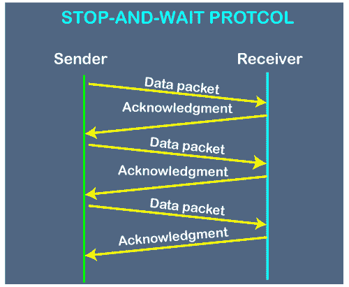
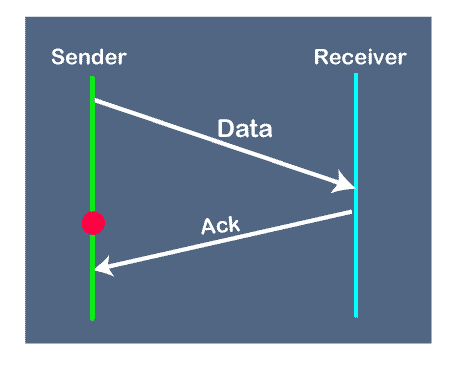

# 停止和等待协议

> 原文：<https://www.javatpoint.com/stop-and-wait-protocol>

在理解停止和等待协议之前，我们首先了解错误控制机制。使用错误控制机制，以便无论发送方发送了什么数据，接收到的数据都应该完全相同。差错控制机制分为两类，即停止和等待 ARQ 和滑动窗口。滑动窗口进一步分为两类，即返回 N 和选择性重复。根据使用情况，人们选择错误控制机制是**停止等待**还是**滑动窗口**。

### 什么是停止和等待协议？

这里的停止和等待意味着，无论发送方想要发送什么数据，他都会将数据发送给接收方。发送完数据后，他停下来等待，直到收到接收方的确认。停止和等待协议是一种流量控制协议，其中流量控制是数据链路层的服务之一。

这是一种数据链路层协议，用于在无噪声信道上传输数据。它提供单向数据传输，这意味着数据的发送或接收将同时发生。它提供流量控制机制，但不提供任何错误控制机制。

使用此帧的想法是，当发送方发送帧时，他会在发送下一帧之前等待确认。

### 停止和等待协议的原语

**停止和等待协议的原语为:**

**发送方**

**规则 1:** 发送方一次发送一个数据包。

**规则 2:** 发送方只有在收到前一个数据包的确认时，才会发送下一个数据包。

因此，发送方的停止和等待协议的思想非常简单，即一次发送一个数据包，在收到确认之前不发送另一个数据包。

### 接收器端

**规则 1:** 接收然后消费数据包。

**规则 2:** 当数据包被消耗时，接收方向发送方发送确认。

因此，接收端的停止和等待协议的思想也非常简单，即消耗数据包，一旦数据包被消耗，就发送确认。这就是所谓的流量控制机制。

### 停止和等待协议的工作

上图显示了停止和等待协议的工作情况。如果有发送方和接收方，则发送方发送数据包，该数据包称为数据包。如果没有收到第一个数据包的确认，发送方将不会发送第二个数据包。接收器发送对其接收到的数据包的确认。一旦收到确认，发送方就发送下一个数据包。这个过程一直持续到所有的包都没有发送。该协议的主要优点是简单，但也有一些缺点。例如，如果有 1000 个数据包要发送，那么这 1000 个数据包不能同时发送，因为在停止和等待协议中，一次发送一个数据包。

### 停止和等待协议的缺点

**以下是与停止和等待协议相关的问题:**

**1。由于数据丢失而出现问题**

假设发送方发送数据，数据丢失。接收器等待数据很久了。由于数据没有被接收器接收到，所以它不发送任何确认。因为发送方没有收到任何确认，所以它不会发送下一个数据包。出现此问题是因为数据丢失。

**在这种情况下，会出现两个问题:**

*   发送方等待确认的时间是无限的。
*   接收者等待数据的时间是无限的。

**2。由于失去确认而出现问题**

假设发送方发送了数据，接收方也收到了数据。收到数据包后，接收器发送确认。在这种情况下，确认会在网络中丢失，因此发送方没有机会收到确认。发送方也没有机会发送下一个数据包，因为在停止和等待协议中，在收到前一个数据包的确认之前，无法发送下一个数据包。

**这种情况下，出现一个问题:**

*   发送方等待确认的时间是无限的。

**3。数据或确认延迟导致的问题**

假设发送方发送了数据，接收方也收到了数据。然后，接收方发送确认，但确认是在发送方超时后收到的。由于确认接收较晚，因此确认可能被误认为是对其他数据包的确认。

* * *