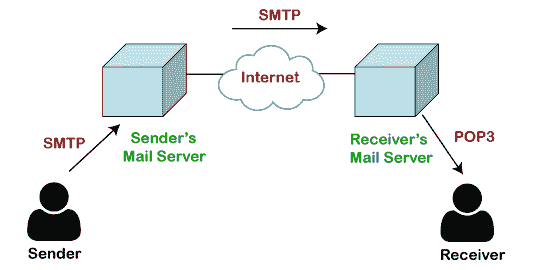
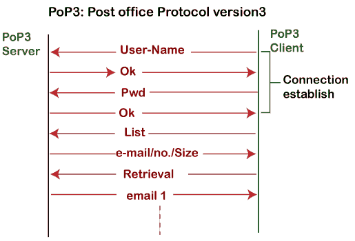

# 持久性有机污染物协议

> 原文：<https://www.javatpoint.com/pop-protocol>

POP 协议代表邮局协议。我们知道，SMTP 被用作邮件传输代理。当消息被发送时，SMPT 被用来将消息从客户端传递到服务器，然后传递到接收方服务器。但是邮件是在邮件访问代理的帮助下从收件人服务器发送到实际服务器的。消息访问代理包含两种类型的协议，即 POP3 和 IMAP。

### 邮件是如何传送的？

假设发送者想要将邮件发送给接收者。第一封邮件被发送到发件人的邮件服务器。然后，邮件通过互联网从发送者的邮件服务器传输到接收者的邮件服务器。在收件人的邮件服务器上收到邮件后，邮件会被发送给用户。整个过程是在电子邮件协议的帮助下完成的。邮件从发件人到发件人邮件服务器再到收件人邮件服务器的传输是在 [SMTP 协议](https://www.javatpoint.com/simple-mail-transfer-protocol)的帮助下完成的。在接收者的邮件服务器上，POP 或 [IMAP 协议](imap-protocol)获取数据并传输给实际用户。

因为 SMTP 是一种推送协议，所以它将消息从客户端推送到服务器。从上图中我们可以看到，SMTP 将邮件从客户端推送到收件人的邮件服务器。电子邮件通信的第三阶段需要拉协议，POP 是拉协议。当邮件从收件人邮件服务器传输到客户端时，这意味着客户端正在从服务器中提取邮件。

### 什么是 POP3？

POP3 是一个简单的协议，功能非常有限。在 POP3 协议的情况下，POP3 客户端安装在收件人系统上，而 POP3 服务器安装在收件人的邮件服务器上。

### POP3 协议的历史

邮局协议的第一个版本于 1984 年由[互联网](https://www.javatpoint.com/internet)工程任务组作为 RFC 918 首次引入。开发人员开发了一种简单有效的电子邮件协议，称为 POP3 协议，用于从服务器检索电子邮件。这提供了离线访问邮件而不是离线访问邮箱的便利。

1985 年，RFC 937 中引入了邮局协议版本 2，但随着 RFC 1081 的发布，1988 年被邮局协议版本 3 所取代。随后，POP3 在出版前的 10 年间进行了修订。一旦它被完全完善，它在 1996 年出版。

尽管 POP3 协议经历了各种增强，但开发人员坚持一个基本原则，即在客户端和服务器之间进行邮件检索时，它遵循三阶段流程。他们试图使这个协议非常简单，这种简单性使这个协议今天非常流行。

**我们来了解一下 POP3 协议的工作原理。**

为了在 POP3 服务器和 POP3 客户端之间建立连接，POP3 服务器向 POP3 客户端请求用户名。如果在 POP3 服务器中找到用户名，那么它会发送 ok 消息。然后它向 POP3 客户端询问密码；然后 POP3 客户端将密码发送到 POP3 服务器。如果密码匹配，则 POP3 服务器发送 OK 消息，连接建立。建立连接后，客户端可以在 POP3 邮件服务器上看到邮件列表。在邮件列表中，用户将从服务器获得电子邮件的数量和大小。从这个列表中，用户可以开始检索邮件。

一旦客户端从服务器检索到所有电子邮件，服务器上的所有电子邮件都将被删除。因此，我们可以说电子邮件被限制在一台特定的机器上，因此不可能在另一台机器上访问相同的邮件。通过将电子邮件设置配置为在邮件服务器上保留邮件副本，可以克服这种情况。

### POP3 协议的优势

**以下是 POP3 协议的优势:**

*   它允许用户离线阅读电子邮件。它只在从服务器下载电子邮件时需要互联网连接。一旦邮件从服务器下载，那么所有下载的邮件都驻留在我们的电脑或硬盘上，无需互联网就可以访问。因此，我们可以说 POP3 协议不需要永久的互联网连接。
*   因为电子邮件已经存储在我们的电脑上，所以它提供了对电子邮件的方便快捷的访问。
*   我们接收或发送的电子邮件没有大小限制。
*   它需要更少的服务器存储空间，因为所有的邮件都存储在本地机器上。
*   邮箱有最大大小，但受到硬盘大小的限制。
*   这是一个简单的协议，因此它是当今最流行的协议之一。
*   它易于配置和使用。

### POP3 协议的缺点

**以下是 POP3 协议的优势:**

*   如果电子邮件是从服务器上下载的，那么默认情况下，所有邮件都会从服务器上删除。因此，除非配置为在服务器上保留邮件副本，否则无法从其他机器访问邮件。
*   将邮件文件夹从本地机器转移到另一台机器可能会很困难。
*   由于所有附件都存储在您的本地计算机上，因此如果病毒扫描程序不扫描它们，病毒攻击的风险很高。病毒攻击会损害计算机。
*   从邮件服务器下载的电子邮件文件夹也会损坏。
*   邮件存储在本地机器上，因此任何坐在您机器上的人都可以访问电子邮件文件夹。

* * *